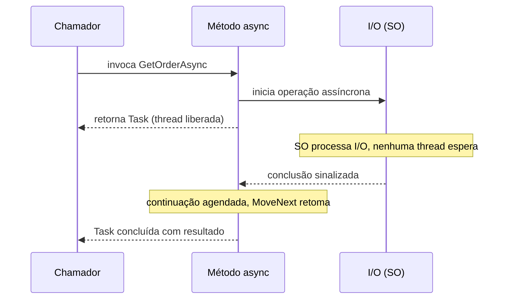

## Resumo

`async` e `await` são as palavras-chave que permitem escrever código assíncrono com a aparência de código sequencial. Elas servem para liberar a thread enquanto uma operação de I/O (rede, disco, database) está em andamento, em vez de bloqueá-la esperando. Importam porque escalabilidade de servidor depende de não desperdiçar threads: uma thread bloqueada não atende ninguém, enquanto uma thread liberada volta ao pool e processa outras requisições.

## Explicação detalhada

Asynchrony não é parallelism. Parallelism é executar várias coisas ao mesmo tempo em CPUs diferentes. Asynchrony é não ficar parado esperando: ao disparar uma operação de I/O, a thread atual é devolvida em vez de bloquear, e a continuação do método roda quando o resultado chega.

Um método `async` retorna `Task`, `Task<T>` ou `ValueTask<T>` (ver [Task vs ValueTask](task-vs-valuetask.md)). O `await` aplicado a uma `Task` faz o seguinte: se a `Task` já estiver concluída, a execução segue de forma síncrona, sem custo extra. Se não estiver, o método é suspenso, o controle retorna a quem chamou, e a thread fica livre. Quando a operação aguardada completa, a continuação é agendada para rodar e o método retoma do ponto exato em que parou.

O ponto central que confunde iniciantes: `await` não cria thread nem ocupa uma thread esperando. Durante a espera de um I/O verdadeiramente assíncrono, nenhuma thread está envolvida. Quem avisa que o I/O terminou é o sistema operacional, via mecanismos como IOCP no Windows.

A assinatura `async Task` propaga para cima: se um método aguarda outro assíncrono, ele também deve ser `async` e ser aguardado. Esse encadeamento é o que se chama de "async all the way". Quebrar a cadeia bloqueando com `.Result` ou `.Wait()` é a principal fonte de problemas.

### SynchronizationContext e ConfigureAwait

Quando uma `Task` é aguardada, por padrão a continuação tenta voltar para o contexto capturado, o `SynchronizationContext`. Em apps clássicos (Windows Forms, WPF, ASP.NET clássico) esse contexto existe e garante que a continuação rode na thread de UI ou na thread de requisição original. Capturar e voltar para esse contexto tem custo.

`ConfigureAwait(false)` diz: não preciso voltar ao contexto original, pode continuar em qualquer thread do pool. Em código de biblioteca isso é recomendado, porque evita depender de um contexto que pode nem existir e elimina o custo de marshalling.

No **ASP.NET Core não existe SynchronizationContext**. Por isso `ConfigureAwait(false)` em controllers e serviços de aplicação no ASP.NET Core não muda comportamento de correção (continua sendo boa prática em bibliotecas reutilizáveis). A ausência de contexto também é o motivo pelo qual certos deadlocks clássicos do ASP.NET tradicional não acontecem no ASP.NET Core.

## Por baixo dos panos

O compilador transforma cada método `async` em uma máquina de estados. Aproximadamente: cada `await` vira um ponto de suspensão numerado. O compilador gera uma struct que implementa `IAsyncStateMachine`, com um campo `state` (em qual ponto parou), campos para as variáveis locais que sobrevivem ao `await`, e um campo para o `AsyncTaskMethodBuilder` que produz a `Task` retornada.

O método `MoveNext` é o coração: ele é um grande `switch` sobre o `state`. Quando encontra um `await` de algo não concluído, ele registra a própria máquina de estados como continuação no awaiter e retorna. Quando a operação completa, o awaiter chama `MoveNext` de novo, que pula para o ponto certo via `state`.

Implicações práticas dessa mecânica:

- Cada método `async` que realmente suspende tem custo de alocação da máquina de estados (no caminho assíncrono). Se o método quase sempre completa de forma síncrona, esse custo é evitável com `ValueTask`.
- Variáveis locais que cruzam um `await` viram campos de heap, então capturas grandes têm custo.
- Exceções lançadas dentro de um método `async` são capturadas e colocadas na `Task` retornada, sendo relançadas no `await`.

## Exemplos em C#

Uso correto, async all the way:

```csharp
public async Task<Order> GetOrderAsync(int id, CancellationToken ct)
{
    await using var connection = new NpgsqlConnection(_connectionString);
    await connection.OpenAsync(ct);

    var order = await _repository.FindAsync(connection, id, ct);
    if (order is null)
        throw new OrderNotFoundException(id);

    return order;
}
```

Errado, sync-over-async causando deadlock potencial e desperdício de thread:

```csharp
public Order GetOrder(int id)
{
    return GetOrderAsync(id, CancellationToken.None).Result;
}
```

`async void`, a usar apenas em event handlers, porque não pode ser aguardado nem ter exceções capturadas:

```csharp
private async void OnButtonClick(object sender, EventArgs e)
{
    await DoWorkAsync();
}
```

Parallelism real com `Task.WhenAll`, quando as operações são independentes:

```csharp
public async Task<Dashboard> LoadDashboardAsync(CancellationToken ct)
{
    var ordersTask = _orders.GetRecentAsync(ct);
    var statsTask = _stats.GetSummaryAsync(ct);

    await Task.WhenAll(ordersTask, statsTask);

    return new Dashboard(await ordersTask, await statsTask);
}
```

## Tradeoffs

- Asynchrony melhora escalabilidade em cargas com I/O, mas não acelera uma operação isolada. Para trabalho puramente de CPU, `async` por si só não ajuda (use `Task.Run` para tirar trabalho pesado da thread atual em apps de UI, não em servidores).
- Código assíncrono tem custo de máquina de estados e agendamento. Para um método trivial chamado em loop apertado, o overhead pode pesar.
- A vantagem clara é em servidores: menos threads bloqueadas significa mais requisições atendidas com o mesmo pool.

## Pegadinhas e erros comuns

- `.Result` e `.Wait()` bloqueiam a thread e, em contextos com `SynchronizationContext` (UI, ASP.NET clássico), causam deadlock: a thread esperando é justamente a que a continuação precisa para rodar.
- `async void` engole exceções: elas sobem direto para o `SynchronizationContext` e podem derrubar o processo. Use `async Task`, exceto em event handlers.
- Esquecer de aguardar uma `Task` (fire and forget) faz exceções passarem despercebidas e perde controle de conclusão.
- `await` dentro de `lock` não compila, e mais amplamente, manter um lock através de um ponto de suspensão é um erro de design.
- Em ASP.NET Core, `ConfigureAwait(false)` não previne deadlock (não há contexto), então não é solução para travamentos: o problema costuma ser bloqueio síncrono em outro lugar.
- Capturar muitas variáveis locais grandes que cruzam o `await` aumenta a alocação da máquina de estados.

## Quando usar e quando evitar

Use `async`/`await` em todo I/O: chamadas de database, HTTP, fila, arquivo. Use em APIs de servidor por padrão. Evite envolver trabalho puramente de CPU em `async` sem necessidade, e nunca use `Task.Run` em código de servidor só para "tornar assíncrono", pois isso apenas troca uma thread do pool por outra. Nunca bloqueie com `.Result`/`.Wait()` para fazer ponte de async para sync: refatore a cadeia inteira para assíncrona.

## Perguntas de auto-teste

1. `await` cria uma nova thread para esperar a operação?
<details><summary>Resposta</summary>Não. Em I/O verdadeiramente assíncrono nenhuma thread fica esperando: a thread é liberada e a continuação é agendada quando o SO sinaliza a conclusão.</details>

2. Por que `.Result` pode causar deadlock no ASP.NET clássico mas não no ASP.NET Core?
<details><summary>Resposta</summary>Porque o ASP.NET clássico tem um SynchronizationContext que limita a continuação a uma thread específica, que está bloqueada esperando o resultado. O ASP.NET Core não tem SynchronizationContext, então a continuação roda em qualquer thread do pool.</details>

3. O que `ConfigureAwait(false)` faz e quando importa?
<details><summary>Resposta</summary>Diz que a continuação não precisa voltar ao contexto capturado, podendo rodar em qualquer thread do pool. Importa em código de biblioteca, para evitar custo e dependência de contexto. No ASP.NET Core não muda correção, pois não há contexto.</details>

4. Quando `async void` é aceitável?
<details><summary>Resposta</summary>Apenas em event handlers, onde a assinatura é imposta. Em qualquer outro caso use async Task, porque async void não pode ser aguardado e suas exceções não são capturáveis no chamador.</details>

5. O que o compilador gera a partir de um método `async`?
<details><summary>Resposta</summary>Uma máquina de estados (struct que implementa IAsyncStateMachine) com um campo de estado, campos para locais que cruzam awaits e um builder que produz a Task. O método MoveNext retoma a execução no ponto correto a cada continuação.</details>

6. Qual a diferença entre `Task.WhenAll` e aguardar tarefas em sequência?
<details><summary>Resposta</summary>WhenAll permite que operações independentes ocorram concorrentemente e aguarda todas; aguardar em sequência só inicia a próxima após a anterior terminar, somando os tempos.</details>

7. Por que async não acelera uma única operação de CPU?
<details><summary>Resposta</summary>Porque asynchrony trata de não bloquear durante esperas de I/O, não de paralelizar cálculo. Trabalho de CPU ainda precisa rodar em alguma thread pelo mesmo tempo.</details>

## Diagrama



## Referências

- [Asynchronous programming in C#](https://learn.microsoft.com/en-us/dotnet/csharp/asynchronous-programming/)
- [Task asynchronous programming model](https://learn.microsoft.com/en-us/dotnet/csharp/asynchronous-programming/task-asynchronous-programming-model)
- [ConfigureAwait FAQ (Stephen Toub)](https://devblogs.microsoft.com/dotnet/configureawait-faq/)
