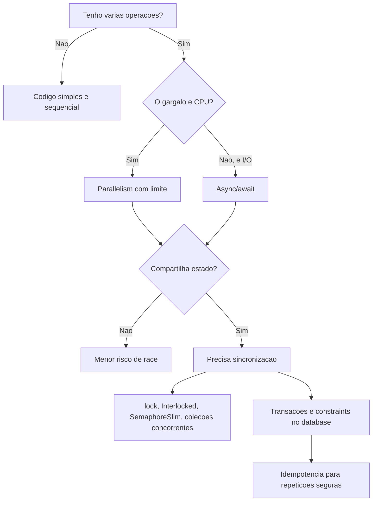

## Resumo

Concurrency é lidar com várias operações em progresso no mesmo intervalo de tempo. Parallelism é executar várias operações literalmente ao mesmo tempo, usando múltiplos núcleos ou threads. Asynchrony é não bloquear enquanto uma operação espera. Esses conceitos se cruzam, mas não são sinônimos.

O problema central da concorrência é coordenar acesso a estado compartilhado. Quando duas execuções leem e escrevem o mesmo dado sem regra clara, surgem race conditions. Em backend .NET isso aparece em contadores incorretos, cache inconsistente, processamento duplicado, ordem inesperada de events, deadlocks, starvation e bugs que somem quando você tenta debugar.

## Confirmação de escopo no acervo

Este tópico não substitui os conteúdos já existentes:

- [Threads, ThreadPool, Task and async/await](threads-threadpool.md) explica o que é uma thread, como o pool funciona e como `Task`/`await` se relacionam com threads.
- [async and await](async-await.md) aprofunda máquina de estados, `SynchronizationContext`, `ConfigureAwait`, deadlock por sync-over-async e boas práticas de `await`.
- [Task vs ValueTask](task-vs-valuetask.md) foca custo de alocação e restrições de `ValueTask`.
- [Idempotency](../02-microservices-patterns/idempotency.md) cobre chaves de idempotency, retries e consumidores idempotentes em sistemas distribuídos.
- [Delivery Semantics](../05-messaging-distributed-systems/delivery-semantics.md) cobre at-most-once, at-least-once e exactly-once.

O que faltava era um tópico unificador sobre concorrência versus parallelism, síncrono versus assíncrono, race conditions e tools de sincronização no código C#.

## Modelo mental

Pense em quatro perguntas separadas:

| Pergunta | Conceito |
| --- | --- |
| Existem várias operações em andamento ao mesmo tempo? | Concurrency |
| Elas executam literalmente ao mesmo tempo em CPUs diferentes? | Parallelism |
| Alguma operação fica esperando I/O, timer ou recurso externo? | Asynchrony |
| Há dados compartilhados sendo lidos/escritos por mais de uma execução? | Sincronização |

Exemplos:

| Cenário | Concorrente? | Paralelo? | Assíncrono? |
| --- | --- | --- | --- |
| Um servidor ASP.NET Core atendendo várias requisições | Sim | Pode ser | Sim, se usa I/O async |
| `Parallel.ForEach` processando imagens | Sim | Sim | Não necessariamente |
| `await httpClient.GetAsync(...)` | Sim, em relação ao restante do app | Não durante a espera | Sim |
| Um método síncrono lendo um arquivo e bloqueando | Não por si só | Não | Não |
| Duas threads incrementando o mesmo contador | Sim | Pode ser | Não necessariamente |

## Síncrono versus assíncrono

Código síncrono mantém a thread ocupada até terminar. Se a operação precisa esperar, a thread fica bloqueada.

```csharp
public Order GetOrder(int id)
{
    return _repository.Find(id);
}
```

Código assíncrono permite que a thread seja liberada enquanto uma operação pendente aguarda conclusão.

```csharp
public async Task<Order?> GetOrderAsync(int id, CancellationToken ct)
{
    return await _repository.FindAsync(id, ct);
}
```

Síncrono não significa ruim. Para cálculo rápido e local, código síncrono é simples e eficiente. O problema é usar síncrono para esperas longas em servidor: chamadas de database, HTTP, filas, arquivos ou serviços externos.

Assíncrono também não significa paralelo. Um `await` de I/O normalmente libera a thread; ele não cria outra thread para esperar. Já `Task.Run` agenda trabalho no `ThreadPool`, então envolve uma thread executando CPU.

## Concurrency versus parallelism

Concurrency é estrutura. Ela existe quando o sistema precisa lidar com múltiplas tarefas em progresso, mesmo que uma CPU só alterne entre elas.

Parallelism é execução física simultânea. Ele existe quando duas ou mais tarefas estão rodando ao mesmo tempo em núcleos diferentes.

```csharp
Task<Order?> orderTask = _orders.GetAsync(orderId, ct);
Task<Customer?> customerTask = _customers.GetAsync(customerId, ct);

await Task.WhenAll(orderTask, customerTask);
```

Esse exemplo é concorrente. As duas operações de I/O ficam pendentes ao mesmo tempo. Mas durante a espera de rede/database, não há necessariamente duas threads executando.

Agora compare:

```csharp
Parallel.ForEach(images, image =>
{
    Resize(image);
});
```

Aqui o objetivo é parallelism. O trabalho é CPU-bound e várias threads podem executar `Resize` ao mesmo tempo.

## CPU-bound versus I/O-bound

Essa distinção decide quase tudo:

| Tipo | Gargalo | Ferramenta comum |
| --- | --- | --- |
| CPU-bound | Processador | `Parallel.ForEach`, PLINQ, workers |
| I/O-bound | Espera externa | APIs async com `await`, `Task.WhenAll` com limite |

CPU-bound:

```csharp
var summaries = orders
    .AsParallel()
    .Select(CalculateRisk)
    .ToArray();
```

I/O-bound:

```csharp
Task<Invoice> invoiceTask = _invoices.GetAsync(id, ct);
Task<Payment> paymentTask = _payments.GetAsync(id, ct);

await Task.WhenAll(invoiceTask, paymentTask);
```

Não use parallelism de CPU para mascarar I/O bloqueante em servidor:

```csharp
public async Task<Order> GetAsync(int id)
{
    return await Task.Run(() => _repository.Find(id));
}
```

Esse padrão só move o bloqueio para outra thread do pool. A correção real é usar API de I/O assíncrona.

## Race condition

Race condition acontece quando o resultado depende da ordem imprevisível entre execuções concorrentes.

Exemplo clássico:

```csharp
private int _count;

public void Increment()
{
    _count++;
}
```

`_count++` parece uma operação só, mas não é. Conceitualmente envolve:

1. Ler `_count`.
2. Somar 1.
3. Escrever o novo valor.

Se duas threads leem `10` ao mesmo tempo, ambas calculam `11` e ambas gravam `11`. Uma atualização se perde.

Correção com `Interlocked`:

```csharp
private int _count;

public void Increment()
{
    Interlocked.Increment(ref _count);
}
```

`Interlocked.Increment` faz a operação de forma atômica para esse caso simples.

## Estado compartilhado

Toda race condition tem três ingredientes:

1. Estado compartilhado.
2. Acesso concorrente.
3. Pelo menos uma escrita.

Se você remove qualquer um dos três, remove a race.

Formas comuns de reduzir risco:

- Preferir immutability.
- Evitar estado estático mutável.
- Criar objetos scoped por requisição em vez de singletons com estado.
- Usar filas/canais para serializar processamento.
- Usar estruturas thread-safe quando o acesso concorrente é esperado.
- Empurrar consistência forte para o database com transações, constraints e locks adequados.

Exemplo de bug comum em serviço singleton:

```csharp
public sealed class ReportService
{
    private readonly List<string> _errors = [];

    public void AddError(string error)
    {
        _errors.Add(error);
    }
}
```

Se esse serviço for singleton, várias requisições podem chamar `AddError` ao mesmo tempo. `List<T>` não é thread-safe para escrita concorrente.

Opções melhores dependem do objetivo:

```csharp
private readonly ConcurrentQueue<string> _errors = new();

public void AddError(string error)
{
    _errors.Enqueue(error);
}
```

Ou, melhor ainda, evitar estado compartilhado no serviço e manter a lista no escopo da operação.

## Locks

`lock` protege uma seção crítica: só uma thread por vez entra naquele bloco para o mesmo objeto de sincronização.

```csharp
private readonly object _gate = new();
private readonly Dictionary<int, Customer> _cache = [];

public Customer? GetFromCache(int id)
{
    lock (_gate)
    {
        return _cache.GetValueOrDefault(id);
    }
}

public void SaveInCache(Customer customer)
{
    lock (_gate)
    {
        _cache[customer.Id] = customer;
    }
}
```

Regras práticas:

- Use um objeto privado só para lock.
- Mantenha a seção crítica pequena.
- Não chame código externo desconhecido dentro do lock.
- Não faça I/O dentro do lock.
- Não use `lock (this)`, `lock (typeof(...))` ou string.
- Não use `await` dentro de `lock`; o compilador não permite.

Quando precisar aguardar de forma assíncrona, use `SemaphoreSlim`:

```csharp
private readonly SemaphoreSlim _gate = new(1, 1);

public async Task RefreshAsync(CancellationToken ct)
{
    await _gate.WaitAsync(ct);
    try
    {
        await LoadAsync(ct);
    }
    finally
    {
        _gate.Release();
    }
}
```

## Deadlock, livelock e starvation

Deadlock acontece quando duas ou mais execuções ficam esperando umas pelas outras para sempre.

```csharp
lock (_a)
{
    lock (_b)
    {
        Work();
    }
}
```

Se outro trecho faz `lock (_b)` e depois `lock (_a)`, duas threads podem travar em ordem inversa.

Prevenção:

- Defina ordem global para adquirir múltiplos locks.
- Evite locks aninhados quando possível.
- Use timeout quando fizer sentido.
- Mantenha locks pequenos.
- Não misture bloqueio síncrono com async (`.Result`, `.Wait()`).

Livelock é quando as execuções continuam ativas, mas nenhuma progride porque uma fica reagindo à outra. Starvation é quando uma operação nunca recebe chance suficiente de executar, por exemplo porque o `ThreadPool` está saturado com operações bloqueantes.

## Coleções thread-safe

Coleções comuns como `List<T>` e `Dictionary<TKey, TValue>` não são seguras para escrita concorrente.

Use coleções concorrentes quando o padrão de acesso pede isso:

| Coleção | Uso comum |
| --- | --- |
| `ConcurrentDictionary<TKey, TValue>` | Cache ou mapa acessado por várias threads |
| `ConcurrentQueue<T>` | Fila FIFO concorrente |
| `ConcurrentStack<T>` | Pilha concorrente |
| `ConcurrentBag<T>` | Acúmulo sem ordem importante |
| `BlockingCollection<T>` | Produtor/consumidor bloqueante legado |

Exemplo:

```csharp
private readonly ConcurrentDictionary<int, Product> _cache = new();

public Product GetOrAdd(int id)
{
    return _cache.GetOrAdd(id, LoadProduct);
}
```

Atenção: thread-safe não significa que toda regra de negócio ficou atômica. Operações compostas ainda podem ter race.

```csharp
if (!_cache.ContainsKey(id))
{
    _cache[id] = LoadProduct(id);
}
```

Mesmo com `ConcurrentDictionary`, esse padrão tem janela entre verificar e gravar. Prefira APIs compostas como `GetOrAdd`, `AddOrUpdate` ou transações.

## Interlocked, volatile e visibilidade

`Interlocked` serve para operações atômicas simples em valores compartilhados.

```csharp
private int _isRunning;

public bool TryStart()
{
    return Interlocked.CompareExchange(ref _isRunning, 1, 0) == 0;
}
```

Esse código troca `_isRunning` de `0` para `1` apenas se ainda era `0`. É uma forma comum de garantir que só uma execução "vence".

`volatile` trata visibilidade de leitura/escrita, mas não torna operações compostas atômicas. Em código de aplicação, ele é mais raro do que iniciantes imaginam. Se você está pensando em `volatile`, normalmente vale revisar se `lock`, `Interlocked`, `CancellationToken`, `Channel` ou uma coleção concorrente expressa melhor a intenção.

## Throttling e backpressure

Concurrency sem limite vira sobrecarga. `Task.WhenAll` sobre dez itens é normal; sobre cem mil chamadas HTTP pode derrubar sua aplicação e o serviço de destino.

Ruim:

```csharp
await Task.WhenAll(ids.Select(id => _client.SendAsync(id, ct)));
```

Se `ids` tiver muitos elementos, isso dispara tudo de uma vez.

Com limite de concorrência:

```csharp
private readonly SemaphoreSlim _limit = new(20);

public async Task SendAllAsync(IEnumerable<int> ids, CancellationToken ct)
{
    var tasks = ids.Select(async id =>
    {
        await _limit.WaitAsync(ct);
        try
        {
            await _client.SendAsync(id, ct);
        }
        finally
        {
            _limit.Release();
        }
    });

    await Task.WhenAll(tasks);
}
```

Backpressure é o mecanismo de fazer produtores desacelerarem quando consumidores não acompanham. Em .NET, `Channel<T>` é uma boa opção para esse padrão.

```csharp
var channel = Channel.CreateBounded<Job>(capacity: 100);
```

Um canal limitado impede crescimento infinito de memória quando a entrada é mais rápida que o processamento.

## Idempotency e concorrência

Idempotency não é mecanismo de lock. Ela é uma propriedade da operação: repetir a mesma intenção não causa efeito adicional.

Mas idempotency e concorrência se encontram em um ponto crítico: duas execuções simultâneas da mesma intenção.

Este padrão é vulnerável:

```csharp
if (!await _db.Orders.AnyAsync(o => o.IdempotencyKey == key, ct))
{
    _db.Orders.Add(new Order(key, command.Amount));
    await _db.SaveChangesAsync(ct);
}
```

Duas requisições com a mesma chave podem passar pelo `AnyAsync` antes de qualquer uma gravar. Resultado: duplicidade.

O desenho robusto empurra a proteção para uma constraint única no database:

```csharp
modelBuilder.Entity<Order>()
    .HasIndex(o => o.IdempotencyKey)
    .IsUnique();
```

E a aplicação trata violação de unicidade como "essa intenção já foi processada". Isso complementa o conteúdo de [Idempotency](../02-microservices-patterns/idempotency.md): a chave precisa ser persistida atomicamente com o efeito, e a constraint é o mecanismo que fecha a janela de corrida.

## Tópicos avançados relacionados

### Thread safety

Um tipo é thread-safe quando pode ser usado concorrentemente sem corromper seu estado interno. Isso não garante que a sequência de operações de negócio seja correta.

Exemplo: `ConcurrentDictionary` é thread-safe, mas "verificar saldo e depois debitar" continua exigindo transação, lock ou operação atômica no database.

### Reentrância

Código reentrante pode ser chamado de novo antes de uma execução anterior terminar. Isso importa em callbacks, events, timers e handlers assíncronos. Se o método usa estado compartilhado temporário, uma reentrada pode sobrescrever dados da execução anterior.

### Contention

Contention é disputa por um recurso compartilhado. Um lock correto pode virar gargalo se todo mundo precisa passar por ele o tempo todo. Sintoma comum: CPU baixa, latência alta e muitas threads esperando.

### False sharing

False sharing ocorre quando threads diferentes atualizam dados independentes que caem na mesma cache line da CPU. Mesmo sem compartilhar uma variável lógica, elas invalidam cache uma da outra. É tópico de performance baixo nível, raro em código de negócio, mas relevante em bibliotecas e processamento intensivo.

### Cancelamento e timeout

Operações concorrentes precisam de forma de parar. `CancellationToken` não mata uma thread; ele comunica cancelamento cooperativo.

```csharp
public async Task SyncAsync(CancellationToken ct)
{
    ct.ThrowIfCancellationRequested();
    await _client.SendAsync(ct);
}
```

Timeouts evitam esperas infinitas, mas devem ser combinados com idempotency quando há retry. Se o cliente desiste por timeout, o servidor pode ainda concluir a operação.

### Ordenação

Concurrency frequentemente quebra ordem. `Task.WhenAll` preserva a associação dos resultados com as tasks, mas não significa que as operações terminaram na ordem original. Mensageria com múltiplos consumidores também aumenta throughput ao custo de ordenação, salvo quando há particionamento/chave de ordenação.

## Como escolher a ferramenta

| Problema | Ferramenta provável |
| --- | --- |
| Incrementar contador compartilhado | `Interlocked` |
| Proteger pequena seção crítica síncrona | `lock` |
| Proteger seção crítica com `await` | `SemaphoreSlim` |
| Cache acessado por múltiplas threads | `ConcurrentDictionary` |
| Processar fila com produtores e consumidores | `Channel<T>` |
| Paralelizar CPU-bound local | `Parallel.ForEach`, PLINQ, workers |
| Chamar múltiplos I/Os independentes | `Task.WhenAll` com limite quando necessário |
| Evitar duplicidade por retry | Idempotency key + constraint única |
| Garantir consistência de dados de negócio | Transação e constraints no database |

## Pegadinhas e erros comuns

- Confundir concorrência com parallelism: nem toda concorrência usa múltiplos núcleos.
- Confundir assíncrono com paralelo: `await` de I/O não cria thread para esperar.
- Usar `Task.Run` em ASP.NET Core para esconder API bloqueante.
- Usar `lock` em objeto público, `this`, `typeof` ou string.
- Fazer I/O ou chamada externa dentro de lock.
- Usar `List<T>` ou `Dictionary<TKey, TValue>` com escrita concorrente.
- Achar que `ConcurrentDictionary` resolve regras compostas de negócio.
- Fazer check-then-act sem proteção atômica: "se não existe, cria".
- Disparar `Task.WhenAll` sem limite para milhares de operações externas.
- Tratar timeout como falha garantida: a operação remota pode ter sido concluída.
- Implementar idempotency sem constraint única ou transação.

## Quando usar e quando evitar

Use concorrência para melhorar throughput e responsividade quando há trabalho independente. Use parallelism para CPU-bound que realmente se beneficia de múltiplos núcleos. Use async para I/O-bound. Use sincronização quando houver estado compartilhado inevitável.

Evite concorrência por padrão em código que poderia ser simples e determinístico. A complexidade cresce rápido: cada estado compartilhado vira uma hipótese a provar. Em backend, prefira designs stateless por requisição, persistência transacional no database e comunicação assíncrona com consumidores idempotentes.

## Perguntas de auto-teste

1. Qual a diferença entre concorrência e parallelism?
<details><summary>Resposta</summary>Concurrency é ter múltiplas operações em progresso no mesmo intervalo de tempo. Parallelism é executar múltiplas operações literalmente ao mesmo tempo, em núcleos ou threads diferentes.</details>

2. `await` torna uma operação paralela?
<details><summary>Resposta</summary>Não. `await` permite suspender o método sem bloquear a thread. Parallelism só ocorre se houver trabalho executando simultaneamente, como CPU-bound em múltiplas threads ou múltiplas operações independentes avançando ao mesmo tempo.</details>

3. Por que `_count++` pode gerar race condition?
<details><summary>Resposta</summary>Porque envolve ler, somar e escrever. Duas threads podem ler o mesmo valor antes de qualquer uma gravar, fazendo uma atualização se perder.</details>

4. Quando usar `Interlocked` em vez de `lock`?
<details><summary>Resposta</summary>Em operações atômicas simples sobre valores, como incremento, decremento, troca e compare-and-swap. Para invariantes com múltiplas variáveis ou blocos maiores, use lock ou outra sincronização.</details>

5. Por que `SemaphoreSlim` é usado com async?
<details><summary>Resposta</summary>Porque ele oferece `WaitAsync`, permitindo aguardar entrada na seção crítica sem bloquear uma thread. `lock` não pode atravessar `await`.</details>

6. Qual é o problema do padrão "se não existe, cria" em código concorrente?
<details><summary>Resposta</summary>Há uma janela entre verificar e criar. Duas execuções podem verificar que não existe e ambas criar. A correção é usar operação atômica, lock, API composta ou constraint única no database.</details>

7. Idempotency substitui lock?
<details><summary>Resposta</summary>Não. Idempotency torna repetição segura. Para concorrência simultânea da mesma intenção, ela precisa ser combinada com atomicidade, normalmente transação e restrição de unicidade.</details>

8. Por que `Task.WhenAll` sem limite pode ser perigoso?
<details><summary>Resposta</summary>Porque pode disparar muitas operações ao mesmo tempo, consumindo memória, conexões e capacidade do serviço externo. Use limite de concorrência ou backpressure.</details>

## Diagrama



## Referências

- [Managed threading best practices](https://learn.microsoft.com/en-us/dotnet/standard/threading/managed-threading-best-practices)
- [Task Parallel Library (TPL)](https://learn.microsoft.com/en-us/dotnet/standard/parallel-programming/task-parallel-library-tpl)
- [Data parallelism](https://learn.microsoft.com/en-us/dotnet/standard/parallel-programming/data-parallelism-task-parallel-library)
- [Interlocked Class](https://learn.microsoft.com/en-us/dotnet/api/system.threading.interlocked)
- [SemaphoreSlim Class](https://learn.microsoft.com/en-us/dotnet/api/system.threading.semaphoreslim)
- [Thread-safe collections](https://learn.microsoft.com/en-us/dotnet/standard/collections/thread-safe/)
