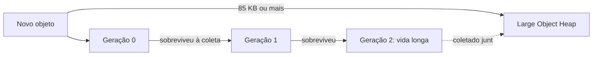

## Resumo

O Garbage Collector (GC) do .NET gerencia automaticamente a memória do heap: aloca objetos e os libera quando não há mais referências vivas a eles. Ele é geracional, dividindo objetos em gerações 0, 1 e 2 para coletar o lixo jovem com frequência e barato, e o velho raramente. Entender o GC importa para evitar pressão de alocação, pausas e vazamentos lógicos (referências que impedem a coleta).

## Explicação detalhada

O heap gerenciado guarda os tipos de referência. O GC determina quais objetos ainda são alcançáveis a partir de raízes (variáveis locais na stack, campos estáticos, registradores, handles). O que não é alcançável é lixo e pode ser recuperado. Você não chama `delete`: o GC decide quando coletar.

**Gerações** existem por uma observação empírica: a maioria dos objetos morre jovem. 

- **Geração 0**: objetos recém-alocados. Coletas de gen 0 são muito frequentes e rápidas.
- **Geração 1**: objetos que sobreviveram a uma coleta de gen 0. Funciona como um buffer entre o jovem e o velho.
- **Geração 2**: objetos de vida longa (caches, singletons, dados estáticos). Coletas de gen 2 são caras, pois varrem o heap todo.

Uma coleta de uma geração N coleta também as gerações menores. Coletar gen 2 é uma coleta completa.

**Large Object Heap (LOH)**: objetos com 85.000 bytes ou mais (tipicamente arrays grandes) vão para um heap separado, o LOH, coletado junto com a gen 2. Por padrão o LOH não é compactado (para evitar custo de mover blocos grandes), o que pode causar fragmentação.

Quando um objeto define um finalizador, sua coleta é adiada: ele vai para uma fila de finalização e só é recuperado em uma coleta posterior, depois de o finalizador rodar. Por isso `IDisposable` com `Dispose` é preferível a finalizadores para liberar recursos não gerenciados de forma determinística.

## Por baixo dos panos

O GC do .NET é do tipo tracing, mark and sweep com compactação. As fases aproximadas:

1. **Mark**: a partir das raízes, marca todos os objetos alcançáveis.
2. **Sweep/relocate**: o que não foi marcado é lixo. Nas gerações que compactam (gen 0 e 1, e gen 2 quando necessário), os objetos vivos são movidos para juntar o espaço livre, e as referências são atualizadas.

Modos de operação:

- **Workstation GC**: otimizado para apps cliente, menor latência, menos threads de GC. Padrão em apps desktop.
- **Server GC**: usa um heap e uma thread de GC por processador lógico, maximizando throughput. Padrão e recomendado em servidores e ASP.NET Core, onde melhora escalabilidade.
- **Background GC**: permite que coletas de gen 2 ocorram concorrentemente com a execução do app, reduzindo pausas.

O GC também ajusta dinamicamente os limiares de cada geração conforme o padrão de alocação do app.

## Exemplos em C#

Liberação determinística com `using`, preferível a depender do finalizador:

```csharp
public async Task<string> ReadAsync(string path, CancellationToken ct)
{
    await using var stream = File.OpenRead(path);
    using var reader = new StreamReader(stream);
    return await reader.ReadToEndAsync(ct);
}
```

Vazamento lógico clássico: evento que mantém o assinante vivo:

```csharp
public class Publisher
{
    public event EventHandler? Updated;
}

public class Subscriber
{
    public Subscriber(Publisher p) => p.Updated += OnUpdated;
    private void OnUpdated(object? s, EventArgs e) { }
}
```

Enquanto `Publisher` viver, ele referencia `Subscriber` pelo handler, impedindo a coleta. A correção é cancelar a inscrição (`p.Updated -= OnUpdated`) no `Dispose`.

Reduzir pressão de alocação reutilizando buffers com pool:

```csharp
var pool = ArrayPool<byte>.Shared;
byte[] buffer = pool.Rent(4096);
try
{
    Process(buffer);
}
finally
{
    pool.Return(buffer);
}
```

## Tradeoffs

- GC automático elimina uma classe inteira de bugs (use after free, double free) ao custo de pausas imprevisíveis e overhead. Em geral o ganho compensa.
- Server GC maximiza throughput usando mais memória e mais threads; Workstation GC favorece latência e menor footprint. Escolha conforme o perfil do app.
- Finalizadores garantem liberação eventual de recursos não gerenciados, mas custam uma coleta extra e não são determinísticos. `IDisposable` é determinístico mas exige disciplina de chamada.
- Pools e structs reduzem alocação e pausas, ao custo de complexidade e regras de uso.

## Pegadinhas e erros comuns

- Chamar `GC.Collect()` manualmente em código de produção: quase sempre piora, atrapalhando a heurística do GC. Use só em cenários muito específicos de diagnóstico.
- Acreditar que `Dispose` libera memória gerenciada: `Dispose` libera recursos não gerenciados (arquivos, conexões); a memória do objeto só é recuperada pelo GC.
- Vazamentos lógicos: coleções estáticas que crescem, eventos não desinscritos, caches sem limite. O objeto é alcançável, então o GC não o coleta.
- Alocar muitos objetos de vida curta em hot path: enche a gen 0 e dispara coletas frequentes. Considere structs, pooling ou `Span<T>`.
- Objetos grandes (85 KB ou mais) indo para o LOH e fragmentando-o.
- Confiar em finalizador para liberar recurso crítico de forma oportuna: pode demorar.

## Quando usar e quando evitar

Deixe o GC fazer seu trabalho na maioria dos casos. Otimize alocação apenas onde profiling mostrar pressão de GC: hot paths, serviços de alta vazão. Use `IDisposable`/`using` para recursos não gerenciados, implemente finalizador só quando lidar diretamente com recurso não gerenciado e ainda assim com o padrão Dispose. Evite `GC.Collect()` e micro-otimizações de memória sem medir.

## Perguntas de auto-teste

1. Por que o GC do .NET é geracional?
<details><summary>Resposta</summary>Porque a maioria dos objetos morre jovem. Coletar a geração 0 (jovem) é frequente e barato; a geração 2 (velha) é coletada raramente, pois varrer tudo é caro.</details>

2. O que acontece quando você chama `Dispose`? Ele libera a memória do objeto?
<details><summary>Resposta</summary>Dispose libera recursos não gerenciados de forma determinística (arquivos, conexões, handles). A memória gerenciada do objeto só é recuperada quando o GC coleta.</details>

3. Qual a diferença entre Workstation GC e Server GC?
<details><summary>Resposta</summary>Workstation foca latência e menor footprint, com menos threads; Server usa um heap e uma thread de GC por CPU lógica para maximizar throughput, sendo padrão em servidores.</details>

4. O que é o LOH e o que vai para ele?
<details><summary>Resposta</summary>Large Object Heap, um heap separado para objetos de 85.000 bytes ou mais (tipicamente arrays grandes), coletado junto da gen 2 e, por padrão, não compactado.</details>

5. Como um evento pode causar vazamento de memória?
<details><summary>Resposta</summary>O publisher mantém uma referência ao assinante pelo handler. Enquanto o publisher viver, o assinante é alcançável e não é coletado. Cancelar a inscrição resolve.</details>

6. Por que evitar `GC.Collect()` em produção?
<details><summary>Resposta</summary>Porque interfere na heurística adaptativa do GC, costuma forçar coletas completas caras e geralmente piora a performance.</details>

## Diagrama



## Referências

- [Fundamentals of garbage collection](https://learn.microsoft.com/en-us/dotnet/standard/garbage-collection/fundamentals)
- [Workstation and server GC](https://learn.microsoft.com/en-us/dotnet/standard/garbage-collection/workstation-server-gc)
- [The Large Object Heap](https://learn.microsoft.com/en-us/dotnet/standard/garbage-collection/large-object-heap)
