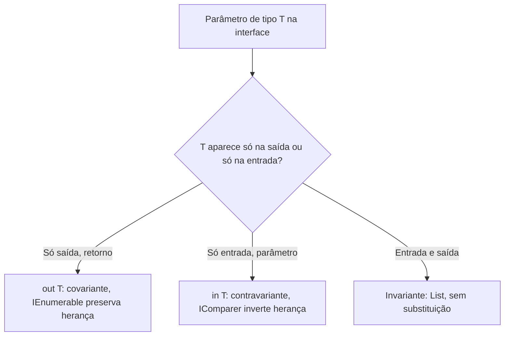

## Resumo

Generics permitem escrever types e métodos parametrizados por tipo, com segurança em tempo de compilação e sem boxing. Variância define quando um tipo genérico pode ser substituído por outro com argumento de tipo relacionado por herança: covariância (`out`) preserva a direção da herança nas saídas, contravariância (`in`) a inverte nas entradas. Importa para usar interfaces como `IEnumerable<out T>` e `IComparer<in T>` de forma flexível sem casts.

## Explicação detalhada

Generics resolvem o problema de reúso com tipo seguro. Antes deles, coleções usavam `object`, exigindo cast e causando boxing de value types. `List<T>` guarda `T` diretamente, com verificação em compilação.

Restrições (`where`) limitam o que `T` pode ser e habilitam operações: `where T : class`, `where T : struct`, `where T : new()` (construtor sem parâmetros), `where T : IComparable<T>` (implementa interface), `where T : BaseClass`, `where T : notnull`. Sem restrição, você só pode tratar `T` como `object`.

**Variância** só se aplica a interfaces e delegates genéricos, e só a reference types. A intuição:

- **Covariância (`out T`)**: o tipo só aparece em posição de saída (retorno). Se `Gato` deriva de `Animal`, então `IEnumerable<Gato>` pode ser usado onde se espera `IEnumerable<Animal>`, porque tudo que sai é pelo menos um `Animal`. A direção da herança é preservada.
- **Contravariância (`in T`)**: o tipo só aparece em posição de entrada (parâmetro). `IComparer<Animal>` pode ser usado onde se espera `IComparer<Gato>`, porque algo que sabe comparar qualquer `Animal` sabe comparar `Gato`. A direção é invertida.
- **Invariância**: o padrão. `List<Gato>` não é `List<Animal>`, porque `List` tanto lê quanto escreve `T`, e permitir a substituição quebraria a segurança de tipo (você poderia inserir um `Cachorro` numa `List<Gato>`).

A regra mnemônica: `out` para o que sai (covariante), `in` para o que entra (contravariante).

## Por baixo dos panos

Generics em .NET são reificados, não apagados como em Java. O runtime conhece o argumento de tipo real em execução. Para reference types, o runtime compartilha uma única instanciação de código (todos os `T` de referência usam o mesmo código JIT, pois têm o mesmo tamanho de ponteiro). Para value types, cada `T` gera código especializado, evitando boxing e dando performance nativa.

Variância é marcada nos metadados da interface com os modificadores `out`/`in` nos parâmetros de tipo. O compilador verifica que um parâmetro `out` nunca aparece em posição de entrada e vice-versa, recusando a compilação se a regra for violada. Por isso variância funciona só com referências: ela depende de conversões de referência, que não existem entre value types sem boxing.

## Exemplos em C#

Método genérico com restrição:

```csharp
public static T MaxBy<T, TKey>(IEnumerable<T> source, Func<T, TKey> selector)
    where TKey : IComparable<TKey>
{
    using var e = source.GetEnumerator();
    if (!e.MoveNext())
        throw new InvalidOperationException("Sequência vazia");

    var best = e.Current;
    var bestKey = selector(best);
    while (e.MoveNext())
    {
        var key = selector(e.Current);
        if (key.CompareTo(bestKey) > 0)
        {
            best = e.Current;
            bestKey = key;
        }
    }
    return best;
}
```

Covariância em ação:

```csharp
IEnumerable<string> strings = new List<string> { "a", "b" };
IEnumerable<object> objects = strings;
```

Funciona porque `IEnumerable<out T>` é covariante: tudo que sai é pelo menos `object`.

Contravariância em ação:

```csharp
Action<object> printAny = o => Console.WriteLine(o);
Action<string> printString = printAny;
printString("texto");
```

Funciona porque `Action<in T>` é contravariante: algo que aceita qualquer `object` aceita `string`.

Invariância recusada pelo compilador:

```csharp
List<string> strs = new();
List<object> objs = strs;
```

Não compila, porque `List<T>` é invariante.

## Tradeoffs

- Generics dão reúso e performance (sem boxing para value types) com segurança de tipo, ao custo de alguma complexidade de assinatura e código JIT especializado por valor type (mais memória de código).
- Variância dá flexibilidade de atribuição sem casts, mas só onde é seguro: saída pura ou entrada pura. Tentar ambos força invariância.
- Restrições deixam a API mais expressiva e segura, porém mais rígida; restrições demais dificultam o reúso.

## Pegadinhas e erros comuns

- Esperar que `List<Derivada>` seja `List<Base>`: classes e `List` são invariantes; só interfaces e delegates marcados com `in`/`out` têm variância.
- Tentar usar variância com value types: `IEnumerable<int>` não é `IEnumerable<object>` por variância (exigiria boxing).
- Marcar `out T` e depois usar `T` como parâmetro de método na interface: não compila.
- Confundir as direções: `out` é covariante (saída), `in` é contravariante (entrada). Em prova, a troca é a pegadinha.
- Achar que generics de C# são apagados como em Java: em .NET o tipo é conhecido em runtime (reificado).

## Quando usar e quando evitar

Use generics sempre que a lógica for a mesma para vários types: coleções, repositórios, handlers, utilitários. Use variância ao projetar interfaces que só produzem (`out`) ou só consomem (`in`) o tipo, para permitir atribuições naturais. Evite forçar variância onde o tipo é lido e escrito (mantenha invariante), e evite restrições desnecessárias que travem o reúso.

## Perguntas de auto-teste

1. Qual a diferença entre covariância e contravariância?
<details><summary>Resposta</summary>Covariância (out) preserva a direção da herança e vale para posições de saída; contravariância (in) inverte a direção e vale para posições de entrada.</details>

2. Por que `IEnumerable<out T>` pode ser covariante mas `List<T>` não?
<details><summary>Resposta</summary>Porque IEnumerable só produz T (saída), então é seguro tratar IEnumerable&lt;Gato&gt; como IEnumerable&lt;Animal&gt;. List lê e escreve T, e permitir a conversão deixaria inserir um tipo errado, quebrando a segurança.</details>

3. Variância funciona com value types? Por quê?
<details><summary>Resposta</summary>Não. Variância depende de conversões de referência; entre value types isso exigiria boxing, então não se aplica.</details>

4. O que a restrição `where T : new()` habilita?
<details><summary>Resposta</summary>Permite instanciar T com construtor sem parâmetros dentro do código genérico.</details>

5. Generics de C# são apagados em runtime como em Java?
<details><summary>Resposta</summary>Não, são reificados: o runtime conhece o argumento de tipo real, com código especializado para value types (sem boxing).</details>

6. `Action<object>` pode ser atribuído a `Action<string>`? Por quê?
<details><summary>Resposta</summary>Sim, porque Action&lt;in T&gt; é contravariante: algo que aceita qualquer object também aceita string.</details>

## Diagrama



## Referências

- [Generics in C#](https://learn.microsoft.com/en-us/dotnet/csharp/programming-guide/generics/)
- [Covariance and contravariance](https://learn.microsoft.com/en-us/dotnet/standard/generics/covariance-and-contravariance)
