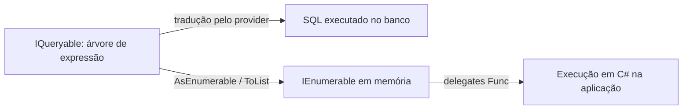

## Resumo

`IEnumerable<T>` representa uma sequência iterável em memória, executada como LINQ to Objects: a lógica roda em C#, na aplicação. `IQueryable<T>` representa uma consulta que pode ser traduzida para outra linguagem (tipicamente SQL) por meio de uma árvore de expressão, sendo executada pelo provedor (por exemplo, o EF Core no banco). A diferença importa porque escolher errado faz o filtro rodar no lugar errado: trazer a tabela inteira para a memória e filtrar em C# em vez de filtrar no banco.

## Explicação detalhada

Ambas expõem LINQ, mas o que acontece quando você encadeia `Where`, `Select` e afins é completamente diferente.

Com `IEnumerable<T>`, os operadores recebem delegates (`Func<T, bool>`) e executam código compilado, item a item, em memória. É LINQ to Objects. Se a fonte é uma lista de mil objetos já carregados, filtrar com `Where` percorre os mil em C#.

Com `IQueryable<T>`, os operadores recebem árvores de expressão (`Expression<Func<T, bool>>`), não delegates. A árvore é uma representação de dados do código (uma estrutura que descreve "comparar a propriedade Status com Ativo"), e não código já compilado. O provedor LINQ (EF Core) inspeciona essa árvore e a traduz para SQL. O filtro vira `WHERE` na consulta e roda no banco.

O ponto de virada é a fronteira. Enquanto você está em `IQueryable`, está montando uma consulta que ainda não rodou. No momento em que a sequência é enumerada (com `ToList`, `foreach`, `First`, `Count`, etc.) ou em que você a converte para `IEnumerable` (por exemplo, chamando `AsEnumerable()`), tudo que vem depois passa a rodar em memória.

### Deferred execution

Tanto `IEnumerable` quanto `IQueryable` usam execução adiada (deferred execution). Definir a consulta não a executa: ela só roda quando enumerada. Isso permite compor a consulta em partes. O contraponto é a enumeração múltipla: se você enumerar a mesma consulta `IQueryable` duas vezes, ela vai ao banco duas vezes; se enumerar uma sequência baseada em iterador duas vezes, o trabalho é refeito.

## Por baixo dos panos

A diferença está na assinatura dos operadores de extensão. `Enumerable.Where` recebe `Func<TSource, bool>`, um delegate executável. `Queryable.Where` recebe `Expression<Func<TSource, bool>>`, que o compilador C# materializa como uma árvore de expressão em vez de compilar para IL executável.

Um `IQueryable` carrega um `Expression` (a árvore acumulada) e um `IQueryProvider`. Cada operador adicional retorna um novo `IQueryable` com a árvore expandida. Quando a enumeração começa, o provider visita a árvore, traduz para o dialeto SQL do banco e executa. Por isso nem toda expressão C# é traduzível: se você chamar um método C# que o provider não sabe converter, ele lança ou (em versões antigas) avalia no cliente.

## Exemplos em C#

Filtro que roda no banco, o caminho correto com EF Core:

```csharp
public async Task<List<Order>> GetPendingAsync(decimal minTotal, CancellationToken ct)
{
    return await _db.Orders
        .Where(o => o.Status == OrderStatus.Pending && o.Total >= minTotal)
        .OrderBy(o => o.CreatedAt)
        .ToListAsync(ct);
}
```

Errado, materializa a tabela inteira e filtra em memória:

```csharp
public async Task<List<Order>> GetPendingWrongAsync(decimal minTotal, CancellationToken ct)
{
    var all = await _db.Orders.ToListAsync(ct);
    return all
        .Where(o => o.Status == OrderStatus.Pending && o.Total >= minTotal)
        .ToList();
}
```

A fronteira explícita com `AsEnumerable`, tudo após ela roda em C#:

```csharp
var result = _db.Orders
    .Where(o => o.Total > 100)
    .AsEnumerable()
    .Where(o => ExpensiveLocalRule(o))
    .ToList();
```

## Tradeoffs

- `IQueryable` empurra o trabalho para o banco: menos dados trafegando, uso de índices, agregação eficiente. O custo é que só expressões traduzíveis funcionam, e a tradução pode gerar SQL ineficiente se mal escrita.
- `IEnumerable` dá liberdade total de C# (qualquer método, qualquer lógica), mas exige que os dados já estejam em memória. Para grandes volumes filtrados, trazer tudo é proibitivo.
- Em assinaturas de método, expor `IQueryable` permite ao chamador continuar compondo a consulta antes de executá-la, mas vaza a responsabilidade de execução e mantém o DbContext vivo. Expor `IEnumerable` ou um tipo materializado encerra a consulta no repositório.

## Pegadinhas e erros comuns

- Chamar `ToList()` cedo demais e depois filtrar: o filtro vira memória, não SQL. Clássico de prova e de PR.
- Tipar a variável como `IEnumerable<T>` ao consultar EF Core: a partir daí o compilador resolve para `Enumerable`, não `Queryable`, e operadores seguintes rodam em memória mesmo que a fonte fosse `IQueryable`.
- Usar um método C# não traduzível dentro de um `Where` de `IQueryable`: gera exceção de tradução em tempo de execução.
- Enumerar a mesma `IQueryable` várias vezes sem perceber: cada enumeração é uma ida ao banco.
- Confundir deferred execution: acreditar que a consulta já rodou quando ainda é só uma definição.

## Quando usar e quando evitar

Use `IQueryable` enquanto a consulta deve ser traduzida e executada pelo banco, mantendo filtros, ordenação e projeção antes de materializar. Materialize com `ToListAsync` no ponto certo, geralmente na borda do repositório. Use `IEnumerable` para trabalhar com dados já em memória ou para lógica que não pode ser traduzida, sabendo que tudo virá para a aplicação. Evite expor `IQueryable` para fora da camada de dados se quiser controle sobre quando e como a consulta executa.

## Perguntas de auto-teste

1. Qual a diferença fundamental entre o que `Queryable.Where` e `Enumerable.Where` recebem?
<details><summary>Resposta</summary>Queryable.Where recebe uma Expression&lt;Func&lt;T,bool&gt;&gt; (árvore de expressão, dados que descrevem o código) traduzível para SQL; Enumerable.Where recebe um Func&lt;T,bool&gt; (delegate compilado) executado em memória.</details>

2. O que acontece se você chamar `.ToList()` antes de `.Where()` numa consulta EF Core?
<details><summary>Resposta</summary>A consulta é executada e a tabela (ou o resultado até ali) é trazida para a memória; o Where seguinte roda em C# como LINQ to Objects, não vira WHERE no SQL.</details>

3. O que é deferred execution?
<details><summary>Resposta</summary>A consulta não roda quando é definida, apenas quando é enumerada (ToList, foreach, First, Count). Permite compor a consulta antes de executá-la.</details>

4. Por que nem toda expressão funciona em um `IQueryable`?
<details><summary>Resposta</summary>Porque o provider precisa traduzir a árvore de expressão para SQL. Métodos C# que ele não sabe converter geram exceção de tradução em tempo de execução.</details>

5. Qual o risco de enumerar a mesma `IQueryable` duas vezes?
<details><summary>Resposta</summary>Cada enumeração dispara uma nova execução, ou seja, duas idas ao banco para a mesma consulta.</details>

6. O que faz `AsEnumerable()` no meio de uma consulta `IQueryable`?
<details><summary>Resposta</summary>Marca a fronteira: o que vem antes é traduzido e executado pelo provider; o que vem depois roda em memória como LINQ to Objects.</details>

## Diagrama



## Referências

- [IQueryable&lt;T&gt; (API reference)](https://learn.microsoft.com/en-us/dotnet/api/system.linq.iqueryable-1)
- [Language Integrated Query (LINQ)](https://learn.microsoft.com/en-us/dotnet/csharp/programming-guide/concepts/linq/)
- [Deferred execution example](https://learn.microsoft.com/en-us/dotnet/csharp/linq/standard-query-operators/deferred-execution-example)
