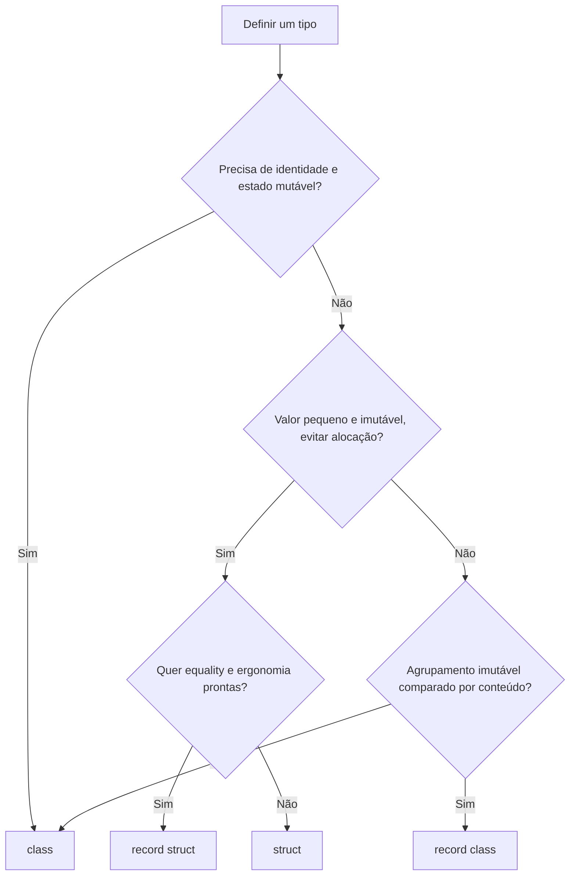

## Resumo

`class`, `struct` e `record` definem types, mas diferem em duas dimensões: semântica de value type versus referência e equality por referência versus por valor. `class` é tipo de referência com equality por referência. `struct` é value type (vive na stack ou inline) com value equality. `record` é açúcar do compilador que gera value equality e immutability convenientes, podendo ser `record class` (referência) ou `record struct` (value). Escolher certo afeta cópia, alocação e comparação.

## Explicação detalhada

**Tipo de referência (`class`)**: a variável guarda uma referência para um objeto no heap. Atribuir copia a referência, não o objeto, então duas variáveis apontam para o mesmo dado. Igualdade padrão (`==` e `Equals`) compara referências: dois objetos com os mesmos campos são diferentes a menos que você sobrescreva.

**Value type (`struct`)**: a variável contém o dado diretamente. Atribuir copia todos os campos. Structs vivem na stack quando são locais, ou inline dentro do objeto que as contém. Igualdade padrão de struct compara os campos (value equality), embora a implementação padrão use reflection e seja lenta se não sobrescrita.

**`record`**: a partir do C# 9, um `record` (que é `record class` por padrão) gera automaticamente: `Equals`/`GetHashCode` por valor, `ToString` legível, desconstrução, e o método `with` para criar cópias com alterações. A partir do C# 10 existe `record struct`, que é um value type com as mesmas conveniências. Records favorecem immutability via propriedades `init`.

A confusão comum: `record` não é uma terceira categoria de memória. Um `record class` continua sendo referência; um `record struct` continua sendo value. O que o `record` muda é a equality (vira por valor) e a ergonomia (with, ToString, desconstrução).

## Por baixo dos panos

Um `record class` é compilado para uma `class` normal com membros gerados: um `EqualityContract`, sobrescritas de `Equals(object)` e `Equals(OtherRecord)`, `GetHashCode` combinando os campos, operadores `==`/`!=`, um construtor de cópia protegido e o `with` que o usa. A equality compara o tipo e cada campo.

`struct` não tem herança (não pode derivar de outra struct nem servir de base), sempre deriva implicitamente de `System.ValueType`, e tem um construtor sem parâmetros que zera os campos. Boxing acontece quando uma struct é tratada como `object` ou interface: ela é copiada para o heap dentro de um objeto, o que custa alocação e anula parte da vantagem do value type.

`readonly struct` garante immutability no nível do tipo e permite ao compilador evitar cópias defensivas. `record struct` pode ser `readonly record struct` para o mesmo efeito.

## Exemplos em C#

Igualdade: class compara referência, record compara por valor:

```csharp
public class PointClass
{
    public int X { get; init; }
    public int Y { get; init; }
}

public record PointRecord(int X, int Y);

var a = new PointClass { X = 1, Y = 2 };
var b = new PointClass { X = 1, Y = 2 };
bool classEqual = a == b;

var c = new PointRecord(1, 2);
var d = new PointRecord(1, 2);
bool recordEqual = c == d;
```

`classEqual` é `false` (referências diferentes); `recordEqual` é `true` (mesmos valores).

Cópia não destrutiva com `with`:

```csharp
var original = new PointRecord(1, 2);
var moved = original with { Y = 10 };
```

`struct` é copiado na atribuição:

```csharp
public struct Money
{
    public decimal Amount { get; init; }
    public string Currency { get; init; }
}

var price = new Money { Amount = 10m, Currency = "BRL" };
var copy = price;
```

Alterar `copy` não afeta `price`, porque a atribuição copiou os campos.

## Tradeoffs

- `class`: ideal para entidades com identidade e estado mutável, objetos grandes e hierarquias com herança. Custo de alocação no heap e pressão no GC.
- `struct`: evita alocação para valores pequenos e de vida curta, melhora localidade de memória. Custo: cópia em cada passagem e risco de boxing. Recomendação oficial: structs até cerca de 16 bytes, imutáveis, que representam um único valor.
- `record class`: ótimo para DTOs, mensagens e value objects imutáveis onde value equality faz sentido. Mesma alocação de class.
- `record struct`: value object por valor com equality conveniente, sem alocação no heap, mas com as regras de cópia de struct.

## Pegadinhas e erros comuns

- Achar que `record` é value type. Não é: `record` padrão é `record class`, continua no heap.
- Usar struct grande e mutável: cópias frequentes e bugs de "alterei a cópia, não o original".
- Igualdade padrão de struct (sem sobrescrever) usa reflection e é lenta; em hot path, implemente `IEquatable<T>`.
- Boxing silencioso ao colocar struct em `object`, em coleção não genérica ou ao chamar método de interface, anulando a vantagem.
- Esperar que dois objetos `class` com campos iguais sejam iguais sem sobrescrever `Equals`/`GetHashCode`.
- Mutar uma propriedade de um `record` esperando immutability: use `init` e `with` para manter o valor imutável.

## Quando usar e quando evitar

Use `class` para entidades com identidade e ciclo de vida, agregados e serviços. Use `record` (class) para DTOs, events, comandos e value objects imutáveis onde comparar por conteúdo é natural. Use `struct` para valores pequenos, imutáveis e de alta frequência (coordenadas, dinheiro, identificadores) onde evitar alocação importa. Evite struct grande ou mutável, e evite `class` quando você só quer um agrupamento imutável de dados comparável por valor.

## Perguntas de auto-teste

1. `record` é value type ou de referência?
<details><summary>Resposta</summary>Depende: record (ou record class) é de referência; record struct é de value. O record por si só não muda a categoria de memória, muda a equality e a ergonomia.</details>

2. Por que dois objetos `class` com os mesmos campos não são iguais por padrão?
<details><summary>Resposta</summary>Porque a equality padrão de class compara referências, não conteúdo. Eles só seriam iguais se você sobrescrevesse Equals e GetHashCode.</details>

3. O que o `with` faz num record?
<details><summary>Resposta</summary>Cria uma nova instância copiando a original e aplicando as alterações indicadas, sem mutar a original (cópia não destrutiva).</details>

4. O que é boxing de uma struct e por que importa?
<details><summary>Resposta</summary>É copiar a struct para um objeto no heap quando ela é tratada como object ou interface. Importa porque gera alocação e anula a vantagem de ser value type.</details>

5. Qual o tamanho aproximado e a forma recomendada para uma struct?
<details><summary>Resposta</summary>Pequena (em torno de 16 bytes ou menos), imutável e representando um único valor lógico, segundo as diretrizes oficiais.</details>

6. Por que a equality padrão de uma struct pode ser lenta?
<details><summary>Resposta</summary>Porque ValueType.Equals usa reflection para comparar campos quando não há override. Implementar IEquatable&lt;T&gt; evita isso.</details>

## Diagrama



## Referências

- [Record types (C# reference)](https://learn.microsoft.com/en-us/dotnet/csharp/language-reference/builtin-types/record)
- [struct (C# reference)](https://learn.microsoft.com/en-us/dotnet/csharp/language-reference/keyword/struct)
- [Choosing between class and struct](https://learn.microsoft.com/en-us/dotnet/standard/design-guidelines/choosing-between-class-and-struct)
