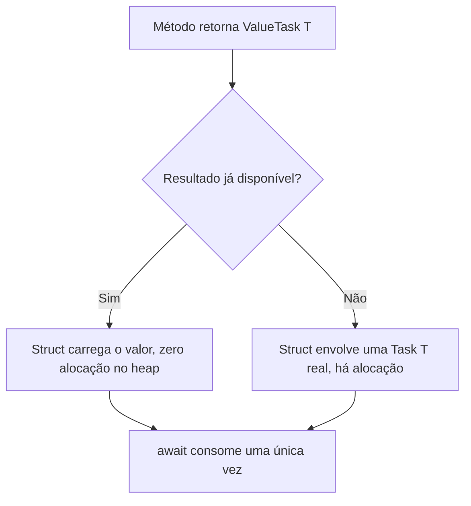

## Resumo

`Task<T>` é a representação padrão de uma operação assíncrona em .NET, mas é um tipo de referência e cada instância aloca no heap. `ValueTask<T>` é uma struct que pode representar um resultado já disponível sem alocar, servindo para reduzir pressão no Garbage Collector em métodos que frequentemente completam de forma síncrona. Importa em caminhos quentes (hot paths) chamados milhões de vezes, onde a alocação de uma `Task` por chamada vira custo mensurável.

## Explicação detalhada

`Task` e `Task<T>` são classes. Quando um método assíncrono retorna uma `Task`, mesmo que o resultado já esteja pronto, há (no caso geral) uma alocação no heap. O runtime otimiza alguns casos (por exemplo, `Task.CompletedTask` e tasks de booleanos/inteiros pequenos em cache), mas para um `Task<T>` de tipo arbitrário com valor já disponível, a alocação acontece.

`ValueTask<T>` é uma struct que encapsula uma de duas coisas: ou um resultado `T` já pronto (caminho síncrono, zero alocação), ou uma `Task<T>` de verdade (caminho assíncrono). A ideia é: se o método muitas vezes retorna um valor já em cache, devolva um `ValueTask<T>` que carrega o valor direto na struct, sem tocar no heap. Só quando realmente precisa esperar é que há a `Task` por baixo.

O cenário canônico é um método com cache: na maioria das chamadas o valor está em cache e retorna na hora; ocasionalmente há um cache miss que dispara I/O. Com `Task<T>`, toda chamada aloca. Com `ValueTask<T>`, só o cache miss aloca.

### As restrições do ValueTask

`ValueTask` troca alocação por regras de uso mais rígidas. Um `ValueTask`:

- Não pode ser aguardado (`await`) mais de uma vez. Uma `Task` pode ser aguardada várias vezes; um `ValueTask`, não, porque o objeto subjacente pode ser reciclado.
- Não pode ser aguardado concorrentemente por múltiplos consumidores.
- Não deve ter `.Result` acessado antes de a operação completar, nem ser bloqueado com `.GetAwaiter().GetResult()` exceto quando já se sabe que completou.
- Não deve ser armazenado em campo para consumo posterior repetido.

A regra prática: consuma um `ValueTask` exatamente uma vez, com um `await` direto. Se precisar de qualquer comportamento mais flexível (aguardar duas vezes, passar adiante, combinar com `WhenAll`), converta para `Task` com `.AsTask()` uma única vez e trabalhe com a `Task`.

## Por baixo dos panos

`ValueTask<T>` é um `readonly struct` que carrega três possibilidades internas: um valor `T`, um `Task<T>`, ou um `IValueTaskSource<T>`. Esse último é o que permite implementações de altíssima performance reaproveitarem o mesmo objeto fonte entre várias operações (é como `Socket` e pipelines fazem para evitar alocação até no caminho assíncrono).

Por ser struct, passar `ValueTask` por aí copia a struct. Aguardar duas vezes é perigoso justamente porque a segunda espera pode ler um `IValueTaskSource` que já foi resetado e reusado para outra operação, retornando resultado errado ou lançando exceção. Essa é a razão técnica das restrições, não uma escolha arbitrária.

## Exemplos em C#

Cache que frequentemente completa de forma síncrona, o caso de uso ideal:

```csharp
public ValueTask<Customer> GetCustomerAsync(int id, CancellationToken ct)
{
    if (_cache.TryGetValue(id, out var customer))
        return new ValueTask<Customer>(customer);

    return new ValueTask<Customer>(LoadFromDatabaseAsync(id, ct));
}

private async Task<Customer> LoadFromDatabaseAsync(int id, CancellationToken ct)
{
    var customer = await _repository.FindAsync(id, ct);
    _cache[id] = customer;
    return customer;
}
```

Consumo correto, um único await direto:

```csharp
var customer = await GetCustomerAsync(42, ct);
```

Errado, aguardando o mesmo ValueTask duas vezes:

```csharp
var pending = GetCustomerAsync(42, ct);
var a = await pending;
var b = await pending;
```

Correto quando precisa de flexibilidade, converta uma vez para Task:

```csharp
Task<Customer> task = GetCustomerAsync(42, ct).AsTask();
var a = await task;
var b = await task;
```

## Tradeoffs

- `Task` é o padrão certo na esmagadora maioria do código. É flexível, compõe com `WhenAll`/`WhenAny`, pode ser aguardada várias vezes e armazenada. A alocação raramente é o gargalo.
- `ValueTask` economiza alocação no caminho síncrono, mas adiciona regras de uso que, se violadas, causam bugs sutis e difíceis de rastrear. A struct também é maior que uma referência, então passá-la muito copia mais bytes.
- A recomendação oficial: use `Task` por padrão. Adote `ValueTask` apenas quando profiling mostrar que a alocação de `Task` em um método quente é significativa e o método com frequência completa de forma síncrona.

## Pegadinhas e erros comuns

- Aguardar um `ValueTask` duas vezes, ou guardá-lo em campo e aguardar depois: comportamento indefinido.
- Usar `ValueTask` em todo lugar "por performance" sem medir: acrescenta risco sem ganho, e a struct maior pode até piorar.
- Combinar `ValueTask` direto com `Task.WhenAll`: converta com `.AsTask()` primeiro.
- Acessar `.Result` de um `ValueTask` que ainda não completou: pode lançar ou retornar lixo. Em provas, a alternativa que diz "ValueTask pode ser aguardado múltiplas vezes como Task" é falsa.
- Esquecer que `ValueTask` (sem genérico) também existe, para métodos assíncronos que não retornam valor mas frequentemente completam síncronos.

## Quando usar e quando evitar

Use `ValueTask<T>` em métodos de API pública de alta frequência onde o caminho síncrono é comum (caches, buffers, leitura de stream já bufferizada) e o profiling confirma a economia. Evite em código de aplicação comum, em métodos que sempre fazem I/O de verdade (aí a `Task` por baixo existe de qualquer forma e você só ganhou restrições), e sempre que precisar da flexibilidade de `Task`.

## Perguntas de auto-teste

1. Por que `ValueTask<T>` pode evitar alocação onde `Task<T>` não evita?
<details><summary>Resposta</summary>Porque ValueTask é uma struct que pode carregar o resultado já pronto dentro de si, sem precisar alocar um objeto no heap. Só quando há trabalho assíncrono real é que existe uma Task por baixo.</details>

2. Cite duas restrições de uso do `ValueTask` que não existem na `Task`.
<details><summary>Resposta</summary>Não pode ser aguardado mais de uma vez e não deve ser armazenado para consumo repetido ou concorrente. A Task não tem essas restrições.</details>

3. Qual é o cenário ideal para `ValueTask<T>`?
<details><summary>Resposta</summary>Um método chamado com alta frequência que, na maioria das vezes, completa de forma síncrona (por exemplo, com valor em cache), e raramente cai num caminho assíncrono.</details>

4. Se você precisa aguardar o resultado duas vezes, o que fazer com um `ValueTask`?
<details><summary>Resposta</summary>Converter uma única vez para Task com .AsTask() e aguardar a Task quantas vezes precisar.</details>

5. `ValueTask` é sempre mais rápido que `Task`?
<details><summary>Resposta</summary>Não. Evita alocação no caminho síncrono, mas é uma struct maior (mais bytes ao copiar) e impõe restrições. Sem caminho síncrono frequente e sem medição, pode não trazer ganho.</details>

6. O que há internamente em um `ValueTask<T>`?
<details><summary>Resposta</summary>Uma de três coisas: um valor T já pronto, uma Task&lt;T&gt;, ou um IValueTaskSource&lt;T&gt; que permite reaproveitar o objeto fonte entre operações.</details>

## Diagrama



## Referências

- [ValueTask&lt;T&gt; (API reference)](https://learn.microsoft.com/en-us/dotnet/api/system.threading.tasks.valuetask-1)
- [Understanding the Whys, Whats, and Whens of ValueTask (Stephen Toub)](https://devblogs.microsoft.com/dotnet/understanding-the-whys-whats-and-whens-of-valuetask/)
