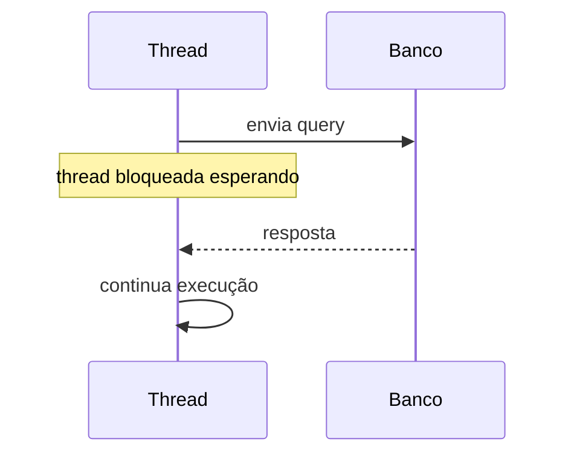
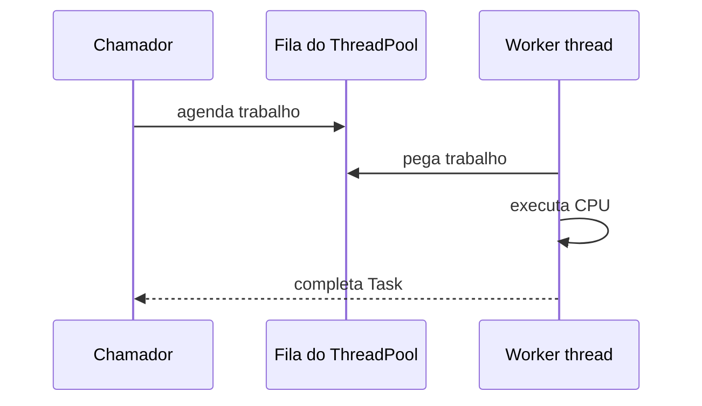
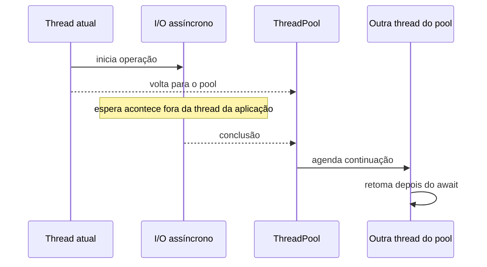
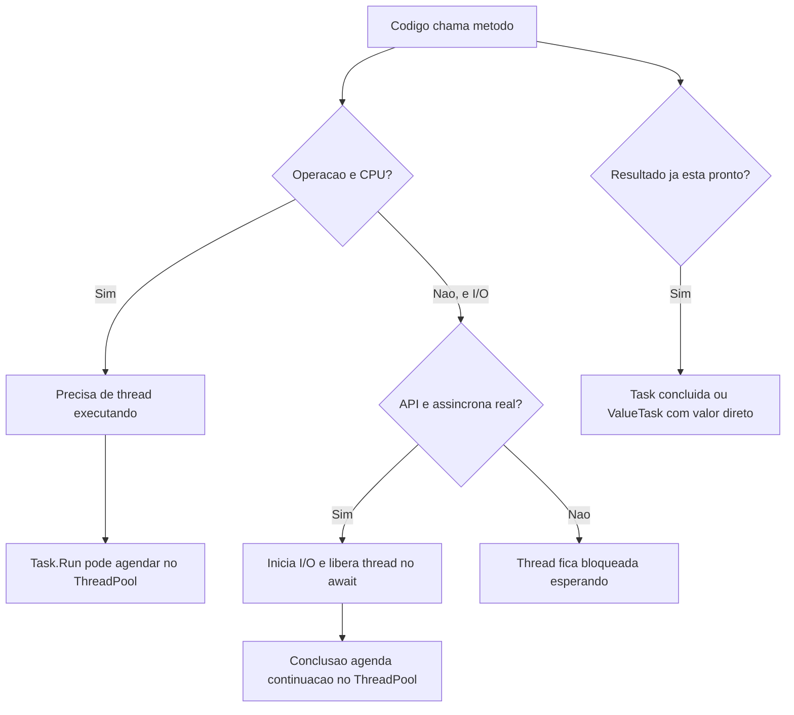

## Resumo

Uma thread é uma linha de execução dentro de um processo. Ela tem sua própria pilha de chamadas, registradores e ponto atual de execução, mas compartilha a memória do processo com outras threads. O `ThreadPool` é o conjunto gerenciado de threads reutilizáveis do .NET, usado para executar trabalho curto sem criar uma thread nova a cada operação.

`Task`, `ValueTask` e `async`/`await` não são threads. Eles são abstrações de operação assíncrona. Às vezes uma `Task` roda em uma thread do pool, como em `Task.Run`. Outras vezes ela representa uma espera de I/O, como database ou HTTP, em que nenhuma thread fica parada esperando. Entender essa diferença evita o erro clássico de achar que "async cria thread".

## Modelo mental em uma frase

Thread é o trabalhador que executa instruções. `Task` é o recibo de uma operação. `await` é o ponto em que o método diz: "se ainda não terminou, guarde onde parei e libere a thread". `ThreadPool` é a escala de trabalhadores reutilizáveis.

## O que é uma thread

Um processo é uma instância de um programa em execução. Ele possui memória própria, handles, código carregado e recursos do sistema operacional. Dentro desse processo podem existir várias threads.

Cada thread tem:

- Uma stack, onde ficam chamadas de método, parâmetros e variáveis locais que não foram promovidas para outro lugar.
- Um conjunto de registradores de CPU, incluindo o instruction pointer, que aponta para a próxima instrução a executar.
- Um estado, como executando, pronta para executar, bloqueada ou finalizada.
- Informações de agendamento usadas pelo sistema operacional.

As threads do mesmo processo compartilham o heap. Por isso duas threads podem acessar o mesmo objeto ao mesmo tempo. Isso é poderoso, mas perigoso: sem sincronização, surgem race conditions, leituras inconsistentes e bugs intermitentes.

### Fluxo de uma thread comum

Imagine uma thread executando este método:

```csharp
public Order GetOrder(int id)
{
    var order = _repository.Find(id);
    return order;
}
```

Enquanto `_repository.Find(id)` está consultando o database de forma síncrona, a thread fica bloqueada. Ela não usa CPU o tempo todo, mas continua ocupada. O sistema operacional a marca como bloqueada, tira essa thread da CPU e deixa outra rodar. Quando o database responde, a thread volta a ficar pronta para continuar.

O ponto importante: a thread ficou reservada para aquela espera. Em servidor, muitas esperas síncronas significam muitas threads presas sem fazer trabalho útil.

## Por baixo dos panos

Uma thread não é uma abstração leve. Criar uma thread envolve o sistema operacional, reserva de stack e estruturas de controle. Além disso, trocar de uma thread para outra tem custo.

Essa troca se chama context switch. De forma simplificada, o sistema operacional precisa:

1. Parar a thread atual.
2. Salvar seus registradores e estado.
3. Escolher outra thread pronta.
4. Restaurar os registradores da nova thread.
5. Continuar a execução de onde ela tinha parado.

Context switch é normal e necessário, mas não é grátis. Se uma aplicação cria threads demais, o sistema passa mais tempo alternando entre threads do que executando trabalho útil. Esse excesso também aumenta consumo de memória, pressão no scheduler e contenção em locks.

## ThreadPool

O `ThreadPool` existe para evitar o custo de criar e destruir threads repetidamente. Em vez de criar uma thread para cada trabalho pequeno, o .NET mantém um conjunto de threads reutilizáveis.

Quando você agenda trabalho no pool, a ideia é:

1. O trabalho entra em uma fila.
2. Uma thread livre do pool pega esse trabalho.
3. A thread executa o delegate.
4. Ao terminar, ela volta para o pool e pega outro trabalho.

Exemplo:

```csharp
ThreadPool.QueueUserWorkItem(_ =>
{
    ProcessBatch();
});
```

Na prática moderna, você raramente chama `ThreadPool.QueueUserWorkItem` diretamente. O caso mais comum é usar `Task.Run`, que agenda trabalho no `ThreadPool`:

```csharp
Task<int> task = Task.Run(() => CalculateReport());
int result = await task;
```

Aqui existe trabalho de CPU. Uma thread do pool executa `CalculateReport`. Isso é parallelism real: uma thread está rodando código.

### Como o pool cresce

O `ThreadPool` ajusta o número de threads dinamicamente. Ele observa throughput, quantidade de trabalho pendente e threads bloqueadas para decidir se deve adicionar mais threads. Esse ajuste não é instantâneo, porque criar threads agressivamente também piora o sistema.

Quando muitas threads do pool ficam bloqueadas em chamadas síncronas, pode ocorrer thread pool starvation: há trabalho na fila, mas poucas threads livres para executá-lo. Em ASP.NET Core isso aparece como latência alta, requisições enfileiradas e uso de CPU às vezes baixo, porque o problema não é falta de CPU, é falta de threads livres.

## Task não é thread

`Task` é uma representação de uma operação que pode terminar agora, terminar no futuro, falhar ou ser cancelada. Ela é um objeto de controle: permite aguardar, verificar status, encadear continuação e capturar exceção.

Uma `Task` pode representar coisas bem diferentes:

| Código | Existe thread executando durante a espera? | O que a Task representa |
| --- | --- | --- |
| `Task.Run(() => Calculate())` | Sim | Trabalho de CPU em uma thread do pool |
| `httpClient.GetAsync(url)` | Não durante a espera de rede | Operação de I/O pendente |
| `Task.FromResult(42)` | Não | Resultado já disponível |
| `Task.Delay(1000)` | Não | Timer que completará no futuro |

Essa tabela é a chave: `Task` não diz "tenho uma thread". Ela diz "tenho uma operação observável".

## async/await e threads

`async` habilita o compilador a transformar o método em uma máquina de estados. `await` marca um ponto em que o método pode ser suspenso sem bloquear a thread.

Considere:

```csharp
public async Task<Order> GetOrderAsync(int id, CancellationToken ct)
{
    var order = await _repository.FindAsync(id, ct);
    return order;
}
```

O fluxo é:

1. Uma thread entra no método.
2. O método chama `FindAsync`.
3. Se a operação já terminou, o método continua na mesma hora.
4. Se a operação não terminou, o `await` registra uma continuação.
5. O método retorna uma `Task<Order>` incompleta para o chamador.
6. A thread fica livre para executar outra coisa.
7. Quando o I/O termina, a continuação é agendada.
8. Alguma thread do pool retoma o método depois do `await`.

Repare no detalhe: a thread que começa o método não precisa ser a mesma que continua depois do `await`. Em ASP.NET Core, normalmente não existe exigência de voltar para a thread original.

### Fluxo em uma requisição ASP.NET Core

```csharp
[HttpGet("{id:int}")]
public async Task<ActionResult<OrderDto>> Get(int id, CancellationToken ct)
{
    var order = await _service.GetOrderAsync(id, ct);
    return Ok(order);
}
```

Um fluxo típico:

1. Kestrel recebe a requisição e agenda o processamento no `ThreadPool`.
2. Uma thread do pool executa o controller.
3. O controller chama o serviço.
4. O serviço inicia uma chamada assíncrona ao database.
5. O `await` encontra uma operação incompleta.
6. A thread volta para o pool.
7. O database responde.
8. O runtime agenda a continuação.
9. Uma thread do pool continua o método.
10. A resposta HTTP é escrita.

Durante a espera do database, nenhuma thread de aplicação fica dedicada àquela requisição. Esse é o ganho de escalabilidade.

## I/O assíncrono versus trabalho de CPU

Asynchrony brilha quando existe espera de I/O: database, HTTP, fila, arquivo, socket. Nesses casos, o sistema operacional ou o runtime avisa quando a operação termina, e a aplicação não precisa manter uma thread parada.

Trabalho de CPU é diferente. Se você precisa calcular hash, gerar relatório pesado, comprimir arquivo ou processar image, alguma thread precisa executar instruções. `async` não remove esse custo.

Errado em servidor:

```csharp
public async Task<Order> GetOrderAsync(int id)
{
    return await Task.Run(() => _repository.Find(id));
}
```

Isso apenas pega uma chamada bloqueante e joga em outra thread do pool. A requisição libera a thread original, mas ocupa outra. Em carga alta, esse padrão piora starvation.

Melhor:

```csharp
public async Task<Order?> GetOrderAsync(int id, CancellationToken ct)
{
    return await _repository.FindAsync(id, ct);
}
```

Aqui o driver de database precisa oferecer I/O assíncrono real.

## ValueTask e threads

`ValueTask<T>` também não é thread. Ele é uma alternativa a `Task<T>` para reduzir alocação quando o resultado frequentemente já está disponível.

Exemplo:

```csharp
public ValueTask<User> GetCurrentUserAsync(CancellationToken ct)
{
    if (_cache.TryGetValue("current-user", out User? user))
        return ValueTask.FromResult(user);

    return new ValueTask<User>(LoadCurrentUserAsync(ct));
}
```

No cache hit, não existe thread nova, `Task` nova ou I/O. O valor já está ali. No cache miss, a `ValueTask` encapsula uma operação assíncrona real.

A correlação com thread é a mesma de `Task`: o que importa é o tipo de operação por baixo. Se for CPU, precisa de thread. Se for I/O assíncrono, a thread é liberada durante a espera. Se já completou, nenhuma thread extra entra na história.

## Fluxos comparados

### 1. Chamada síncrona bloqueante

```csharp
var order = repository.Find(id);
```



Bom para código simples e pequeno fora de servidor. Ruim para servidor sob carga quando a espera é longa ou frequente.

### 2. Task.Run com CPU

```csharp
var result = await Task.Run(() => Calculate());
```



Útil em aplicações de UI para não travar a tela. Em ASP.NET Core, use com muito critério, porque o servidor já está no `ThreadPool`.

### 3. I/O assíncrono com await

```csharp
var order = await repository.FindAsync(id, ct);
```



Esse é o cenário ideal para `async`/`await` em servidores.

## Pegadinhas e erros comuns

- Achar que cada `Task` cria uma thread. Não cria.
- Usar `Task.Run` para transformar I/O síncrono em API assíncrona em servidor. Isso troca uma thread bloqueada por outra thread bloqueada.
- Bloquear com `.Result`, `.Wait()` ou `.GetAwaiter().GetResult()` dentro de código assíncrono. Isso prende uma thread e pode causar deadlock ou starvation.
- Criar `new Thread(...)` para trabalho curto. Prefira `Task.Run` ou APIs assíncronas reais.
- Aumentar `ThreadPool.SetMinThreads` como primeira solução. Pode mascarar starvation, mas não remove a causa: bloqueio síncrono ou trabalho longo no pool.
- Usar `Thread.Sleep` em código assíncrono. Use `await Task.Delay(...)`.
- Compartilhar estado mutável entre threads sem `lock`, `SemaphoreSlim`, `ConcurrentDictionary`, canais ou outro mecanismo adequado.

## Quando usar cada coisa

Use `async`/`await` para I/O assíncrono: database, HTTP, messaging, arquivos e timers. Use `Task` como retorno padrão de operações assíncronas. Use `ValueTask` só quando houver caminho síncrono frequente e medição indicando que alocação de `Task` pesa.

Use `Task.Run` para trabalho de CPU quando faz sentido deslocar esse trabalho para o `ThreadPool`, especialmente em aplicações desktop/UI. Em servidor, prefira deixar o request pipeline livre de trabalho pesado; se o processamento for caro, considere fila, worker service, processamento em background ou outra architecture.

Use `Thread` diretamente apenas quando precisar de controle explícito de uma thread dedicada e longa, com nome, prioridade, afinidade operacional ou loop próprio. Isso é incomum em aplicações web modernas.

## Perguntas de auto-teste

1. Uma `Task` sempre usa uma thread?
<details><summary>Resposta</summary>Não. Uma Task representa uma operação. Ela pode ser trabalho em uma thread do pool, I/O pendente, timer ou resultado já concluído.</details>

2. O que acontece com a thread quando um `await` aguarda I/O assíncrono ainda não concluído?
<details><summary>Resposta</summary>O método registra uma continuação, retorna uma Task incompleta ao chamador e libera a thread. Quando o I/O termina, a continuação é agendada no runtime.</details>

3. Por que chamada síncrona de database pode prejudicar escalabilidade?
<details><summary>Resposta</summary>Porque a thread fica bloqueada esperando a resposta. Com muitas requisições simultâneas, várias threads ficam presas e o ThreadPool pode não ter threads livres para novos trabalhos.</details>

4. `Task.Run` torna uma operação de I/O realmente assíncrona?
<details><summary>Resposta</summary>Não. Ele apenas executa a operação em uma thread do pool. Se a operação interna bloqueia, essa thread continua bloqueada.</details>

5. Depois de um `await`, o código continua necessariamente na mesma thread?
<details><summary>Resposta</summary>Não. Em ASP.NET Core, normalmente a continuação pode rodar em qualquer thread disponível do ThreadPool.</details>

6. Qual é a diferença essencial entre CPU-bound e I/O-bound?
<details><summary>Resposta</summary>CPU-bound precisa de uma thread executando instruções. I/O-bound passa boa parte do tempo esperando recurso externo, e pode liberar a thread se usar API assíncrona real.</details>

7. Quando faz sentido usar `ValueTask<T>`?
<details><summary>Resposta</summary>Quando o método é chamado com alta frequência, muitas vezes completa de forma síncrona e profiling mostra que evitar alocações de Task traz ganho real.</details>

## Diagrama geral



## Referências

- [Threads and threading](https://learn.microsoft.com/en-us/dotnet/standard/threading/threads-and-threading)
- [The managed thread pool](https://learn.microsoft.com/en-us/dotnet/standard/threading/the-managed-thread-pool)
- [ThreadPool Class](https://learn.microsoft.com/en-us/dotnet/api/system.threading.threadpool)
- [Task-based asynchronous pattern](https://learn.microsoft.com/en-us/dotnet/standard/asynchronous-programming-patterns/task-based-asynchronous-pattern-tap)
- [How async/await really works (Stephen Toub)](https://devblogs.microsoft.com/dotnet/how-async-await-really-works/)
