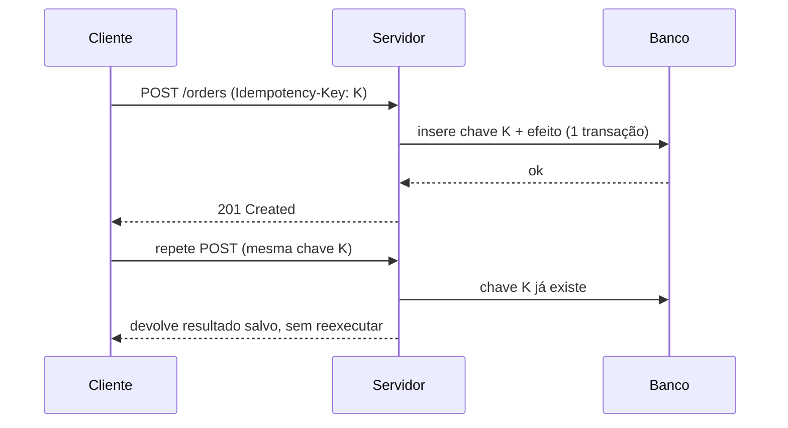

## Resumo

Uma operação é idempotente quando executá-la várias vezes produz o mesmo efeito que executá-la uma única vez. Em sistemas distribuídos isso é essencial porque mensagens são reentregues e requisições são repetidas: sem idempotency, um retry pode cobrar duas vezes, criar pedidos duplicados ou corromper estado. A técnica central é detectar e descartar repetições por meio de uma chave de idempotency.

## Explicação detalhada

Retries são inevitáveis. Um cliente que não recebe resposta não sabe se a operação falhou antes ou depois de ter efeito, então repete. Um broker com delivery at-least-once reentrega a mensagem após falha de confirmação (ver [delivery semantics](../05-messaging-distributed-systems/delivery-semantics.md)). A questão não é evitar a repetição, é torná-la segura.

**Idempotency natural**: algumas operações já são idempotentes por natureza. Definir um valor (`status = pago`) é idempotente; aplicar duas vezes dá o mesmo resultado. Já incrementar (`saldo += 10`) não é: aplicar duas vezes dobra o efeito.

**Métodos HTTP**: por especificação, `GET`, `PUT` e `DELETE` são idempotentes; `POST` não é. `PUT /recurso/42` com o mesmo corpo repetido leva ao mesmo estado. `POST /pedidos` repetido cria dois pedidos, a menos que você adicione idempotency explícita.

**Chave de idempotency**: para tornar idempotente uma operação que não é, o cliente envia um identificador único da intenção (por exemplo, no header `Idempotency-Key`). O servidor registra essa chave junto ao resultado. Se a mesma chave chegar de novo, ele não reexecuta: devolve o resultado já gravado. A chave precisa ser persistida de forma atômica com o efeito da operação, senão há janela de corrida.

**Idempotency em consumidores de mensagem**: o consumidor guarda os IDs de mensagens já processadas (uma tabela de deduplicação) e ignora repetições. Combinado com [Outbox](outbox-pattern.md) no produtor, é a base do processamento confiável.

## Por baixo dos panos

A garantia depende de atomicidade entre verificar a chave, gravar o resultado e aplicar o efeito. Se o efeito (gravar o pedido) e o registro da chave forem feitos em transações separadas, uma falha entre eles deixa o sistema inconsistente: efeito aplicado sem chave registrada (reexecuta) ou chave registrada sem efeito (perde a operação).

A forma robusta usa uma única transação no database: dentro dela, tenta inserir a chave em uma tabela com restrição de unicidade e aplica o efeito. Se a inserção da chave violar a unicidade, a operação já foi processada, então faz rollback (ou retorna o resultado salvo). A restrição de unicidade no database é o que serializa requisições concorrentes com a mesma chave, evitando duas execuções simultâneas.

Há ainda o custo de armazenamento: a tabela de chaves cresce. Define-se um TTL (por exemplo, manter chaves por 24 horas ou 7 dias), suficiente para cobrir a janela de retries esperada.

## Exemplos em C#

Consumidor idempotente com tabela de deduplicação, tudo em uma transação:

```csharp
public async Task HandleAsync(PaymentMessage message, CancellationToken ct)
{
    await using var tx = await _db.Database.BeginTransactionAsync(ct);

    bool alreadyProcessed = await _db.ProcessedMessages
        .AnyAsync(m => m.MessageId == message.Id, ct);

    if (alreadyProcessed)
    {
        await tx.CommitAsync(ct);
        return;
    }

    _db.ProcessedMessages.Add(new ProcessedMessage(message.Id, DateTimeOffset.UtcNow));
    _db.Payments.Add(new Payment(message.OrderId, message.Amount));

    await _db.SaveChangesAsync(ct);
    await tx.CommitAsync(ct);
}
```

Endpoint com chave de idempotency via header:

```csharp
app.MapPost("/orders", async (
    [FromHeader(Name = "Idempotency-Key")] string key,
    CreateOrder command,
    IOrderService service,
    CancellationToken ct) =>
{
    var existing = await service.FindByIdempotencyKeyAsync(key, ct);
    if (existing is not null)
        return Results.Ok(existing);

    var order = await service.CreateAsync(key, command, ct);
    return Results.Created($"/orders/{order.Id}", order);
});
```

## Tradeoffs

- Idempotency torna retries seguros e simplifica a recuperação de falhas, ao custo de armazenamento e lógica de deduplicação.
- Operações naturalmente idempotentes (set, upsert determinístico) evitam toda a infraestrutura de chaves; vale modelar a operação para ser idempotente quando possível.
- A tabela de chaves precisa de TTL e limpeza, senão cresce indefinidamente.
- A atomicidade exige que efeito e registro de chave compartilhem a mesma transação, o que limita arranjos onde o efeito está em outro sistema (aí entram Outbox e saga).

## Pegadinhas e erros comuns

- Registrar a chave em transação separada do efeito: abre janela de inconsistência sob falha.
- Confiar que `POST` é idempotente: não é, por especificação. Sem chave explícita, repetição cria duplicata.
- Usar como chave algo não único ou gerado no servidor: a chave deve vir do cliente e identificar a intenção, estável entre os retries.
- Esquecer da concorrência: duas requisições simultâneas com a mesma chave. Sem restrição de unicidade no database, ambas passam na verificação e executam.
- Tornar idempotente só o caminho feliz, ignorando que a resposta original também precisa ser devolvida em repetições.
- Confundir idempotency com exactly-once: idempotency no consumidor é justamente como se obtém efeito exactly-once sobre delivery at-least-once.

## Quando usar e quando evitar

Use idempotency em toda operação que altera estado e pode ser repetida: endpoints de escrita expostos a clientes com retry, consumidores de filas at-least-once, webhooks. Prefira modelar operações como naturalmente idempotentes. A leitura pura (`GET`) já é idempotente e não precisa de chave. Evite o overhead de chaves para operações internas comprovadamente executadas uma única vez, mas em dúvida, em sistema distribuído, assuma que haverá repetição.

## Perguntas de auto-teste

1. O que significa uma operação ser idempotente?
<details><summary>Resposta</summary>Executá-la várias vezes produz o mesmo efeito que executá-la uma vez. Repetições não alteram o resultado final.</details>

2. Quais métodos HTTP são idempotentes por especificação e qual não é?
<details><summary>Resposta</summary>GET, PUT e DELETE são idempotentes; POST não é.</details>

3. Por que registrar a chave de idempotency e aplicar o efeito devem ocorrer na mesma transação?
<details><summary>Resposta</summary>Para evitar janela de inconsistência: se forem separados, uma falha entre eles pode aplicar o efeito sem registrar a chave (reexecuta) ou registrar a chave sem aplicar o efeito (perde a operação).</details>

4. Como tratar duas requisições concorrentes com a mesma chave?
<details><summary>Resposta</summary>Com uma restrição de unicidade no database sobre a chave, que serializa as inserções: apenas uma insere e executa, a outra detecta a duplicata.</details>

5. Qual a relação entre idempotency e delivery at-least-once?
<details><summary>Resposta</summary>Idempotency no consumidor neutraliza as reentregas do at-least-once, produzindo efeito equivalente a exactly-once.</details>

6. `saldo += 10` é idempotente? E `status = pago`?
<details><summary>Resposta</summary>O incremento não é (repetir soma de novo); a atribuição é (repetir leva ao mesmo estado).</details>

## Diagrama



## Referências

- [Idempotent (MDN Glossary)](https://developer.mozilla.org/en-US/docs/Glossary/Idempotent)
- [Mission-critical data platform (Azure Architecture)](https://learn.microsoft.com/en-us/azure/architecture/reference-architectures/containers/aks-mission-critical/mission-critical-data-platform)
