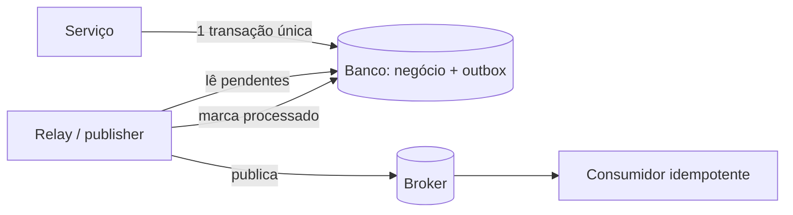

## Resumo

O Outbox pattern resolve o problema do dual-write: salvar dados no database e publicar uma mensagem em um broker são duas operações em sistemas distintos que não compartilham transação, então uma pode falhar deixando o sistema inconsistente. A solução é gravar a mensagem em uma tabela outbox dentro da mesma transação do database, e um processo separado lê essa tabela e publica no broker. Importa para garantir que evento e estado nunca divirjam.

## Explicação detalhada

O problema central: ao processar um pedido, você quer (1) gravar o pedido no database e (2) publicar um evento `OrderCreated` no broker. Se gravar no database e o broker cair antes de publicar, o estado existe mas ninguém é notificado. Se publicar primeiro e a gravação falhar, notificou-se algo que não aconteceu. Não há transação distribuída barata entre database e broker que resolva isso de forma confiável, e mesmo two-phase commit traz custos e fragilidade.

O Outbox transforma dois sistemas em um. A escrita de negócio e o registro da mensagem ocorrem na **mesma transação do database**, em uma tabela `outbox`. Como é uma transação local única, ou as duas acontecem ou nenhuma. O evento agora está garantidamente persistido junto ao estado.

Um componente separado, o **relay** ou **publisher**, lê as linhas pendentes da tabela outbox e as publica no broker, marcando-as como enviadas após a confirmação. Há duas formas de implementar o relay:

- **Polling publisher**: um worker consulta periodicamente a tabela por mensagens não enviadas e as publica.
- **Change Data Capture (CDC)**: tools como Debezium leem o log de transações do database e emitem as mudanças, sem polling.

Como o relay pode falhar entre publicar e marcar como enviado, a delivery é **at-least-once**: a mesma mensagem pode ser publicada mais de uma vez. Por isso o consumidor precisa ser idempotente (ver [idempotency](idempotency.md)). Outbox garante "pelo menos uma vez", idempotency no consumidor completa o efeito "exatamente uma vez".

## Por baixo dos panos

A tabela outbox guarda tipicamente: id da mensagem, tipo do evento, payload serializado, timestamp de criação e status ou timestamp de processamento. O id da mensagem é o que o consumidor usa para deduplicar.

A garantia depende de a inserção na outbox estar na mesma transação que a mudança de negócio. Em EF Core, isso significa adicionar a entidade outbox ao mesmo `DbContext` e chamar um único `SaveChanges`, ou abrir uma transação explícita envolvendo ambos.

O relay deve lidar com concorrência: se houver várias instâncias, duas podem pegar a mesma linha. Soluções incluem `SELECT ... FOR UPDATE SKIP LOCKED` no PostgreSQL (cada worker trava e pula linhas já travadas) ou processamento ordenado por uma única instância. A ordem de publicação pode importar; muitos relays publicam por ordem de criação para preservar a sequência de events por agregado.

## Exemplos em C#

Gravar negócio e outbox na mesma transação:

```csharp
public async Task CreateOrderAsync(CreateOrder command, CancellationToken ct)
{
    var order = Order.Create(command.CustomerId, command.Items);
    _db.Orders.Add(order);

    var @event = new OutboxMessage(
        Id: Guid.NewGuid(),
        Type: nameof(OrderCreated),
        Payload: JsonSerializer.Serialize(new OrderCreated(order.Id, order.CustomerId)),
        CreatedAt: DateTimeOffset.UtcNow);
    _db.Outbox.Add(@event);

    await _db.SaveChangesAsync(ct);
}
```

Relay com polling e bloqueio que pula linhas travadas (PostgreSQL):

```csharp
public async Task PublishPendingAsync(CancellationToken ct)
{
    await using var tx = await _db.Database.BeginTransactionAsync(ct);

    var pending = await _db.Outbox
        .FromSqlRaw(
            "SELECT * FROM outbox WHERE processed_at IS NULL " +
            "ORDER BY created_at LIMIT 100 FOR UPDATE SKIP LOCKED")
        .ToListAsync(ct);

    foreach (var message in pending)
    {
        await _broker.PublishAsync(message.Type, message.Payload, message.Id, ct);
        message.MarkProcessed(DateTimeOffset.UtcNow);
    }

    await _db.SaveChangesAsync(ct);
    await tx.CommitAsync(ct);
}
```

## Tradeoffs

- Outbox garante consistência entre estado e events sem transação distribuída, usando só a transação local do database. É a solução padrão para publicação confiável de events.
- O custo é latência adicional (o relay publica depois) e infraestrutura extra (tabela, worker ou CDC, limpeza das linhas processadas).
- Entrega at-least-once exige consumidores idempotentes, o que adiciona complexidade do outro lado.
- Polling consome o database periodicamente; CDC evita isso mas adiciona uma ferramenta e dependência do log do database.

## Pegadinhas e erros comuns

- Fazer dual-write direto (salvar e publicar em operações separadas) achando que "quase nunca falha": é exatamente a inconsistência que o Outbox previne.
- Inserir na outbox fora da transação de negócio: perde a garantia atômica, voltando ao problema original.
- Esquecer a idempotency no consumidor: como a delivery é at-least-once, events repetidos causarão efeito duplicado.
- Não limpar a tabela outbox: ela cresce indefinidamente; defina retenção e remova mensagens já processadas.
- Múltiplas instâncias do relay sem controle de concorrência: publicam a mesma mensagem em paralelo (mais duplicatas e possível desordem).
- Ignorar a ordem quando ela importa para o consumidor.

## Quando usar e quando evitar

Use Outbox sempre que precisar publicar events de forma confiável a partir de uma mudança de estado no database, que é o caso típico em arquiteturas orientadas a events e em [sagas](saga.md). Evite quando não há publicação de events (operação puramente local) ou quando a perda ocasional de uma notificação é aceitável e o custo do Outbox não se justifica. Nunca substitua Outbox por dual-write direto quando a consistência importa.

## Perguntas de auto-teste

1. Qual problema o Outbox pattern resolve?
<details><summary>Resposta</summary>O dual-write: salvar no database e publicar no broker são operações em sistemas distintos sem transação compartilhada, então uma pode falhar deixando estado e evento inconsistentes.</details>

2. Por que gravar a mensagem na mesma transação do database resolve isso?
<details><summary>Resposta</summary>Porque vira uma única transação local: ou a mudança de negócio e o registro da mensagem são confirmados juntos, ou nenhum é. O evento fica garantidamente persistido com o estado.</details>

3. O que é o relay e quais formas ele pode ter?
<details><summary>Resposta</summary>É o processo que lê a tabela outbox e publica no broker. Pode ser um polling publisher (consulta periódica) ou usar Change Data Capture lendo o log de transações do database.</details>

4. Qual delivery semantics o Outbox oferece e o que isso exige do consumidor?
<details><summary>Resposta</summary>At-least-once: a mesma mensagem pode ser publicada mais de uma vez se o relay falhar entre publicar e marcar como enviada. Exige consumidores idempotentes.</details>

5. Como evitar que múltiplas instâncias do relay publiquem a mesma linha?
<details><summary>Resposta</summary>Com controle de concorrência, por exemplo SELECT ... FOR UPDATE SKIP LOCKED no PostgreSQL, fazendo cada worker travar e pular linhas já travadas.</details>

6. Por que não basta salvar no database e depois publicar no broker em sequência?
<details><summary>Resposta</summary>Porque uma falha entre as duas operações deixa o sistema inconsistente: estado sem evento ou evento sem estado. Não há atomicidade entre os dois sistemas.</details>

## Diagrama



## Referências

- [Transactional Outbox pattern (Azure Architecture)](https://learn.microsoft.com/en-us/azure/architecture/best-practices/transactional-outbox-cosmos)
- [Transactional outbox (microservices.io)](https://microservices.io/patterns/data/transactional-outbox.html)
