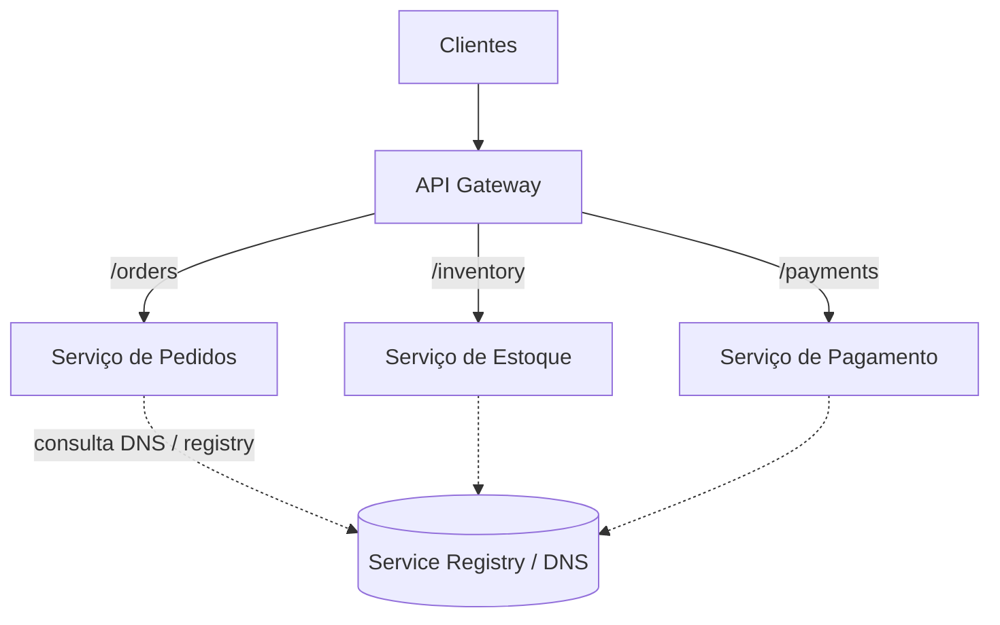

## Resumo

Um API Gateway é um ponto de entrada único que fica entre os clientes e os microsserviços, roteando requisições e centralizando preocupações transversais (autenticação, rate limiting, TLS, agregação). Service discovery é o mecanismo que permite aos serviços encontrarem uns aos outros sem endereços fixos, já que instâncias sobem, descem e mudam de IP dinamicamente. Juntos resolvem o roteamento em sistemas distribuídos e elásticos.

## Explicação detalhada

**API Gateway**: sem ele, cada cliente precisaria conhecer o endereço de cada serviço e lidar com autenticação, retries e versões em cada um. O gateway concentra isso. Funções típicas:

- Roteamento de requisições para o serviço correto por caminho ou host.
- Autenticação e autorização na borda, evitando repetir em cada serviço.
- Rate limiting, throttling e proteção contra abuso.
- Terminação de TLS.
- Agregação de respostas de vários serviços em uma só (reduz idas e voltas do cliente).
- Observabilidade centralizada (logs, métricas, correlação).

Um padrão relacionado é o **Backend for Frontend (BFF)**: um gateway por tipo de cliente (web, mobile), cada um moldando as respostas às necessidades daquele frontend. Em .NET, YARP (Yet Another Reverse Proxy) é a base comum para construir gateways customizados; Ocelot é outra opção. Em nuvem, há Azure API Management e gateways gerenciados.

**Service discovery**: instâncias de serviço são efêmeras (escalam, reiniciam, mudam de IP). Endereços fixos não funcionam. Há dois modelos:

- **Client-side discovery**: o cliente consulta um registro de serviços (service registry) e escolhe uma instância, fazendo o balanceamento ele mesmo.
- **Server-side discovery**: o cliente chama um endereço estável (load balancer ou DNS do serviço) que consulta o registro e encaminha. O cliente não conhece as instâncias.

O **service registry** mantém o catálogo de instâncias saudáveis, alimentado por health checks. Em Kubernetes, isso é embutido: cada `Service` ganha um nome DNS estável e o kube-proxy distribui para os Pods saudáveis (ver [objetos do Kubernetes](../06-docker-k8s-cicd-azure/objetos-kubernetes.md)), tornando o discovery transparente.

## Por baixo dos panos

Em Kubernetes, criar um `Service` registra um nome DNS interno (por exemplo, `inventory.default.svc.cluster.local`). Quando um serviço chama esse nome, o DNS resolve para um IP virtual estável (ClusterIP), e o kube-proxy faz o balanceamento para os Pods atrás do Service, removendo automaticamente os que falham nos health checks. É server-side discovery embutido na plataforma, por isso muitos times em Kubernetes não precisam de um registry separado como Consul ou Eureka.

Um gateway baseado em YARP mantém uma tabela de rotas (match por path/host) e clusters (conjuntos de destinos). Ele pode integrar resiliência (timeout, retry, circuit breaker, ver [circuit breaker e retry](circuit-breaker-retry.md)) e descobrir destinos dinamicamente a partir do DNS do Kubernetes ou de um registry.

Health checks alimentam tanto o discovery quanto o gateway: instâncias que falham são retiradas do balanceamento, e o gateway para de encaminhar para elas.

## Exemplos em C#

Gateway mínimo com YARP, configurado por arquivo:

```csharp
var builder = WebApplication.CreateBuilder(args);

builder.Services.AddReverseProxy()
    .LoadFromConfig(builder.Configuration.GetSection("ReverseProxy"));

var app = builder.Build();
app.MapReverseProxy();
app.Run();
```

Configuração de rota e cluster (appsettings.json):

```json
{
  "ReverseProxy": {
    "Routes": {
      "orders-route": {
        "ClusterId": "orders-cluster",
        "Match": { "Path": "/orders/{**catch-all}" }
      }
    },
    "Clusters": {
      "orders-cluster": {
        "Destinations": {
          "d1": { "Address": "http://orders.default.svc.cluster.local/" }
        }
      }
    }
  }
}
```

O destino usa o nome DNS do Service do Kubernetes, então o discovery e o balanceamento ficam a cargo da plataforma.

## Tradeoffs

- O gateway centraliza preocupações transversais e simplifica os clientes, mas vira um ponto único que precisa ser altamente disponível e pode tornar-se gargalo se sobrecarregado de lógica.
- Colocar muita regra de negócio no gateway o transforma em um novo monólito disfarçado; ele deve cuidar de roteamento e cross-cutting, não de domínio.
- Client-side discovery dá controle de balanceamento ao cliente, mas espalha a lógica de discovery em cada serviço. Server-side centraliza e simplifica os clientes, ao custo de uma camada extra.
- Discovery embutido (Kubernetes) reduz infraestrutura, mas amarra o discovery à plataforma.

## Pegadinhas e erros comuns

- Colocar lógica de negócio no gateway: ele deve rotear e tratar preocupações transversais, não decidir regras de domínio.
- Hardcodar IPs ou endereços de instâncias: quebram quando as instâncias escalam ou reiniciam. Use nomes estáveis e discovery.
- Esquecer health checks: o discovery e o gateway continuam encaminhando para instâncias mortas.
- Tornar o gateway um ponto único de falha sem redundância.
- Em Kubernetes, montar um registry externo desnecessário quando o Service DNS já resolve o discovery.
- Confundir gateway (entrada norte-sul, cliente para serviços) com service mesh (comunicação leste-oeste, serviço a serviço), que resolvem problemas diferentes.

## Quando usar e quando evitar

Use um API Gateway quando há vários serviços expostos a clientes externos e você quer centralizar autenticação, TLS, rate limiting e roteamento; use BFF quando diferentes clientes precisam de respostas moldadas de forma distinta. Use service discovery sempre que instâncias forem dinâmicas, preferindo o discovery embutido da plataforma quando rodar em Kubernetes. Evite gateway para um único serviço simples, e evite empilhar lógica de domínio nele.

## Perguntas de auto-teste

1. Quais preocupações um API Gateway centraliza?
<details><summary>Resposta</summary>Roteamento, autenticação e autorização na borda, rate limiting, terminação de TLS, agregação de respostas e observabilidade, tirando essas responsabilidades de cada serviço e dos clientes.</details>

2. Por que service discovery é necessário em microsserviços?
<details><summary>Resposta</summary>Porque instâncias são efêmeras (escalam, reiniciam, mudam de IP), então endereços fixos não funcionam. O discovery permite localizar instâncias saudáveis dinamicamente.</details>

3. Qual a diferença entre client-side e server-side discovery?
<details><summary>Resposta</summary>No client-side o cliente consulta o registry e escolhe a instância, balanceando ele mesmo. No server-side o cliente chama um endereço estável que consulta o registry e encaminha, sem conhecer as instâncias.</details>

4. Como o Kubernetes resolve o discovery?
<details><summary>Resposta</summary>Cada Service ganha um nome DNS estável que resolve para um IP virtual; o kube-proxy balanceia para os Pods saudáveis atrás dele, removendo os que falham nos health checks. É server-side discovery embutido.</details>

5. Qual o risco de colocar lógica de negócio no gateway?
<details><summary>Resposta</summary>Transformá-lo em um monólito disfarçado e em gargalo, misturando responsabilidades de domínio com as de roteamento e borda.</details>

6. Qual a diferença entre API Gateway e service mesh?
<details><summary>Resposta</summary>O gateway trata o tráfego norte-sul (clientes externos para serviços); o service mesh trata o tráfego leste-oeste (serviço a serviço) com sidecars, resolvendo problemas diferentes.</details>

## Diagrama



## Referências

- [Gateway pattern (Azure microservices)](https://learn.microsoft.com/en-us/azure/architecture/microservices/design/gateway)
- [API Gateway pattern (microservices.io)](https://microservices.io/patterns/apigateway.html)
- [Server-side service discovery (microservices.io)](https://microservices.io/patterns/server-side-discovery.html)
