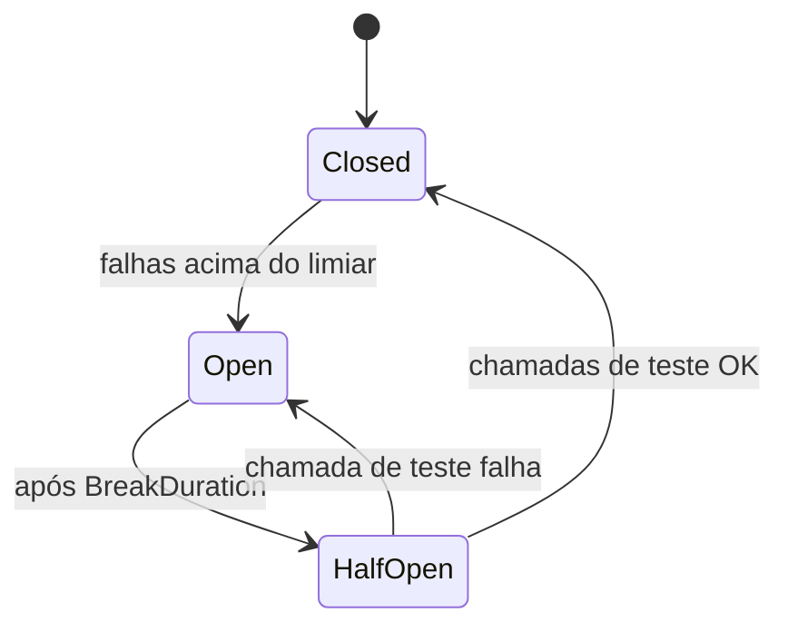

## Resumo

Retry e circuit breaker são padrões de resiliência para chamadas a dependências que podem falhar (rede, serviços, banco). Retry repete uma operação que falhou por motivo transitório; circuit breaker para de tentar quando o destino está claramente indisponível, evitando martelar um serviço caído e dando tempo para ele se recuperar. Em .NET, a biblioteca Polly (integrada via `Microsoft.Extensions.Http.Resilience`) implementa ambos.

## Explicação detalhada

**Retry**: ao receber uma falha transitória (timeout, 503, conexão recusada), repetir após um intervalo costuma ter sucesso. As variações importam:

- **Intervalo fixo** repete sempre após o mesmo tempo.
- **Backoff exponencial** aumenta o intervalo a cada tentativa (1s, 2s, 4s), evitando sobrecarregar o destino.
- **Jitter** adiciona aleatoriedade ao intervalo para evitar que muitos clientes repitam em sincronia (efeito manada).

Retry só é seguro em operações idempotentes (ver [idempotência](idempotencia.md)). Repetir um `POST` não idempotente pode duplicar efeitos.

**Circuit breaker**: funciona como um disjuntor elétrico, com três estados.

- **Closed (fechado)**: chamadas passam normalmente. O breaker conta falhas.
- **Open (aberto)**: depois de um limiar de falhas, o breaker abre e rejeita chamadas imediatamente, sem nem tentar, por um período. Isso protege o destino e libera o chamador rápido (fail fast).
- **Half-open (meio aberto)**: após o período, permite algumas chamadas de teste. Se passam, fecha; se falham, reabre.

A combinação típica é: timeout para limitar a espera, retry para falhas transitórias, circuit breaker para falhas persistentes, e um fallback para degradar com elegância. A ordem de composição importa: o retry costuma envolver o circuit breaker e o timeout por tentativa.

## Por baixo dos panos

No .NET moderno, `Microsoft.Extensions.Http.Resilience` expõe pipelines de resiliência construídos sobre o Polly v8 (`ResiliencePipeline`). Você adiciona um handler de resiliência ao `HttpClient` via `IHttpClientFactory`, e cada chamada passa pelas estratégias na ordem configurada.

O circuit breaker mantém estado compartilhado (contagem de falhas, estado atual) entre chamadas, normalmente por instância de pipeline. Por isso o breaker deve ser registrado como singleton ou via o pipeline nomeado da fábrica de HttpClient, não recriado a cada requisição, senão ele nunca acumula histórico para abrir.

O retry com backoff exponencial calcula o atraso como base elevada ao número da tentativa, somando jitter. O timeout é implementado com `CancellationToken` encadeado, cancelando a operação ao estourar o limite.

## Exemplos em C#

Pipeline de resiliência no `HttpClient` via fábrica:

```csharp
builder.Services.AddHttpClient("inventory", c =>
{
    c.BaseAddress = new Uri("https://inventory.internal");
})
.AddResilienceHandler("inventory-pipeline", pipeline =>
{
    pipeline.AddRetry(new HttpRetryStrategyOptions
    {
        MaxRetryAttempts = 3,
        BackoffType = DelayBackoffType.Exponential,
        UseJitter = true,
        Delay = TimeSpan.FromSeconds(1)
    });

    pipeline.AddCircuitBreaker(new HttpCircuitBreakerStrategyOptions
    {
        FailureRatio = 0.5,
        SamplingDuration = TimeSpan.FromSeconds(30),
        MinimumThroughput = 10,
        BreakDuration = TimeSpan.FromSeconds(15)
    });

    pipeline.AddTimeout(TimeSpan.FromSeconds(5));
});
```

Pipeline standalone do Polly para uma operação qualquer:

```csharp
var pipeline = new ResiliencePipelineBuilder()
    .AddRetry(new RetryStrategyOptions
    {
        MaxRetryAttempts = 3,
        BackoffType = DelayBackoffType.Exponential,
        UseJitter = true
    })
    .AddTimeout(TimeSpan.FromSeconds(10))
    .Build();

var result = await pipeline.ExecuteAsync(
    async token => await _client.GetDataAsync(token), ct);
```

## Tradeoffs

- Retry aumenta a chance de sucesso em falhas transitórias, mas amplifica carga e pode piorar uma sobrecarga se sem backoff e jitter. Em operação não idempotente, é perigoso.
- Circuit breaker protege o destino e dá resposta rápida ao chamador, ao custo de rejeitar chamadas que talvez funcionassem (falsos positivos) enquanto está aberto.
- Timeout evita esperas longas, mas mal calibrado corta operações legítimas que só estavam lentas.
- Fallback melhora a experiência sob falha, porém pode mascarar problemas se não houver alerta por trás.

## Pegadinhas e erros comuns

- Aplicar retry a operação não idempotente: duplica efeitos. Garanta idempotência antes.
- Retry sem backoff e jitter: cria efeito manada, sincronizando clientes e agravando a sobrecarga.
- Recriar o circuit breaker a cada chamada (estado novo sempre): ele nunca acumula falhas e nunca abre. Use estado compartilhado/singleton.
- Aninhar retries em várias camadas (cliente, gateway, serviço): a contagem multiplica e a carga explode.
- Timeout maior que o do chamador acima: o de cima dispara primeiro e o retry de baixo trabalha em vão.
- Tratar todo erro como transitório: repetir um 400 ou 401 não adianta; só vale para falhas realmente transitórias.

## Quando usar e quando evitar

Use retry com backoff e jitter para falhas transitórias de rede e dependências, sempre em operações idempotentes. Use circuit breaker em integrações com serviços que podem ficar indisponíveis, para falhar rápido e proteger o destino. Use timeout em toda chamada externa. Evite retry em erros determinísticos (4xx de validação), evite empilhar retries em múltiplas camadas, e evite resiliência elaborada em chamadas internas baratas onde a falha deve simplesmente propagar.

## Perguntas de auto-teste

1. Quais são os três estados de um circuit breaker?
<details><summary>Resposta</summary>Closed (passa e conta falhas), Open (rejeita de imediato por um período) e Half-open (deixa passar algumas chamadas de teste para decidir se fecha ou reabre).</details>

2. Por que retry exige idempotência?
<details><summary>Resposta</summary>Porque repetir uma operação não idempotente pode duplicar seu efeito (por exemplo, cobrar duas vezes). Só é seguro repetir o que pode ser repetido sem efeito adicional.</details>

3. O que jitter resolve no retry?
<details><summary>Resposta</summary>Evita o efeito manada: sem aleatoriedade, muitos clientes repetem no mesmo instante e sincronizam a carga sobre o destino. O jitter espalha os retries no tempo.</details>

4. Por que recriar o circuit breaker a cada chamada é um erro?
<details><summary>Resposta</summary>Porque o estado (contagem de falhas) é perdido a cada instância nova, então ele nunca acumula histórico suficiente para abrir. O breaker precisa de estado compartilhado.</details>

5. O que o estado Open proporciona ao chamador?
<details><summary>Resposta</summary>Fail fast: a chamada é rejeitada imediatamente sem tentar o destino, liberando o chamador rápido e poupando o serviço caído.</details>

6. Faz sentido aplicar retry a um erro 400?
<details><summary>Resposta</summary>Não. 400 é erro determinístico de requisição inválida; repetir não muda o resultado. Retry vale só para falhas transitórias.</details>

## Diagrama



## Referências

- [Build resilient HTTP apps (.NET)](https://learn.microsoft.com/en-us/dotnet/core/resilience/)
- [Polly documentation](https://www.pollydocs.org/)
- [Circuit Breaker pattern (Azure Architecture)](https://learn.microsoft.com/en-us/azure/architecture/patterns/circuit-breaker)
