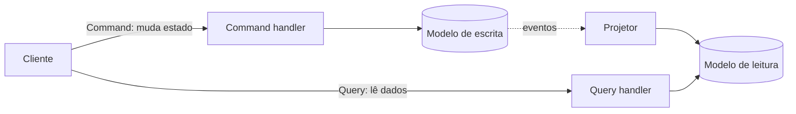

## Resumo

CQRS separa as operações de escrita (commands, que alteram estado) das de leitura (queries, que retornam dados), tratando-as como caminhos distintos com modelos próprios. A ideia é que ler e escrever têm necessidades diferentes: a escrita exige consistência e regras de negócio, a leitura exige formato conveniente e velocidade. Importa porque permite otimizar cada lado independentemente, mas adiciona complexidade que nem todo sistema justifica.

## Explicação detalhada

No modelo CRUD tradicional, o mesmo modelo serve para ler e escrever. CQRS quebra isso em dois:

- **Command**: representa uma intenção de mudar o estado (`CreateOrder`, `CancelOrder`). Passa pelas regras de negócio, valida, aplica e tipicamente não retorna dados além de um identificador ou confirmação. Comandos são imperativos e nomeados pela intenção.
- **Query**: pede dados sem efeito colateral (`GetOrderById`, `ListPendingOrders`). Pode usar projeções otimizadas, ler de réplicas ou de views materializadas, sem passar pela lógica de domínio da escrita.

Há níveis de adoção:

1. **CQRS leve (mesmo banco)**: apenas separa os tipos e handlers de command e query no código, lendo e escrevendo o mesmo banco. É o caso mais comum e barato, frequentemente implementado com a biblioteca MediatR (padrão Mediator, ver [design patterns clássicos](design-patterns-classicos.md)).
2. **CQRS com modelos de leitura separados**: a escrita mantém o modelo normalizado; a leitura usa tabelas ou views desnormalizadas, atualizadas a partir das escritas.
3. **CQRS com armazenamentos separados**: escrita e leitura em bancos diferentes (por exemplo, escrita em PostgreSQL, leitura em Elasticsearch ou Redis), sincronizados por eventos. Aqui surge a consistência eventual: o lado de leitura fica momentaneamente atrasado em relação à escrita.

CQRS é frequentemente confundido com Event Sourcing, mas são independentes. Event Sourcing guarda os eventos como fonte da verdade; CQRS só separa leitura de escrita. Pode-se usar um sem o outro.

## Por baixo dos panos

Numa implementação leve com MediatR, cada command ou query é um objeto que implementa `IRequest<TResponse>`, e cada handler implementa `IRequestHandler<TRequest, TResponse>`. O mediator recebe a mensagem, encontra o handler registrado por tipo e o invoca. Pipeline behaviors envolvem os handlers para validação, logging e transação, funcionando como decorators.

Quando os armazenamentos são separados, a sincronização do modelo de leitura costuma vir de eventos de domínio publicados pela escrita. O produtor publica de forma confiável (ver [Outbox](outbox-pattern.md)) e um projetor consome os eventos e atualiza o modelo de leitura. Esse atraso entre escrever e o read model refletir é a consistência eventual, e precisa ser tratada na experiência do usuário (por exemplo, retornar o dado recém-escrito a partir do command, não relendo imediatamente o read model).

## Exemplos em C#

Command e handler com MediatR:

```csharp
public record CreateOrder(int CustomerId, IReadOnlyList<OrderItem> Items)
    : IRequest<int>;

public class CreateOrderHandler(IOrderRepository repository, IUnitOfWork uow)
    : IRequestHandler<CreateOrder, int>
{
    public async Task<int> Handle(CreateOrder command, CancellationToken ct)
    {
        var order = Order.Create(command.CustomerId, command.Items);
        await repository.AddAsync(order, ct);
        await uow.SaveChangesAsync(ct);
        return order.Id;
    }
}
```

Query e handler, lendo uma projeção enxuta:

```csharp
public record GetOrderSummary(int OrderId) : IRequest<OrderSummaryDto?>;

public class GetOrderSummaryHandler(IDbConnection connection)
    : IRequestHandler<GetOrderSummary, OrderSummaryDto?>
{
    public async Task<OrderSummaryDto?> Handle(GetOrderSummary query, CancellationToken ct)
    {
        const string sql =
            "SELECT id, customer_id, total, status FROM order_summary WHERE id = @OrderId";
        return await connection.QuerySingleOrDefaultAsync<OrderSummaryDto>(sql, new { query.OrderId });
    }
}
```

## Tradeoffs

- CQRS leve melhora organização e clareza (cada caso de uso é explícito) com baixo custo, sendo um bom padrão geral.
- Modelos de leitura separados otimizam consultas pesadas e desacoplam o formato de leitura do de escrita, ao custo de manter a sincronização.
- Armazenamentos separados dão escalabilidade independente de leitura e escrita, mas introduzem consistência eventual, mais infraestrutura e mais pontos de falha.
- O risco é over-engineering: aplicar CQRS pesado em um CRUD simples adiciona complexidade sem retorno.

## Pegadinhas e erros comuns

- Confundir CQRS com Event Sourcing: são independentes; um não exige o outro.
- Achar que CQRS obriga dois bancos: a forma mais comum usa o mesmo banco, só separando o código.
- Ignorar a consistência eventual quando há read model separado: ler logo após escrever pode não refletir a mudança.
- Comandos retornando o agregado completo: idealmente retornam o mínimo (id ou confirmação), mantendo a separação.
- Transformar tudo em command/query e adicionar MediatR sem necessidade: complexidade desnecessária em domínios simples.
- Colocar lógica de negócio nas queries: queries devem ser leitura pura, sem efeito colateral.

## Quando usar e quando evitar

Use CQRS leve como organização padrão em aplicações com casos de uso ricos. Adote modelos de leitura separados quando as consultas são pesadas e diferem muito do modelo de escrita. Use armazenamentos separados quando leitura e escrita têm requisitos de escala muito distintos e a equipe aceita consistência eventual. Evite CQRS pesado em CRUD simples, onde um modelo único é mais direto e barato de manter.

## Perguntas de auto-teste

1. O que CQRS separa?
<details><summary>Resposta</summary>As operações de escrita (commands, que mudam estado) das de leitura (queries, que retornam dados), com modelos e caminhos potencialmente distintos.</details>

2. CQRS exige dois bancos de dados?
<details><summary>Resposta</summary>Não. A forma mais comum usa o mesmo banco, separando apenas os tipos e handlers no código. Armazenamentos separados são um nível mais avançado.</details>

3. Qual a diferença entre CQRS e Event Sourcing?
<details><summary>Resposta</summary>CQRS separa leitura de escrita; Event Sourcing guarda eventos como fonte da verdade. São independentes e podem ser usados juntos ou separados.</details>

4. Que problema surge com modelos de leitura separados?
<details><summary>Resposta</summary>Consistência eventual: o modelo de leitura é atualizado de forma assíncrona, então pode estar momentaneamente atrasado em relação à escrita.</details>

5. O que um command idealmente retorna?
<details><summary>Resposta</summary>O mínimo necessário, como um identificador ou confirmação, em vez do agregado completo, preservando a separação de responsabilidades.</details>

6. Por que queries não devem ter efeito colateral?
<details><summary>Resposta</summary>Porque leitura deve ser pura e previsível; efeitos colaterais pertencem a commands. Misturar quebra a separação e dificulta cache e otimização.</details>

## Diagrama



## Referências

- [CQRS pattern (Azure Architecture)](https://learn.microsoft.com/en-us/azure/architecture/patterns/cqrs)
- [CQRS (Martin Fowler)](https://martinfowler.com/bliki/CQRS.html)
