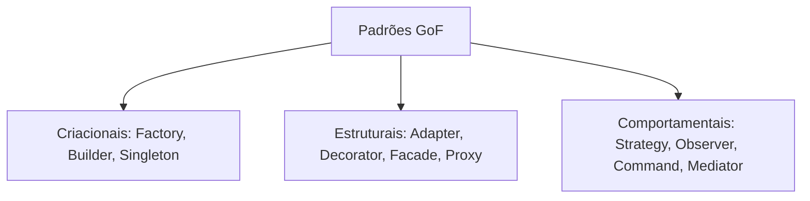

## Resumo

Design patterns clássicos são soluções reutilizáveis para problemas recorrentes de projeto, catalogadas pelo Gang of Four (GoF) em três famílias: criacionais (como objetos são criados), estruturais (como objetos se compõem) e comportamentais (como objetos colaboram). Importam porque dão vocabulário comum e estruturas testadas, mas devem ser aplicados quando o problema aparece, não preventivamente.

## Explicação detalhada

As três famílias e os padrões mais usados em backend .NET:

**Criacionais**
- **Factory Method / Abstract Factory**: encapsula a criação de objetos atrás de uma interface, isolando o cliente da classe concreta. Comum quando a escolha do tipo depende de configuração ou contexto.
- **Builder**: constrói um objeto complexo passo a passo, separando a construção da representação. Útil para objetos com muitos parâmetros opcionais.
- **Singleton**: garante uma única instância. Em .NET moderno, prefira o ciclo de vida singleton do contêiner de DI em vez da implementação manual com estado estático.

**Estruturais**
- **Adapter**: faz uma interface incompatível funcionar com outra esperada, envolvendo o objeto.
- **Decorator**: adiciona comportamento a um objeto envolvendo-o em outro com a mesma interface. Base de muitos middlewares e de cross-cutting concerns como cache e logging.
- **Facade**: oferece uma interface simples para um subsistema complexo.
- **Proxy**: um substituto que controla acesso ao objeto real (lazy loading, controle de acesso).

**Comportamentais**
- **Strategy**: encapsula algoritmos intercambiáveis atrás de uma interface, escolhidos em runtime. Substitui cadeias de `if`/`switch` sobre tipo.
- **Observer**: notifica dependentes quando o estado muda. Base de eventos e de mensageria.
- **Template Method**: define o esqueleto de um algoritmo e deixa subclasses preencherem passos.
- **Command**: encapsula uma requisição como objeto, base de CQRS e de filas de tarefas.
- **Mediator**: centraliza a comunicação entre componentes, reduzindo acoplamento direto.

A relação com SOLID é forte: muitos padrões são formas concretas de aplicar inversão de dependência e aberto/fechado (ver [SOLID](../07-qualidade-solid/solid.md)).

## Por baixo dos panos

Vários padrões aparecem embutidos no próprio .NET e em bibliotecas comuns:

- **Strategy** está em `IComparer<T>` passado a `OrderBy`, e em políticas configuráveis.
- **Decorator** está no pipeline de `HttpClient` (`DelegatingHandler`) e no de middleware do ASP.NET Core (ver [pipeline e middleware](../01-csharp-dotnet/pipeline-middleware.md)).
- **Factory** está em `IHttpClientFactory` e em `ILoggerFactory`.
- **Observer** está em eventos e em `IObservable<T>`.
- **Command + Mediator** estão na biblioteca MediatR, base comum de implementações de [CQRS](cqrs.md).

O contêiner de injeção de dependência do .NET é, na prática, uma fábrica configurável que resolve grafos de objetos, tornando desnecessárias muitas implementações manuais de Singleton e Factory.

## Exemplos em C#

Strategy substituindo um switch por polimorfismo:

```csharp
public interface IDiscountStrategy
{
    decimal Apply(decimal total);
}

public class NoDiscount : IDiscountStrategy
{
    public decimal Apply(decimal total) => total;
}

public class PercentageDiscount(decimal percent) : IDiscountStrategy
{
    public decimal Apply(decimal total) => total * (1 - percent);
}

public class Checkout(IDiscountStrategy discount)
{
    public decimal Finalize(decimal total) => discount.Apply(total);
}
```

Decorator adicionando cache a um repositório sem alterar o original:

```csharp
public class CachedProductRepository(IProductRepository inner, IMemoryCache cache)
    : IProductRepository
{
    public async Task<Product?> GetAsync(int id, CancellationToken ct)
    {
        if (cache.TryGetValue(id, out Product? cached))
            return cached;

        var product = await inner.GetAsync(id, ct);
        if (product is not null)
            cache.Set(id, product, TimeSpan.FromMinutes(5));

        return product;
    }
}
```

## Tradeoffs

- Padrões trazem estrutura, testabilidade e vocabulário, mas adicionam indireção. Aplicados sem necessidade, viram complexidade acidental (over-engineering).
- Strategy e Decorator favorecem o princípio aberto/fechado, mas espalham a lógica em várias classes, o que pode dificultar a leitura de fluxos simples.
- Singleton manual frequentemente vira estado global e dificulta testes; o singleton do contêiner de DI é a alternativa preferível.
- Padrões criacionais reduzem acoplamento à criação concreta, ao custo de mais tipos e configuração.

## Pegadinhas e erros comuns

- Aplicar padrão por antecipação ("vou precisar"): YAGNI. Introduza quando o problema concreto surgir.
- Implementar Singleton manual com estado mutável estático: gera acoplamento global e problemas de concorrência e teste.
- Confundir Adapter (compatibilizar interfaces existentes) com Facade (simplificar um subsistema) e com Decorator (mesma interface, comportamento somado).
- Usar Strategy onde um simples delegate (`Func`) bastaria, criando hierarquias desnecessárias.
- Tratar MediatR como obrigatório para CQRS: é uma implementação de Mediator, não um requisito.

## Quando usar e quando evitar

Use Strategy quando houver variações de algoritmo selecionadas em runtime; Decorator para somar comportamentos transversais (cache, logging, resiliência) sem tocar no original; Factory quando a criação depende de contexto; Mediator/Command para desacoplar emissor e tratador de requisições. Evite padrões quando uma solução direta é mais clara, e prefira recursos da linguagem e do framework (delegates, DI, records) quando resolvem o mesmo problema com menos cerimônia.

## Perguntas de auto-teste

1. Quais são as três famílias de padrões GoF?
<details><summary>Resposta</summary>Criacionais (criação de objetos), estruturais (composição de objetos) e comportamentais (colaboração entre objetos).</details>

2. Qual a diferença entre Adapter, Facade e Decorator?
<details><summary>Resposta</summary>Adapter compatibiliza uma interface incompatível; Facade simplifica o acesso a um subsistema complexo; Decorator mantém a mesma interface e adiciona comportamento envolvendo o objeto.</details>

3. Por que o Strategy é preferível a um grande switch sobre tipo?
<details><summary>Resposta</summary>Porque encapsula cada algoritmo em um tipo, permite adicionar novos sem alterar o código existente (aberto/fechado) e melhora a testabilidade.</details>

4. Por que evitar Singleton manual em .NET moderno?
<details><summary>Resposta</summary>Porque costuma virar estado global mutável, com problemas de concorrência e teste. O ciclo de vida singleton do contêiner de DI resolve o mesmo sem esses problemas.</details>

5. Onde o padrão Decorator aparece embutido no ASP.NET Core?
<details><summary>Resposta</summary>No pipeline de middleware e nos DelegatingHandler do HttpClient, que envolvem o próximo componente com a mesma forma de invocação.</details>

6. MediatR é obrigatório para CQRS?
<details><summary>Resposta</summary>Não. MediatR é uma implementação dos padrões Mediator e Command. CQRS pode ser feito sem ele.</details>

## Diagrama



## Referências

- [Architectural principles (.NET)](https://learn.microsoft.com/en-us/dotnet/architecture/modern-web-apps-azure/architectural-principles)
- [Design Patterns (Refactoring Guru)](https://refactoring.guru/design-patterns)
