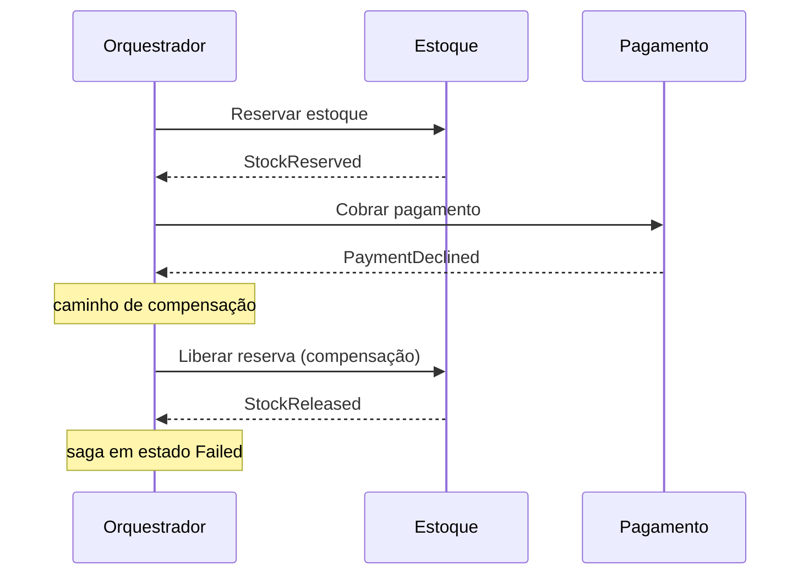

## Resumo

Saga é um padrão para manter consistência em uma operação que abrange vários serviços, cada um com seu próprio banco, onde não existe uma transação ACID global. A saga quebra a operação em uma sequência de transações locais; se um passo falha, executa transações de compensação que desfazem logicamente os passos anteriores. Importa porque, em microsserviços, o commit distribuído tradicional é inviável, e a saga oferece consistência eventual com recuperação explícita.

## Explicação detalhada

Em um monólito com um banco, uma transação ACID garante tudo ou nada. Em microsserviços, cada serviço tem seu banco, e uma operação como "criar pedido, reservar estoque, cobrar pagamento" toca três serviços. Não dá para envolver os três em uma transação atômica sem two-phase commit, que é frágil e pouco escalável.

A saga troca atomicidade por uma sequência de transações locais com compensação. Cada passo confirma localmente. Se um passo falha, a saga não faz rollback (já foi commitado), mas executa **compensações**: ações que revertem o efeito de negócio dos passos já concluídos (cancelar a reserva, estornar a cobrança). A compensação é lógica, não um rollback de banco: "estornar pagamento" é uma nova transação, não o desfazer da anterior.

Há dois estilos de coordenação:

- **Coreografia**: não há coordenador central. Cada serviço reage a eventos e publica novos eventos. O serviço de pedido publica `OrderCreated`, o de estoque reage reservando e publica `StockReserved`, e assim por diante. Simples para fluxos curtos, mas a lógica fica espalhada e o fluxo global fica difícil de enxergar e depurar.
- **Orquestração**: um orquestrador central (a saga) comanda os passos, enviando comandos a cada serviço e reagindo às respostas, decidindo quando avançar ou compensar. Centraliza a lógica do fluxo, facilita monitoramento e tratamento de erro, ao custo de um componente a mais e de acoplamento ao orquestrador.

As mensagens de comando e evento devem ser publicadas de forma confiável (ver [Outbox](outbox-pattern.md)) e processadas de forma idempotente (ver [idempotência](idempotencia.md)), pois reentregas são esperadas.

## Por baixo dos panos

A saga é uma máquina de estados persistida. O orquestrador guarda em qual passo está cada instância de saga, para retomar após falhas e reinícios. Cada transição é disparada por uma resposta de um serviço, e o estado avança ou entra no caminho de compensação.

Compensações precisam ser projetadas com cuidado porque nem todo efeito é reversível: enviar um e-mail não se desfaz, então o desenho da saga deve ordenar os passos para deixar ações irreversíveis ou difíceis de compensar para o fim, quando o sucesso já é provável. Também é preciso lidar com compensações que falham, geralmente com retry e alertas.

Há também o problema de leitura intermediária: durante a saga, o sistema está em estado parcial e visível. Técnicas como campos de status (pedido "pendente" até a saga concluir) evitam que outros vejam um estado inconsistente como definitivo.

## Exemplos em C#

Esqueleto de orquestrador como máquina de estados (ilustrativo, simplificado):

```csharp
public enum OrderSagaState
{
    Started, StockReserved, PaymentCharged, Completed, Compensating, Failed
}

public class OrderSaga(IStockClient stock, IPaymentClient payment, ISagaStore store)
{
    public async Task HandleAsync(OrderSagaContext ctx, CancellationToken ct)
    {
        switch (ctx.State)
        {
            case OrderSagaState.Started:
                await stock.ReserveAsync(ctx.OrderId, ctx.Items, ct);
                ctx.State = OrderSagaState.StockReserved;
                break;

            case OrderSagaState.StockReserved:
                try
                {
                    await payment.ChargeAsync(ctx.OrderId, ctx.Amount, ct);
                    ctx.State = OrderSagaState.PaymentCharged;
                }
                catch (PaymentDeclinedException)
                {
                    await stock.ReleaseAsync(ctx.OrderId, ct);
                    ctx.State = OrderSagaState.Failed;
                }
                break;

            case OrderSagaState.PaymentCharged:
                ctx.State = OrderSagaState.Completed;
                break;
        }

        await store.SaveAsync(ctx, ct);
    }
}
```

## Tradeoffs

- Saga viabiliza consistência em operações multisserviço sem transação distribuída, com recuperação explícita por compensação.
- O custo é complexidade: máquina de estados persistida, compensações para cada passo, idempotência e tratamento de falhas de compensação.
- Coreografia é simples para fluxos curtos mas espalha a lógica e dificulta a visão global; orquestração centraliza e facilita observabilidade ao custo de um componente coordenador.
- A consistência é eventual e há estados intermediários visíveis, exigindo modelagem de status.

## Pegadinhas e erros comuns

- Tratar compensação como rollback de banco: ela é uma transação de negócio nova que reverte o efeito, não um desfazer transacional.
- Esquecer que passos irreversíveis (e-mail enviado, mensagem externa) não compensam; ordene-os para o fim.
- Não persistir o estado da saga: sem isso, não há como retomar após falha ou reinício.
- Ignorar idempotência: reentregas reexecutam passos e compensações, duplicando efeitos.
- Não lidar com falha da própria compensação, deixando o sistema em estado inconsistente sem alerta.
- Escolher coreografia para um fluxo longo e ramificado, tornando-o impossível de entender e depurar.

## Quando usar e quando evitar

Use saga quando uma operação de negócio precisa abranger vários serviços com bancos próprios e você precisa de consistência com recuperação. Prefira orquestração para fluxos longos, ramificados ou que exigem boa observabilidade; coreografia para fluxos curtos e simples. Evite saga quando a operação cabe em um único serviço e banco (use uma transação local ACID) ou quando consistência eventual e estados intermediários são inaceitáveis para o caso.

## Perguntas de auto-teste

1. Por que microsserviços não usam uma transação ACID global para operações multisserviço?
<details><summary>Resposta</summary>Porque cada serviço tem seu próprio banco e não há transação atômica entre eles sem two-phase commit, que é frágil e pouco escalável. A saga oferece uma alternativa.</details>

2. O que é uma transação de compensação?
<details><summary>Resposta</summary>Uma ação de negócio que reverte logicamente o efeito de um passo já confirmado (cancelar reserva, estornar pagamento). Não é um rollback de banco, é uma nova transação.</details>

3. Qual a diferença entre coreografia e orquestração?
<details><summary>Resposta</summary>Na coreografia não há coordenador: cada serviço reage a eventos e publica outros. Na orquestração um coordenador central comanda os passos e decide quando avançar ou compensar.</details>

4. Por que passos irreversíveis devem ficar no fim da saga?
<details><summary>Resposta</summary>Porque não podem ser compensados (um e-mail enviado não se desfaz). Deixá-los para quando o sucesso já é provável reduz a chance de precisar revertê-los.</details>

5. Por que a saga precisa persistir seu estado?
<details><summary>Resposta</summary>Para retomar de onde parou após falhas ou reinícios, sabendo qual passo executar ou compensar em cada instância.</details>

6. Qual o tipo de consistência oferecida por uma saga?
<details><summary>Resposta</summary>Consistência eventual, com estados intermediários visíveis durante a execução, ao contrário da atomicidade imediata de uma transação ACID.</details>

## Diagrama



## Referências

- [Saga pattern (Azure Architecture)](https://learn.microsoft.com/en-us/azure/architecture/patterns/saga)
- [Saga pattern (microservices.io)](https://microservices.io/patterns/data/saga.html)
