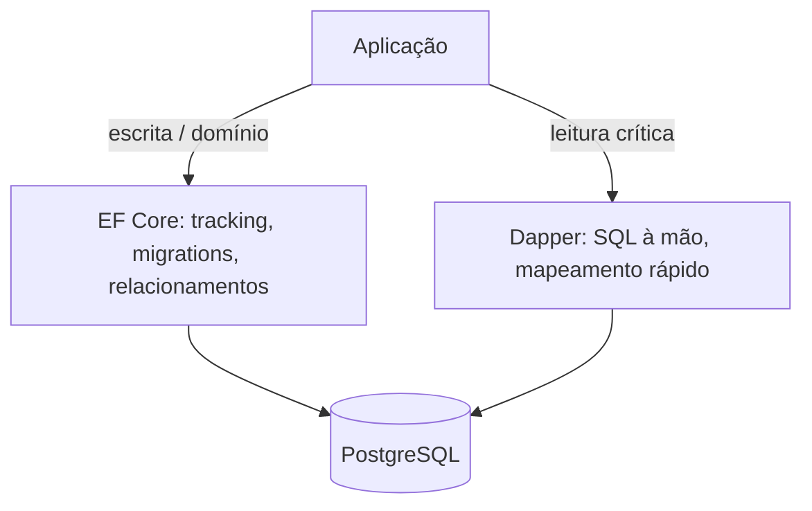

## Resumo

EF Core é um ORM completo: mapeia objetos para tabelas, rastreia mudanças, gera SQL, gerencia migrations e relacionamentos. Dapper é um micro ORM: ele apenas executa o SQL que você escreve e mapeia o resultado para objetos, com overhead mínimo. A escolha é entre produtividade e abstração (EF Core) versus controle total sobre o SQL e performance bruta (Dapper). Muitos sistemas usam os dois lado a lado.

## Explicação detalhada

**EF Core** trabalha no nível do modelo de domínio. Você consulta com LINQ, ele traduz para SQL (ver [IQueryable vs IEnumerable](../01-csharp-dotnet/iqueryable-vs-ienumerable.md)), materializa entidades, rastreia mudanças (ver [change tracking](change-tracking.md)) e persiste com `SaveChanges`. Cuida de relacionamentos, migrations, concorrência otimista e mais. O preço é abstração: o SQL é gerado, nem sempre ótimo, e há overhead de tracking e materialização.

**Dapper** trabalha no nível do SQL. Você escreve a query, chama um método de extensão sobre a `IDbConnection` (`Query`, `QueryAsync`, `Execute`) e o Dapper mapeia colunas para propriedades por nome. Não há tracking, não há geração de SQL, não há migrations. É essencialmente ADO.NET com mapeamento automático e parametrização, muito próximo do metal e muito rápido.

A divisão prática comum: **EF Core para escrita e domínio** (onde tracking, relacionamentos e migrations agregam), **Dapper para leitura e consultas críticas de performance** (relatórios, listas, queries complexas afinadas à mão). Isso encaixa bem com [CQRS](../02-microservices-patterns/cqrs.md): comandos com EF, queries com Dapper.

Ambos parametrizam as consultas, prevenindo SQL injection. Em nenhum dos dois você deve concatenar entrada do usuário em string SQL.

## Por baixo dos panos

O Dapper usa reflection uma vez por shape de consulta para gerar e cachear um delegate de materialização (IL emitido) que copia as colunas do `IDataReader` para o objeto. Por isso, depois da primeira execução, o mapeamento é quase tão rápido quanto escrever o código manual. Ele não mantém estado entre chamadas além desse cache.

O EF Core faz mais trabalho por consulta: traduz a árvore de expressão LINQ em SQL, materializa entidades, opcionalmente cria snapshots para tracking e faz fix-up de navegações. Esse trabalho é o que entrega produtividade e o que custa em hot paths. Por isso `AsNoTracking` e projeções aproximam o EF do desempenho do Dapper em leitura, sem igualá-lo no limite.

Nenhum dos dois gerencia o ciclo de vida da conexão por você da mesma forma: o EF abre e fecha conexões internamente pelo `DbContext`; com Dapper, você controla a `IDbConnection` (idealmente obtida de um pool e aberta por escopo curto).

## Exemplos em C#

Leitura com Dapper, SQL explícito e mapeamento automático:

```csharp
public async Task<IReadOnlyList<OrderSummary>> GetSummariesAsync(
    int customerId, CancellationToken ct)
{
    const string sql = """
        SELECT o.id AS Id, o.total AS Total, o.status AS Status
        FROM orders o
        WHERE o.customer_id = @customerId
        ORDER BY o.created_at DESC
        """;

    await using var connection = new NpgsqlConnection(_connectionString);
    var rows = await connection.QueryAsync<OrderSummary>(
        new CommandDefinition(sql, new { customerId }, cancellationToken: ct));
    return rows.ToList();
}
```

Escrita com EF Core, aproveitando tracking e relacionamentos:

```csharp
public async Task AddItemAsync(int orderId, OrderItem item, CancellationToken ct)
{
    var order = await _db.Orders
        .Include(o => o.Items)
        .FirstAsync(o => o.Id == orderId, ct);

    order.AddItem(item);
    await _db.SaveChangesAsync(ct);
}
```

## Tradeoffs

- EF Core entrega produtividade, abstração de database, migrations e segurança de tipo no LINQ, ao custo de overhead e de SQL gerado que às vezes precisa de ajuste.
- Dapper entrega performance próxima do ADO.NET e controle total do SQL, ao custo de escrever e manter o SQL à mão, sem tracking, migrations ou abstração de relacionamentos.
- Usar os dois junto combina o melhor: domínio e escrita no EF, leitura crítica no Dapper. O custo é manter duas formas de acesso a dados no projeto.
- Em consultas simples a diferença de performance raramente importa; ela aparece em alto volume e consultas complexas.

## Pegadinhas e erros comuns

- Concatenar entrada do usuário no SQL (em qualquer um dos dois) abre SQL injection. Sempre use parâmetros.
- Esperar tracking ou relacionamentos automáticos no Dapper: ele não tem; você monta o mapeamento (incluindo multi-mapping para joins).
- Usar EF Core com tracking em leituras pesadas e culpar o ORM pela lentidão, quando `AsNoTracking` e projeções resolveriam.
- Gerenciar mal a conexão no Dapper (não fechar, abrir cedo demais), prejudicando o pool.
- Achar que Dapper é sempre a escolha por ser mais rápido: para escrita de domínio com relacionamentos e migrations, o EF costuma ser mais produtivo e seguro.
- Misturar responsabilidades sem critério, espalhando SQL solto e perdendo a consistência do acesso a dados.

## Quando usar e quando evitar

Use EF Core para o modelo de domínio e a escrita, onde tracking, relacionamentos, concorrência otimista e migrations agregam valor. Use Dapper para leituras de alta performance, relatórios e consultas complexas que você quer escrever e afinar à mão. Combine os dois em arquiteturas CQRS. Evite Dapper para gerenciar schema e relacionamentos ricos de escrita, e evite EF Core com tracking em caminhos de leitura quentes onde cada microssegundo conta.

## Perguntas de auto-teste

1. Qual a diferença fundamental entre EF Core e Dapper?
<details><summary>Resposta</summary>EF Core é um ORM completo (mapeamento, tracking, geração de SQL, migrations, relacionamentos); Dapper é um micro ORM que só executa o SQL que você escreve e mapeia o resultado para objetos, com overhead mínimo.</details>

2. Por que o Dapper é tão rápido após a primeira execução?
<details><summary>Resposta</summary>Porque gera e cacheia um delegate de materialização (IL emitido) por shape de consulta, tornando o mapeamento subsequente quase tão rápido quanto código manual.</details>

3. Em uma architecture CQRS, como os dois costumam ser divididos?
<details><summary>Resposta</summary>EF Core para os comandos (escrita e domínio, com tracking e relacionamentos) e Dapper para as queries (leitura de alta performance), frequentemente lado a lado.</details>

4. Os dois previnem SQL injection? Como?
<details><summary>Resposta</summary>Sim, ambos parametrizam as consultas. O risco aparece apenas se você concatenar entrada do usuário diretamente na string SQL, o que nunca se deve fazer.</details>

5. Como aproximar o desempenho de leitura do EF Core ao do Dapper?
<details><summary>Resposta</summary>Usando AsNoTracking e projeções com Select, evitando o custo de tracking e de materializar entidades inteiras.</details>

6. O que o Dapper não oferece que o EF Core oferece?
<details><summary>Resposta</summary>Change tracking, geração de SQL a partir de LINQ, migrations, gestão automática de relacionamentos e concorrência otimista integrada.</details>

## Diagrama



## Referências

- [Entity Framework Core](https://learn.microsoft.com/en-us/ef/core/)
- [Dapper (repositório oficial)](https://github.com/DapperLib/Dapper)
