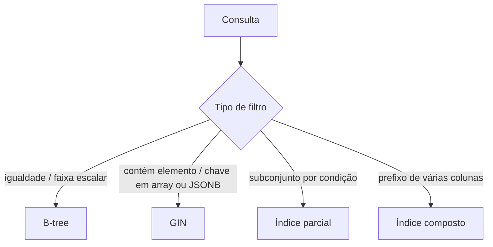

## Resumo

Índices no PostgreSQL aceleram consultas evitando varrer a tabela inteira, com tipos diferentes para necessidades diferentes (B-tree para igualdade e faixa, GIN para conteúdo de coleções e JSONB). JSONB é o tipo binário para armazenar JSON com consultas e indexação eficientes. Entender qual índice usar e como consultar JSONB é o que separa um schema rápido de um lento quando há dados semiestruturados.

## Explicação detalhada

**Tipos de índice mais usados:**

- **B-tree** (padrão): para igualdade e faixa (`=`, `<`, `>`, `BETWEEN`, `ORDER BY`). Cobre a maioria dos casos com colunas escalares.
- **GIN** (Generalized Inverted Index): para valores que contêm múltiplos componentes, como arrays, full-text search e JSONB. É o índice para perguntas do tipo "contém este elemento/chave".
- **Hash**: só para igualdade; raramente preferível ao B-tree.
- **BRIN**: para tabelas muito grandes com correlação física (por exemplo, dados temporais em ordem de inserção), ocupando pouquíssimo espaço.

**Índices parciais e compostos:** um índice parcial indexa apenas as linhas que satisfazem uma condição (`WHERE status = 'pending'`), útil quando as consultas focam um subconjunto. Um índice composto cobre várias colunas; a ordem importa, pois ele serve consultas que filtram pelo prefixo das colunas (um índice em `(a, b)` ajuda filtros por `a` e por `a, b`, mas não por `b` sozinho).

**JSON vs JSONB:** `json` guarda o texto literal (preserva formatação e ordem das chaves, mas reprocessa a cada acesso). `jsonb` guarda uma forma binária decomposta: ocupa um pouco mais, perde a formatação original, mas é muito mais rápido para consultar e pode ser indexado com GIN. Para quase todo uso prático, prefira `jsonb`.

**Operadores JSONB:** `->` retorna o valor como JSON, `->>` retorna como texto, `@>` testa contenção (o JSON contém este fragmento), `?` testa existência de chave. Um índice GIN sobre a coluna JSONB acelera consultas com `@>` e `?`.

## Por baixo dos panos

Um índice B-tree mantém as chaves ordenadas em árvore balanceada, permitindo busca logarítmica e varredura ordenada de faixas. O otimizador decide entre usar o índice (index scan) ou varrer a tabela (seq scan) com base nas estatísticas: se a consulta retornaria grande parte da tabela, o seq scan pode ser mais barato que pular por muitas entradas de índice.

O GIN inverte a estrutura: para cada componente (elemento de array, chave/valor de JSONB), mantém a lista de linhas que o contêm. Por isso responde rápido a "quais linhas contêm X". A construção e atualização do GIN é mais cara que a do B-tree, então ele penaliza mais a escrita.

Todo índice tem custo de manutenção: cada `INSERT`/`UPDATE`/`DELETE` precisa atualizar os índices afetados, e índices ocupam espaço em disco e memória de cache. Por isso indexar tudo é contraproducente: indexe as colunas e expressões realmente usadas em filtros, joins e ordenação frequentes.

## Exemplos em C#

Tabela com coluna JSONB e índices (DDL):

```sql
CREATE TABLE events (
    id BIGINT GENERATED ALWAYS AS IDENTITY PRIMARY KEY,
    type TEXT NOT NULL,
    payload JSONB NOT NULL,
    created_at TIMESTAMPTZ NOT NULL DEFAULT now()
);

CREATE INDEX idx_events_type ON events (type);
CREATE INDEX idx_events_payload ON events USING GIN (payload);
CREATE INDEX idx_events_pending ON events (created_at) WHERE type = 'pending';
```

Consulta JSONB com contenção, usando o índice GIN:

```sql
SELECT id, payload ->> 'userId' AS user_id
FROM events
WHERE payload @> '{"status": "active"}';
```

Mapeamento de JSONB no EF Core com Npgsql:

```csharp
modelBuilder.Entity<EventLog>()
    .Property(e => e.Payload)
    .HasColumnType("jsonb");
```

Consultando JSONB via LINQ com EF Core e Npgsql:

```csharp
var actives = await _db.Events
    .Where(e => EF.Functions.JsonContains(e.Payload, """{"status":"active"}"""))
    .ToListAsync(ct);
```

## Tradeoffs

- Índices aceleram leitura mas penalizam escrita e ocupam espaço; cada índice é mantido em toda alteração. Indexe com base nas consultas reais, não preventivamente.
- B-tree cobre a maioria dos casos escalares; GIN é necessário para conteúdo de arrays e JSONB, ao custo de escrita mais cara.
- JSONB dá flexibilidade de schema (dados semiestruturados, campos variáveis) sem migrations para cada atributo, mas perde parte das garantias e da clareza de colunas tipadas; abusar dele vira um banco sem schema.
- Índice parcial economiza espaço e acelera quando as consultas focam um subconjunto, mas só serve a consultas que batem com sua condição.

## Pegadinhas e erros comuns

- Indexar tudo: degrada escrita e desperdiça espaço sem ganho proporcional de leitura.
- Esperar que um índice em `(a, b)` ajude filtros só por `b`: índice composto serve o prefixo, não qualquer coluna isolada.
- Usar `json` em vez de `jsonb` quando vai consultar: `json` reprocessa o texto e não aceita índice GIN da mesma forma.
- Filtrar JSONB com expressões não indexáveis (extrair e comparar texto) e esquecer que o GIN acelera contenção `@>` e existência `?`, não toda operação.
- Criar índice e não rodar `ANALYZE` ou ter estatísticas desatualizadas, fazendo o otimizador ignorá-lo.
- Modelar tudo como JSONB e perder integridade referencial, tipos e clareza que colunas relacionais dariam.

## Quando usar e quando evitar

Use B-tree para a maioria das colunas filtradas, ordenadas ou usadas em joins. Use GIN para consultas de contenção em JSONB, arrays e full-text. Use índices parciais e compostos guiados pelas consultas reais, verificando com `EXPLAIN ANALYZE` (ver [SQL essencial](sql-essencial.md)). Use JSONB para dados genuinamente semiestruturados ou de schema variável. Evite indexar colunas pouco usadas, evite JSONB para dados que são naturalmente relacionais e precisam de integridade e tipagem.

## Perguntas de auto-teste

1. Quando usar um índice GIN em vez de B-tree?
<details><summary>Resposta</summary>Para valores com múltiplos componentes (arrays, full-text, JSONB), respondendo perguntas de contenção/existência. B-tree serve igualdade e faixa em colunas escalares.</details>

2. Qual a diferença entre `json` e `jsonb`?
<details><summary>Resposta</summary>json guarda o texto literal e reprocessa a cada acesso; jsonb guarda forma binária decomposta, mais rápida para consultar e indexável com GIN. Para consultar, prefira jsonb.</details>

3. Um índice composto em `(a, b)` ajuda um filtro só por `b`?
<details><summary>Resposta</summary>Não. Índice composto serve consultas pelo prefixo das colunas (a, ou a e b), mas não por b isolado.</details>

4. O que fazem os operadores `@>` e `->>` em JSONB?
<details><summary>Resposta</summary>@> testa contenção (o JSON contém o fragmento dado) e pode usar índice GIN; ->> extrai o valor de uma chave como texto.</details>

5. Por que indexar tudo é contraproducente?
<details><summary>Resposta</summary>Porque cada índice é mantido em toda escrita (custo de INSERT/UPDATE/DELETE) e ocupa espaço, sem ganho de leitura para colunas que não são filtradas.</details>

6. Quando um índice parcial é vantajoso?
<details><summary>Resposta</summary>Quando as consultas focam um subconjunto definido por uma condição (por exemplo, status pendente); o índice indexa só essas linhas, economizando espaço e acelerando.</details>

## Diagrama



## Referências

- [Indexes (PostgreSQL)](https://www.postgresql.org/docs/current/indexes.html)
- [JSON Types (PostgreSQL)](https://www.postgresql.org/docs/current/datatype-json.html)
- [GIN Indexes (PostgreSQL)](https://www.postgresql.org/docs/current/gin.html)
