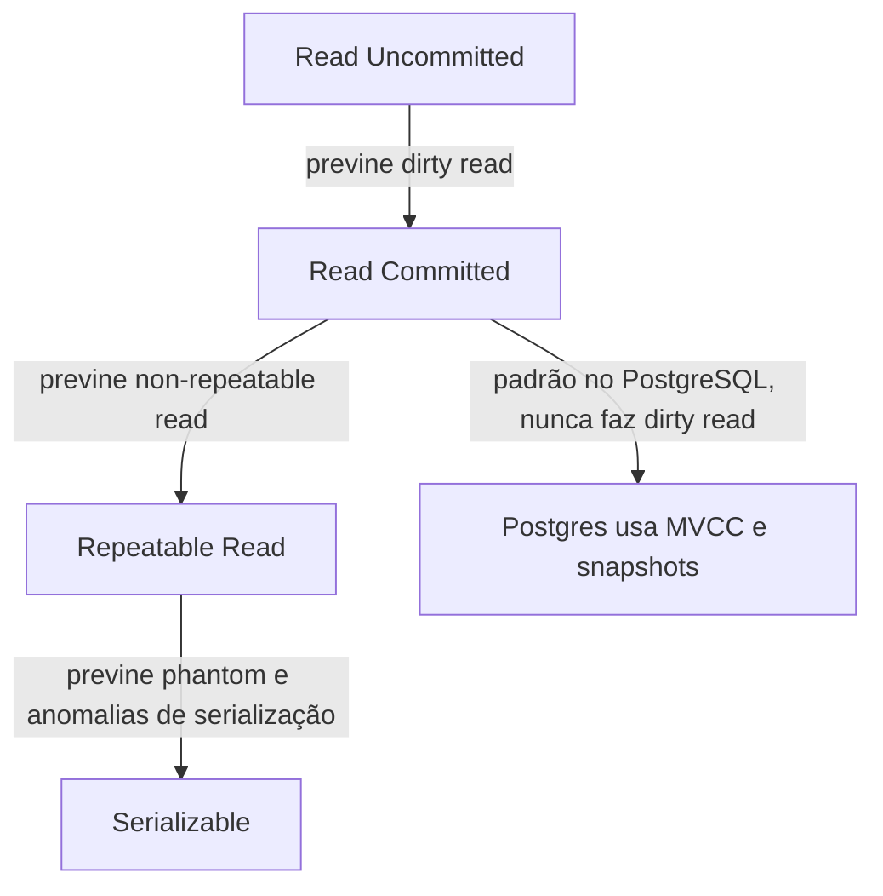

## Resumo

O nível de isolamento de uma transação define o quanto ela é protegida dos efeitos de transações concorrentes. A teoria classifica anomalias (dirty read, non-repeatable read, phantom read) e níveis (Read Uncommitted, Read Committed, Repeatable Read, Serializable) que as previnem progressivamente. O PostgreSQL implementa isolamento com MVCC (multiversão), e seu padrão é Read Committed. Entender isso evita bugs de concorrência sutis e perda de dados sob carga.

## Explicação detalhada

A propriedade I de ACID é o isolamento. Quanto mais alto o nível, menos anomalias, porém maior o custo de concorrência (mais bloqueios ou mais conflitos e retries).

**Anomalias clássicas:**

- **Dirty read**: ler dados que outra transação escreveu mas ainda não confirmou (commit). Se aquela transação fizer rollback, você leu algo que nunca existiu.
- **Non-repeatable read**: ler a mesma linha duas vezes na mesma transação e obter valores diferentes, porque outra transação a alterou e confirmou no intervalo.
- **Phantom read**: reexecutar a mesma consulta de faixa e obter um conjunto diferente de linhas, porque outra transação inseriu ou removeu linhas que satisfazem o critério.

**Níveis de isolamento do padrão SQL e o que previnem:**

- **Read Uncommitted**: permite dirty reads. O mais fraco.
- **Read Committed**: sem dirty reads; cada comando vê apenas dados já confirmados. Ainda permite non-repeatable e phantom reads.
- **Repeatable Read**: sem dirty nem non-repeatable reads. No padrão SQL ainda permitiria phantom; na implementação do PostgreSQL, previne também phantom.
- **Serializable**: o mais forte, equivalente a executar as transações em alguma ordem serial. Previne todas as anomalias, inclusive anomalias de serialização mais sutis.

**No PostgreSQL especificamente:**

- O padrão é **Read Committed**.
- O PostgreSQL **nunca permite dirty reads**: se você pedir Read Uncommitted, ele se comporta como Read Committed.
- **Repeatable Read** no PostgreSQL usa um snapshot do início da transação e já previne phantom reads (vai além do mínimo do padrão).
- **Serializable** usa SSI (Serializable Snapshot Isolation): detecta conflitos de serialização e aborta uma das transações, que deve ser repetida.

## Por baixo dos panos

O PostgreSQL usa **MVCC (Multi-Version Concurrency Control)**: em vez de bloquear leituras com escritas, cada `UPDATE`/`DELETE` cria uma nova versão da linha e mantém a antiga visível para quem precisa dela. Cada transação enxerga um snapshot consistente conforme seu nível: em Read Committed, um snapshot novo a cada comando; em Repeatable Read e Serializable, um snapshot fixo do início da transação.

A consequência prática mais importante: **leitura não bloqueia escrita e escrita não bloqueia leitura**. Leitores veem a versão apropriada sem esperar os escritores. Conflitos reais ocorrem entre escritores da mesma linha, onde há bloqueio de linha.

Como linhas antigas ficam para trás, o PostgreSQL precisa do **VACUUM** (autovacuum) para recuperar o espaço das versões mortas. Tabelas com muita atualização acumulam "bloat" se o vacuum não acompanhar.

Em Serializable, o SSI monitora dependências entre transações e, ao detectar um padrão que violaria a serialização, aborta uma com erro de serialização (`could not serialize access`), exigindo retry da aplicação. Por isso aplicações que usam Serializable precisam de lógica de repetição.

## Exemplos em C#

Definir nível de isolamento explícito com EF Core:

```csharp
await using var tx = await _db.Database
    .BeginTransactionAsync(IsolationLevel.Serializable, ct);
try
{
    var account = await _db.Accounts.FirstAsync(a => a.Id == id, ct);
    account.Balance -= amount;
    await _db.SaveChangesAsync(ct);
    await tx.CommitAsync(ct);
}
catch (PostgresException ex) when (ex.SqlState == "40001")
{
    await tx.RollbackAsync(ct);
    throw new SerializationRetryException();
}
```

`40001` é o SQLSTATE de falha de serialização, sinal de que a transação deve ser repetida.

Bloqueio pessimista quando você quer impedir escritas concorrentes na linha:

```sql
SELECT * FROM accounts WHERE id = @id FOR UPDATE;
```

Outras transações que tentarem `FOR UPDATE` ou alterar essa linha esperam até o commit.

## Tradeoffs

- Níveis mais altos previnem mais anomalias, ao custo de mais conflitos (em Serializable, aborts e retries) ou mais espera (com bloqueios pessimistas).
- Read Committed (padrão) tem boa concorrência e basta para muitos casos, mas deixa non-repeatable e phantom reads, exigindo cuidado em lógicas que leem e decidem.
- Serializable dá a maior garantia com a menor complexidade de raciocínio (pense como se fosse serial), mas a aplicação precisa repetir transações abortadas.
- MVCC dá ótima concorrência leitura/escrita, ao custo de bloat e dependência do vacuum.

## Pegadinhas e erros comuns

- Assumir que Read Committed evita non-repeatable ou phantom reads: não evita. Reler dentro da mesma transação pode dar resultados diferentes.
- Padrão read-modify-write sem proteção: ler saldo, calcular e gravar em Read Committed permite que duas transações concorrentes sobrescrevam uma à outra (lost update). Use `FOR UPDATE`, controle otimista (coluna de versão) ou Serializable.
- Usar Serializable sem lógica de retry: a aplicação quebra ao receber erro de serialização em vez de repetir.
- Esperar dirty reads no PostgreSQL ao pedir Read Uncommitted: ele os trata como Read Committed e nunca lê dados não confirmados.
- Transações longas que seguram snapshots e versões antigas, atrapalhando o vacuum e causando bloat.
- Confundir bloqueio pessimista (`FOR UPDATE`, espera) com controle otimista (detecta conflito no commit/save).

## Quando usar e quando evitar

Use Read Committed como padrão na maioria das operações. Suba para Repeatable Read quando a transação precisa de uma visão estável dos dados durante toda a sua execução. Use Serializable para invariantes críticas entre múltiplas linhas e transações, sempre com retry. Use `FOR UPDATE` ou controle otimista por versão para o padrão read-modify-write. Evite transações longas e evite níveis altos onde o padrão já basta, pelo custo de concorrência.

## Perguntas de auto-teste

1. Qual a diferença entre non-repeatable read e phantom read?
<details><summary>Resposta</summary>Non-repeatable read é a mesma linha retornar valores diferentes ao ser relida; phantom read é uma consulta de faixa retornar um conjunto diferente de linhas (linhas surgem ou somem) ao ser reexecutada.</details>

2. Qual o nível de isolamento padrão do PostgreSQL?
<details><summary>Resposta</summary>Read Committed.</details>

3. O PostgreSQL permite dirty reads?
<details><summary>Resposta</summary>Não. Mesmo pedindo Read Uncommitted, ele se comporta como Read Committed e nunca lê dados não confirmados.</details>

4. O que é MVCC e qual sua principal consequência prática?
<details><summary>Resposta</summary>Multi-Version Concurrency Control: cada escrita cria uma nova versão da linha, mantendo as antigas visíveis conforme o snapshot de cada transação. A consequência é que leitura não bloqueia escrita nem vice-versa.</details>

5. O que a aplicação precisa fazer ao usar Serializable no PostgreSQL?
<details><summary>Resposta</summary>Implementar retry: o SSI pode abortar transações com erro de serialização (SQLSTATE 40001), que devem ser repetidas.</details>

6. Como evitar lost update no padrão read-modify-write?
<details><summary>Resposta</summary>Com bloqueio pessimista (SELECT ... FOR UPDATE), controle otimista por coluna de versão, ou isolamento Serializable com retry.</details>

## Diagrama



## Referências

- [Transaction Isolation (PostgreSQL)](https://www.postgresql.org/docs/current/transaction-iso.html)
- [Concurrency Control / MVCC (PostgreSQL)](https://www.postgresql.org/docs/current/mvcc.html)
