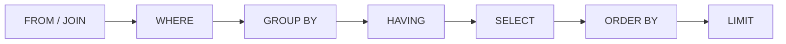

## Resumo

SQL é a linguagem para consultar e manipular dados relacionais. O essencial gira em torno de filtrar (`WHERE`), combinar tabelas (`JOIN`), agrupar e resumir (`GROUP BY` com funções de agregação) e ordenar (`ORDER BY`), além de entender índices e plano de execução para que as consultas sejam rápidas. Dominar isso é base para usar bem qualquer ORM e para diagnosticar lentidão.

## Explicação detalhada

**Ordem lógica de avaliação**: SQL não é executado na ordem em que é escrito. A ordem lógica é `FROM` e `JOIN`, depois `WHERE`, depois `GROUP BY`, depois `HAVING`, depois `SELECT` (incluindo aliases e funções de janela), depois `ORDER BY` e por fim `LIMIT`. Isso explica, por exemplo, por que você não pode usar um alias do `SELECT` no `WHERE`: o `WHERE` roda antes do `SELECT`.

**JOINs** combinam linhas de tabelas relacionadas:

- `INNER JOIN`: só as linhas com correspondência nos dois lados.
- `LEFT JOIN`: todas as da esquerda, com `NULL` onde não há correspondência à direita.
- `RIGHT JOIN`: o espelho do left.
- `FULL OUTER JOIN`: todas as linhas dos dois lados, com `NULL` onde falta correspondência.
- `CROSS JOIN`: produto cartesiano, toda combinação.

**Agregação**: funções como `COUNT`, `SUM`, `AVG`, `MIN`, `MAX` resumem grupos definidos por `GROUP BY`. `WHERE` filtra linhas antes de agrupar; `HAVING` filtra grupos depois de agregar. Essa distinção é clássica em entrevista.

**NULL** representa ausência de valor e tem lógica de três valores: `NULL = NULL` é `NULL` (não verdadeiro), por isso comparações usam `IS NULL` / `IS NOT NULL`. Agregações como `COUNT(coluna)` ignoram `NULL`, enquanto `COUNT(*)` conta todas as linhas.

**Índices** aceleram a busca evitando varrer a tabela inteira (sequential scan). Um índice B-tree serve para igualdade e faixa (`=`, `<`, `>`, `BETWEEN`, ordenação). O custo é espaço e escrita mais lenta, pois o índice é mantido a cada `INSERT`/`UPDATE`/`DELETE` (ver [índices e JSONB](indices-jsonb.md)).

## Por baixo dos panos

O otimizador do PostgreSQL transforma a consulta SQL em um plano de execução: ele estima o custo de diferentes estratégias (sequential scan, index scan, tipos de join como nested loop, hash join, merge join) usando estatísticas das tabelas e escolhe a mais barata. `EXPLAIN` mostra o plano estimado; `EXPLAIN ANALYZE` executa e mostra os tempos reais.

Ler o plano é a principal ferramenta de diagnóstico: um `Seq Scan` em uma tabela grande filtrada por uma coluna sem índice é sinal de índice faltante. Um `Nested Loop` sobre muitas linhas pode indicar consulta mal escrita ou estatísticas desatualizadas (resolvidas com `ANALYZE`).

## Exemplos em C#

JOIN com agregação e filtro de grupo:

```sql
SELECT c.id, c.name, COUNT(o.id) AS total_orders, SUM(o.total) AS revenue
FROM customers c
INNER JOIN orders o ON o.customer_id = c.id
WHERE o.created_at >= '2026-01-01'
GROUP BY c.id, c.name
HAVING SUM(o.total) > 1000
ORDER BY revenue DESC
LIMIT 10;
```

LEFT JOIN para incluir quem não tem correspondência:

```sql
SELECT c.id, c.name, COUNT(o.id) AS total_orders
FROM customers c
LEFT JOIN orders o ON o.customer_id = c.id
GROUP BY c.id, c.name;
```

Clientes sem pedidos aparecem com `total_orders = 0`.

Diagnóstico de plano:

```sql
EXPLAIN ANALYZE
SELECT * FROM orders WHERE status = 'pending';
```

## Tradeoffs

- Índices aceleram leitura mas penalizam escrita e ocupam espaço; índice demais degrada `INSERT`/`UPDATE`. Indexe o que é realmente filtrado e ordenado com frequência.
- Agregação no banco é eficiente (perto dos dados, usando índices), bem melhor que trazer linhas e agregar na aplicação.
- `SELECT *` é cômodo mas traz colunas desnecessárias, mais I/O e tráfego; em produção, selecione as colunas usadas.
- Joins poderosos podem ficar caros: um join sem índice nas colunas de junção ou com cardinalidade alta gera planos lentos.

## Pegadinhas e erros comuns

- Confundir `WHERE` e `HAVING`: `WHERE` filtra linhas antes da agregação, `HAVING` filtra grupos depois.
- Comparar com `NULL` usando `=`: sempre dá desconhecido; use `IS NULL` / `IS NOT NULL`.
- Esquecer colunas não agregadas no `GROUP BY`: no PostgreSQL isso é erro (toda coluna do SELECT não agregada deve estar no GROUP BY).
- `COUNT(coluna)` ignora `NULL`, enquanto `COUNT(*)` conta todas as linhas: usar um achando que é o outro distorce o resultado.
- `LEFT JOIN` com filtro da tabela à direita no `WHERE` vira efetivamente `INNER JOIN`: o filtro elimina as linhas com `NULL`. Coloque a condição na cláusula `ON` se quiser preservar o left.
- `SELECT *` em produção, trazendo dados e custo desnecessários.

## Quando usar e quando evitar

Use SQL direto para consultas complexas, relatórios e otimização fina, onde controle sobre joins e índices importa, frequentemente via [Dapper](dapper-vs-ef.md). Use agregação no banco em vez de trazer linhas para a aplicação. Aprenda a ler `EXPLAIN ANALYZE` para diagnosticar lentidão. Evite `SELECT *` em código de produção e evite recriar no banco lógica que pertence à aplicação, ou vice-versa.

## Perguntas de auto-teste

1. Qual a diferença entre `WHERE` e `HAVING`?
<details><summary>Resposta</summary>WHERE filtra linhas antes da agregação; HAVING filtra grupos depois de agregar (pode usar funções de agregação).</details>

2. Por que `coluna = NULL` nunca é verdadeiro?
<details><summary>Resposta</summary>Porque NULL representa ausência de valor e a lógica é de três valores: a comparação resulta em desconhecido. Usa-se IS NULL / IS NOT NULL.</details>

3. Qual a diferença entre `INNER JOIN` e `LEFT JOIN`?
<details><summary>Resposta</summary>INNER traz só linhas com correspondência nos dois lados; LEFT traz todas as da esquerda, preenchendo com NULL onde não há correspondência à direita.</details>

4. Qual a ordem lógica de avaliação de uma consulta?
<details><summary>Resposta</summary>FROM/JOIN, WHERE, GROUP BY, HAVING, SELECT, ORDER BY, LIMIT. Por isso aliases do SELECT não estão disponíveis no WHERE.</details>

5. Qual a diferença entre `COUNT(*)` e `COUNT(coluna)`?
<details><summary>Resposta</summary>COUNT(*) conta todas as linhas; COUNT(coluna) conta apenas as linhas em que a coluna não é NULL.</details>

6. Para que serve `EXPLAIN ANALYZE`?
<details><summary>Resposta</summary>Executa a consulta e mostra o plano de execução real com tempos e contagens, sendo a principal ferramenta para diagnosticar lentidão (por exemplo, um Seq Scan em coluna sem índice).</details>

## Diagrama



## Referências

- [SQL Commands (PostgreSQL)](https://www.postgresql.org/docs/current/sql.html)
- [Joins Between Tables (PostgreSQL Tutorial)](https://www.postgresql.org/docs/current/tutorial-join.html)
