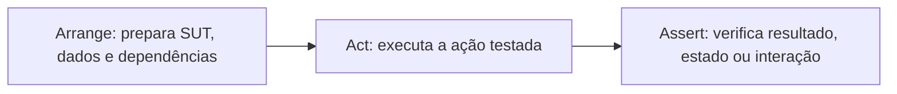

## Resumo

AAA (Arrange, Act, Assert) é a estrutura padrão de um teste unitário: preparar o cenário (Arrange), executar a ação testada (Act) e verificar o resultado (Assert). Essa separação em três blocos torna o teste legível, focado e fácil de diagnosticar quando falha. É a convenção mais difundida para escrever tests claros, independente do framework.

## Explicação detalhada

Cada bloco tem um papel único:

- **Arrange**: monta tudo que o teste precisa. Cria o objeto sob teste (SUT, system under test), prepara dados de entrada, configura dependências e test doubles (ver [test doubles](test-doubles.md)). É o "dado que".
- **Act**: invoca a única ação que está sendo testada, geralmente uma chamada de método. É o "quando". Idealmente uma linha: o estímulo cuja consequência será verificada.
- **Assert**: verifica que o resultado é o esperado, seja o valor retornado, o estado final ou a interação ocorrida. É o "então".

A força do padrão é o foco. Um bom teste unitário verifica **um comportamento**. A separação visual deixa claro o que é preparação, o que é a ação e o que é a verificação, então quando o teste falha você sabe rapidamente onde olhar.

Boas práticas associadas:

- **Um conceito por teste**: vários `Assert` sobre o mesmo resultado lógico são aceitáveis, mas evite testar comportamentos distintos no mesmo método.
- **Nome descritivo**: o nome do teste deve dizer o que é testado e o resultado esperado, por exemplo `Withdraw_ComSaldoInsuficiente_LancaExcecao`. Padrões comuns são `Metodo_Cenario_ResultadoEsperado`.
- **Independência**: tests não dependem de ordem nem de estado compartilhado; cada um arranja o próprio cenário.
- **Determinismo**: o mesmo teste sempre dá o mesmo resultado, sem depender de relógio, rede ou aleatoriedade (use abstrações como `TimeProvider`, ver [.NET 8 new features](../01-csharp-dotnet/dotnet8-csharp12-new-features.md)).

Um padrão relacionado, vindo do BDD, é **Given-When-Then**, que mapeia quase um para um em Arrange-Act-Assert, com vocabulário voltado a comportamento.

## Por baixo dos panos

A maioria dos frameworks de teste em .NET (xUnit, NUnit, MSTest, ver [testing tools](testing-tools.md)) descobre métodos marcados com atributos (`[Fact]`, `[Test]`) por reflection, instancia a classe de teste e executa cada método isoladamente, capturando exceções. Uma asserção que falha lança uma exceção específica do framework, que é registrada como falha sem interromper os outros tests.

No xUnit, a classe de teste é instanciada uma vez por teste, o que reforça a independência: estado de instância não vaza entre tests. Inicialização comum vai no construtor (o "arrange" compartilhado) e limpeza em `IDisposable.Dispose` ou `IAsyncLifetime`.

## Exemplos em C#

Teste de retorno de valor com xUnit, três blocos explícitos:

```csharp
[Fact]
public void Add_DoisNumeros_RetornaSoma()
{
    var calculator = new Calculator();

    var result = calculator.Add(2, 3);

    Assert.Equal(5, result);
}
```

Teste de exceção, ainda em AAA:

```csharp
[Fact]
public void Withdraw_ComSaldoInsuficiente_LancaExcecao()
{
    var account = new Account(balance: 100m);

    var act = () => account.Withdraw(150m);

    Assert.Throws<InsufficientFundsException>(act);
}
```

Teste parametrizado, um caso por linha de dados:

```csharp
[Theory]
[InlineData(0, true)]
[InlineData(2, true)]
[InlineData(3, false)]
public void IsEven_VariosNumeros_RetornaEsperado(int input, bool expected)
{
    var result = NumberUtils.IsEven(input);

    Assert.Equal(expected, result);
}
```

## Tradeoffs

- AAA torna os tests legíveis e diagnosticáveis, com custo praticamente nulo; é convenção, não ferramenta.
- Insistir em um único Act por teste melhora o foco, mas pode aumentar o número de tests; o ganho de clareza compensa.
- Muitos Asserts no mesmo teste podem mascarar a causa (o primeiro a falhar interrompe os demais); bibliotecas como FluentAssertions ajudam com mensagens melhores e asserções agrupadas.
- Excesso de preparação (Arrange) indica que o SUT tem dependências demais, um sinal de design (ver [SOLID](../07-quality-solid/solid.md)).

## Pegadinhas e erros comuns

- Misturar Act e Assert (asserções intercaladas com ações), perdendo a clareza de qual ação produziu qual resultado.
- Testar mais de um comportamento no mesmo método, dificultando saber o que quebrou.
- Testes dependentes de ordem ou de estado compartilhado, que falham de forma intermitente.
- Não determinismo: depender de `DateTime.Now`, rede ou aleatoriedade torna o teste instável (flaky).
- Nome genérico (`Test1`, `TestWithdraw`) que não diz o cenário nem o resultado esperado.
- Arrange gigante: sinal de que o objeto sob teste está acoplado demais e talvez precise ser refatorado.

## Quando usar e quando evitar

Use AAA como estrutura padrão de praticamente todo teste unitário, com nomes descritivos e um comportamento por teste. Use `[Theory]`/`[InlineData]` para cobrir variações de entrada sem duplicar código. Mantenha os tests independentes e determinísticos. Não há "quando evitar" o AAA em si; o que se evita é o contrário: tests sem estrutura, com múltiplos comportamentos e dependências de ordem.

## Perguntas de auto-teste

1. O que cada letra de AAA representa?
<details><summary>Resposta</summary>Arrange (preparar o cenário e dependências), Act (executar a ação testada) e Assert (verificar o resultado esperado).</details>

2. Por que um teste deve idealmente ter um único Act?
<details><summary>Resposta</summary>Para focar em um comportamento, deixando claro qual ação produziu o resultado verificado e facilitando o diagnóstico quando falha.</details>

3. O que torna um teste flaky e como evitar?
<details><summary>Resposta</summary>Depender de relógio, rede, aleatoriedade, ordem de execução ou estado compartilhado. Evita-se com determinismo e isolation, abstraindo o tempo e as dependências externas.</details>

4. Qual a relação entre AAA e Given-When-Then?
<details><summary>Resposta</summary>São equivalentes: Given mapeia para Arrange, When para Act e Then para Assert; Given-When-Then usa vocabulário de comportamento (BDD).</details>

5. Por que um bloco Arrange muito grande é um sinal de alerta?
<details><summary>Resposta</summary>Porque indica que o objeto sob teste tem muitas dependências ou responsabilidades, sugerindo um problema de design a ser refatorado.</details>

6. Qual a vantagem de um nome como `Withdraw_ComSaldoInsuficiente_LancaExcecao`?
<details><summary>Resposta</summary>Comunica método, cenário e resultado esperado, então a falha já diz o que era esperado sem precisar ler o corpo do teste.</details>

## Diagrama



## Referências

- [Unit testing best practices (.NET)](https://learn.microsoft.com/en-us/dotnet/core/testing/unit-testing-best-practices)
- [Unit testing C# with xUnit](https://learn.microsoft.com/en-us/dotnet/core/testing/unit-testing-csharp-with-xunit)
