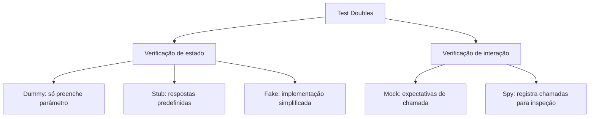

## Resumo

Test doubles (doubles de teste) são objetos que substituem dependências reais durante um teste, para isolar o código sob teste de database, rede, relógio e outros serviços. O termo guarda-chuva, de Gerard Meszaros, abrange cinco types com propósitos distintos: dummy, stub, fake, mock e spy. A distinção principal está entre verificar estado (stub/fake) e verificar interação (mock/spy), e confundi-los leva a tests frágeis ou pouco significativos.

## Explicação detalhada

Os cinco types:

- **Dummy**: objeto passado só para preencher um parâmetro, nunca usado de verdade. Existe para satisfazer a assinatura. Exemplo: um `ILogger` que nunca é chamado no caminho testado.
- **Stub**: fornece respostas predefinidas às chamadas feitas durante o teste. Não tem lógica, só devolve o que você programou. Usado para alimentar o SUT com entradas controladas. Verifica-se estado: o resultado do SUT dada a resposta do stub.
- **Fake**: uma implementação funcional, porém simplificada, leve demais para produção mas real o suficiente para o teste. O exemplo clássico é um repositório em memória que substitui o database, ou um `TimeProvider` controlável. Tem comportamento de verdade.
- **Mock**: um objeto pré-programado com **expectativas** sobre como deve ser chamado. O teste verifica a **interação**: se o método foi chamado, quantas vezes, com quais argumentos. A asserção está no próprio mock.
- **Spy**: registra como foi chamado para você inspecionar depois. Parecido com o mock, mas a verificação é feita pelo teste após a ação, não como expectativa prévia. Muitas vezes é um stub que também grava as chamadas recebidas.

A divisão conceitual mais importante:

- **Verificação de estado** (stub, fake): você exercita o SUT e verifica o resultado ou o estado final. O dublê só viabiliza o cenário.
- **Verificação de interação** (mock, spy): você verifica que o SUT colaborou corretamente com a dependência (chamou o método X com o argumento Y).

Em frameworks como Moq e NSubstitute (ver [testing tools](testing-tools.md)), o mesmo objeto pode atuar como stub (configurando retornos) e como mock (verificando chamadas), então os termos se misturam na prática, mas a intenção do teste continua sendo estado ou interação.

## Por baixo dos panos

Bibliotecas de mocking geram, em tempo de execução, uma implementação dinâmica da interface (ou de uma classe com membros virtuais), tipicamente via geração de proxy com `System.Reflection.Emit` ou Castle DynamicProxy. Cada chamada ao proxy é interceptada: se houver um retorno configurado, ele é devolvido (comportamento de stub); todas as chamadas são gravadas para permitir verificação posterior (comportamento de spy/mock).

Por isso essas bibliotecas exigem que o membro seja substituível: interfaces, métodos `virtual` ou `abstract`. Um método não virtual de classe concreta não pode ser interceptado, o que é uma das razões para programar contra interfaces (ver [SOLID](../07-quality-solid/solid.md), inversão de dependência).

## Exemplos em C#

Stub com Moq, alimentando o SUT com uma resposta controlada (verificação de estado):

```csharp
[Fact]
public async Task GetPrice_ProdutoComDesconto_AplicaPercentual()
{
    var repo = new Mock<IProductRepository>();
    repo.Setup(r => r.GetAsync(42, It.IsAny<CancellationToken>()))
        .ReturnsAsync(new Product(42, "Caneca", 100m, DiscountPercent: 0.1m));
    var service = new PricingService(repo.Object);

    var price = await service.GetPriceAsync(42, CancellationToken.None);

    Assert.Equal(90m, price);
}
```

Mock com Moq, verificando interação:

```csharp
[Fact]
public async Task PlaceOrder_ComSucesso_PublicaEvento()
{
    var publisher = new Mock<IEventPublisher>();
    var service = new OrderService(publisher.Object);

    await service.PlaceOrderAsync(new CreateOrder(1, []), CancellationToken.None);

    publisher.Verify(
        p => p.PublishAsync(It.IsAny<OrderPlaced>(), It.IsAny<CancellationToken>()),
        Times.Once);
}
```

Fake como repositório em memória:

```csharp
public class InMemoryProductRepository : IProductRepository
{
    private readonly Dictionary<int, Product> _store = new();

    public Task<Product?> GetAsync(int id, CancellationToken ct) =>
        Task.FromResult(_store.GetValueOrDefault(id));

    public Task AddAsync(Product product, CancellationToken ct)
    {
        _store[product.Id] = product;
        return Task.CompletedTask;
    }
}
```

## Tradeoffs

- Verificação de estado (stub/fake) produz tests mais robustos a refatoração: você testa o resultado, não o como. O risco é não cobrir interações que importam (efeitos colaterais como publicar evento).
- Verificação de interação (mock) é necessária quando o efeito é a própria chamada (enviar e-mail, publicar mensagem), mas acopla o teste à implementação: mudar a forma de colaborar quebra o teste mesmo sem mudar o comportamento observável (tests frágeis).
- Fakes dão tests realistas e rápidos, mas precisam ser mantidos para refletir o contrato real; um fake que diverge do real mascara bugs.
- Mockar demais é um cheiro: pode indicar que o SUT tem dependências em excesso.

## Pegadinhas e erros comuns

- Usar mock (verificar interação) quando bastaria verificar estado, criando tests frágeis que quebram a cada refatoração interna.
- Mockar types que você não possui (bibliotecas externas) diretamente, em vez de envolvê-los numa abstração própria.
- Over-mocking: cada colaborador virando mock, tornando o teste um espelho da implementação sem verificar comportamento real.
- Tentar mockar método não virtual de classe concreta: a maioria das libs não consegue interceptar; programe contra interfaces.
- Confundir os termos e, por exemplo, chamar de mock o que é só um stub; o que importa é se o teste verifica estado ou interação.
- Fake que destoa do comportamento real (ordenação, validação ausente), dando falsa confiança.

## Quando usar e quando evitar

Use stub/fake para fornecer entradas e isolar o SUT quando você quer verificar o resultado ou o estado. Use mock/spy quando o comportamento a verificar é justamente a interação com a dependência (uma chamada com efeito colateral). Prefira fakes para dependências com lógica (repositório, relógio) e stubs para respostas pontuais. Evite verificar interação quando estado basta, e evite mockar excessivamente: muitos mocks num teste sugerem repensar o design do SUT.

## Perguntas de auto-teste

1. Qual a distinção conceitual mais importante entre os types de test double?
<details><summary>Resposta</summary>Entre verificar estado (stub, fake: exercita o SUT e checa resultado/estado) e verificar interação (mock, spy: checa se a dependência foi chamada de certa forma).</details>

2. Qual a diferença entre stub e mock?
<details><summary>Resposta</summary>O stub fornece respostas predefinidas para alimentar o SUT, e a verificação é sobre o estado/resultado; o mock carrega expectativas sobre como deve ser chamado, e a verificação é sobre a interação.</details>

3. O que caracteriza um fake?
<details><summary>Resposta</summary>É uma implementação funcional mas simplificada (por exemplo, um repositório em memória), com comportamento real o suficiente para o teste, porém inadequada para produção.</details>

4. Por que verificar interação pode gerar tests frágeis?
<details><summary>Resposta</summary>Porque acopla o teste à forma como o SUT colabora com a dependência; mudar a implementação interna sem alterar o comportamento observável quebra o teste.</details>

5. Por que bibliotecas de mocking exigem interfaces ou membros virtuais?
<details><summary>Resposta</summary>Porque geram um proxy dinâmico que intercepta as chamadas; métodos não virtuais de classe concreta não podem ser interceptados.</details>

6. Quando a verificação de interação (mock) é realmente necessária?
<details><summary>Resposta</summary>Quando o comportamento a testar é o próprio efeito colateral, como publicar um evento ou enviar um e-mail, que não se reflete em estado retornado.</details>

## Diagrama



## Referências

- [Mocks Aren't Stubs (Martin Fowler)](https://martinfowler.com/articles/mocksArentStubs.html)
- [Unit testing best practices (.NET)](https://learn.microsoft.com/en-us/dotnet/core/testing/unit-testing-best-practices)
