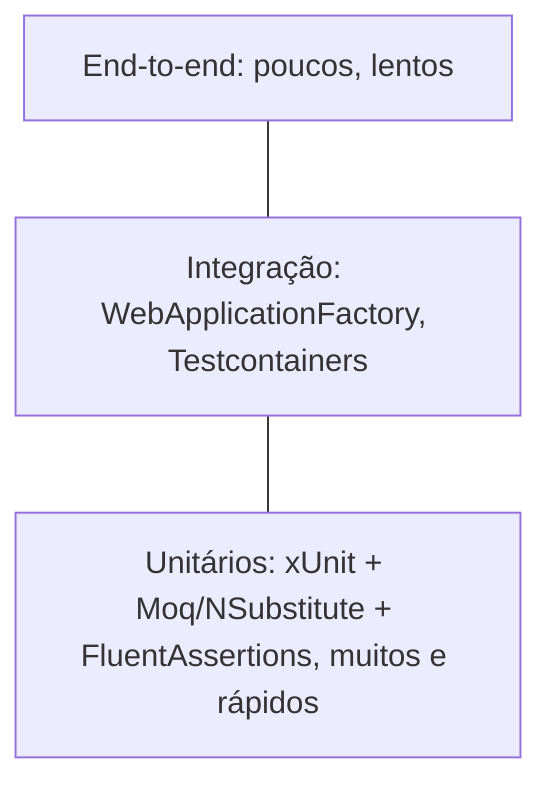

## Resumo

O ecossistema de tests em .NET reúne frameworks de execução (xUnit, NUnit, MSTest), bibliotecas de mocking (Moq, NSubstitute) e de asserção (FluentAssertions), além de tools para teste de integração (`WebApplicationFactory`, Testcontainers). Saber o papel de cada peça e combiná-las bem é o que torna a suíte de tests legível, rápida e confiável.

## Explicação detalhada

**Frameworks de execução** descobrem e rodam os tests, fornecem os atributos e as asserções básicas:

- **xUnit**: o mais adotado em projetos .NET modernos. Usa `[Fact]` para tests simples e `[Theory]` com `[InlineData]`/`[MemberData]` para parametrizados. Cria uma instância da classe por teste (reforçando isolation) e usa o construtor para setup e `IDisposable`/`IAsyncLifetime` para teardown.
- **NUnit**: maduro e rico em recursos, com `[Test]`, `[TestCase]`, `[SetUp]`/`[TearDown]` e um modelo de ciclo de vida diferente (instância compartilhada por padrão).
- **MSTest**: o framework da Microsoft, com `[TestMethod]` e `[TestInitialize]`. Funcional, menos popular que xUnit hoje.

**Bibliotecas de mocking** criam test doubles (ver [test doubles](test-doubles.md)):

- **Moq**: a mais difundida, com API baseada em lambdas (`Setup`, `Returns`, `Verify`).
- **NSubstitute**: sintaxe mais enxuta e legível (`Returns`, `Received`), agradável para muitos times.

**Bibliotecas de asserção** melhoram a expressividade e as mensagens de falha:

- **FluentAssertions**: asserções encadeadas e legíveis (`result.Should().Be(5)`) com mensagens de erro detalhadas, facilitando o diagnóstico.

**Teste de integração:**

- **`WebApplicationFactory<T>`** (Microsoft.AspNetCore.Mvc.Testing): sobe a aplicação ASP.NET Core em memória para testar o pipeline de ponta a ponta, incluindo routing, filtros e DI, sem rede real.
- **Testcontainers**: sobe dependências reais (PostgreSQL, Redis, RabbitMQ) em containers Docker durante o teste, dando integração fiel ao ambiente de produção.

A pirâmide de tests orienta a proporção: muitos tests unitários (rápidos, isolados), menos de integração (componentes juntos) e poucos end-to-end (caros e lentos).

## Por baixo dos panos

Os frameworks se integram ao `dotnet test`, que usa o VSTest/Microsoft.Testing.Platform para descobrir e executar os tests e reportar resultados. Cada framework fornece um adaptador (por exemplo, `xunit.runner.visualstudio`) que conecta sua descoberta de tests ao runner.

`WebApplicationFactory` usa um servidor de teste em memória (`TestServer`) que implementa o pipeline HTTP do ASP.NET Core sem abrir uma porta real, permitindo substituir serviços no contêiner de DI (por exemplo, trocar o database por um fake) para o teste.

Testcontainers usa a API do Docker para criar, configurar e descartar containers programaticamente, esperando o serviço ficar saudável antes do teste e removendo o container ao final, garantindo isolation entre execuções.

## Exemplos em C#

Teste unitário xUnit com FluentAssertions:

```csharp
[Fact]
public void Discount_ClienteVip_AplicaDezPorCento()
{
    var policy = new DiscountPolicy();

    var result = policy.For(CustomerTier.Vip, 200m);

    result.Should().Be(180m);
}
```

Mocking com NSubstitute:

```csharp
[Fact]
public async Task Notify_ChamaCanalUmaVez()
{
    var channel = Substitute.For<INotificationChannel>();
    var service = new NotificationService(channel);

    await service.NotifyAsync("oi", CancellationToken.None);

    await channel.Received(1).SendAsync("oi", Arg.Any<CancellationToken>());
}
```

Teste de integração com `WebApplicationFactory`:

```csharp
public class OrdersApiTests(WebApplicationFactory<Program> factory)
    : IClassFixture<WebApplicationFactory<Program>>
{
    [Fact]
    public async Task Get_Health_Retorna200()
    {
        var client = factory.CreateClient();

        var response = await client.GetAsync("/health");

        response.StatusCode.Should().Be(HttpStatusCode.OK);
    }
}
```

## Tradeoffs

- xUnit favorece isolation (instância por teste) e é o padrão de fato; NUnit oferece mais recursos e flexibilidade de ciclo de vida; a escolha costuma ser convenção de time.
- FluentAssertions melhora legibilidade e mensagens, ao custo de uma dependência extra e de checar a licença atual da biblioteca antes de adotar em projeto comercial.
- Testcontainers dá fidelidade máxima (dependências reais), mas exige Docker e deixa os tests mais lentos; bons para a camada de integração, não para a unitária.
- `WebApplicationFactory` testa o pipeline real em memória, mais rápido que e2e com rede, porém ainda mais pesado que um teste unitário.

## Pegadinhas e erros comuns

- Misturar dois frameworks de execução no mesmo projeto de teste, gerando confusão de atributos e ciclo de vida.
- Tratar tests de integração como unitários: lentidão e dependências externas não pertencem à base da pirâmide.
- Depender de container ou database real em tests que deveriam ser unitários, tornando-os lentos e instáveis.
- Não limpar estado entre tests de integração (database compartilhado), causando interferência e flakiness.
- Verificar interação com mock onde uma asserção de estado seria mais robusta (ver [test doubles](test-doubles.md)).
- Adotar uma biblioteca sem checar sua licença e modelo de manutenção atuais.

## Quando usar e quando evitar

Use um único framework de execução (xUnit por padrão em projetos novos) com FluentAssertions para clareza. Use Moq ou NSubstitute para isolar dependências em tests unitários. Use `WebApplicationFactory` para testar a API de ponta a ponta em memória e Testcontainers quando precisar de dependências reais com fidelidade. Siga a pirâmide: muitos unitários, alguns de integração, poucos e2e. Evite dependências externas na camada unitária e evite duplicar a mesma coverage em camadas caras.

## Perguntas de auto-teste

1. Qual a diferença entre `[Fact]` e `[Theory]` no xUnit?
<details><summary>Resposta</summary>[Fact] marca um teste sem parâmetros; [Theory] marca um teste parametrizado, alimentado por dados via [InlineData] ou [MemberData], rodando um caso por conjunto de dados.</details>

2. Para que serve o `WebApplicationFactory`?
<details><summary>Resposta</summary>Para subir a aplicação ASP.NET Core em memória (com TestServer) e testar o pipeline HTTP de ponta a ponta, podendo substituir serviços no contêiner de DI, sem rede real.</details>

3. Qual o papel das bibliotecas de asserção como FluentAssertions?
<details><summary>Resposta</summary>Tornar as asserções mais legíveis e fornecer mensagens de falha detalhadas, facilitando entender o que deu errado.</details>

4. Quando usar Testcontainers?
<details><summary>Resposta</summary>Em tests de integração que precisam de dependências reais (PostgreSQL, Redis, RabbitMQ) com alta fidelidade, subindo-as em containers Docker durante o teste. Exige Docker e deixa os tests mais lentos.</details>

5. O que a pirâmide de tests orienta?
<details><summary>Resposta</summary>A proporção: muitos tests unitários rápidos na base, menos de integração no meio e poucos end-to-end no topo, por serem mais lentos e caros.</details>

6. Por que não usar database real em um teste unitário?
<details><summary>Resposta</summary>Porque torna o teste lento, dependente de ambiente e potencialmente instável, fugindo do propósito do teste unitário de isolar e exercitar uma unidade rapidamente.</details>

## Diagrama



## Referências

- [Testing in .NET](https://learn.microsoft.com/en-us/dotnet/core/testing/)
- [xUnit.net](https://xunit.net/)
- [Moq (repositório)](https://github.com/devlooped/moq)
