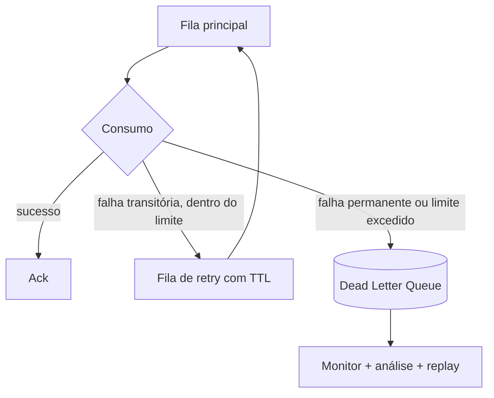

## Resumo

Uma Dead Letter Queue (DLQ) é uma fila para onde vão as mensagens que não puderam ser processadas com sucesso, depois de esgotadas as tentativas. Em vez de perder a mensagem ou ficar reprocessando para sempre uma que sempre falha (envenenando a fila), a DLQ a isola para análise e tratamento posterior. Importa porque dá resiliência e observabilidade ao consumo de mensagens, separando falhas transitórias de falhas permanentes.

## Explicação detalhada

No consumo de mensagens, uma mensagem pode falhar por dois motivos:

- **Falha transitória**: o banco estava indisponível, um serviço deu timeout. Tentar de novo provavelmente resolve.
- **Falha permanente (poison message)**: a mensagem está malformada, viola uma invariante, referencia algo que não existe. Reprocessar nunca vai funcionar.

Sem DLQ, uma poison message pode ser reentregue indefinidamente, bloqueando o avanço da fila e consumindo recursos. A estratégia padrão combina:

1. **Retry com limite**: tentar processar algumas vezes, idealmente com backoff (ver [circuit breaker e retry](../02-microsservicos-patterns/circuit-breaker-retry.md)), para absorver falhas transitórias.
2. **Encaminhar para a DLQ**: após atingir o limite de tentativas, mover a mensagem para a DLQ em vez de devolvê-la à fila principal.
3. **Inspeção e tratamento**: monitorar a DLQ, alertar, analisar a causa, corrigir e eventualmente reprocessar (replay) ou descartar.

No **RabbitMQ**, a DLQ é configurada via Dead Letter Exchange (DLX): uma fila pode declarar um exchange para o qual mensagens "mortas" são roteadas. Uma mensagem é dead-lettered quando é rejeitada (`basic.reject`/`basic.nack`) sem requeue, quando expira por TTL, ou quando a fila excede o limite de tamanho. Para limitar tentativas, costuma-se contar entregas (header `x-death` ou contador próprio) e nack sem requeue ao atingir o limite.

No **Azure Service Bus**, cada fila e assinatura já tem uma DLQ embutida; mensagens vão para lá automaticamente após exceder `MaxDeliveryCount` ou por expiração, e a aplicação pode dead-letter explicitamente.

## Por baixo dos panos

A reentrega imediata (nack com requeue) é perigosa: a poison message volta ao topo e é entregue de novo em loop apertado, gerando CPU e logs sem progresso. Por isso o controle de tentativas é essencial.

Um padrão comum para retry com atraso no RabbitMQ usa filas de espera com TTL: a mensagem rejeitada vai para uma fila de retry com TTL, e ao expirar é dead-lettered de volta para a fila principal, criando um atraso entre tentativas. Cada passagem incrementa o contador de entregas, e ao ultrapassar o limite a mensagem segue para a DLQ final.

A DLQ preserva a mensagem original e seus metadados (motivo da morte, contagem de tentativas, timestamp), o que é o que permite diagnosticar e reprocessar. O replay normalmente republica a mensagem na fila principal após a correção da causa, e a idempotência do consumidor (ver [idempotência](../02-microsservicos-patterns/idempotencia.md)) garante que um eventual reprocessamento duplicado não cause efeito indevido.

## Exemplos em C#

Consumidor que limita tentativas e encaminha para DLQ (RabbitMQ, ilustrativo):

```csharp
public async Task ConsumeAsync(BasicDeliverEventArgs ea, IModel channel, CancellationToken ct)
{
    int attempts = GetDeathCount(ea.BasicProperties);

    try
    {
        await ProcessAsync(ea.Body, ct);
        channel.BasicAck(ea.DeliveryTag, multiple: false);
    }
    catch (TransientException) when (attempts < MaxAttempts)
    {
        channel.BasicNack(ea.DeliveryTag, multiple: false, requeue: false);
    }
    catch (Exception)
    {
        channel.BasicNack(ea.DeliveryTag, multiple: false, requeue: false);
    }
}
```

Aqui `requeue: false` envia a mensagem ao Dead Letter Exchange configurado na fila, seja para a fila de retry (com TTL) ou para a DLQ final, conforme a topologia.

Declaração da fila apontando para um DLX:

```csharp
var args = new Dictionary<string, object>
{
    ["x-dead-letter-exchange"] = "orders.dlx",
    ["x-dead-letter-routing-key"] = "orders.dead"
};
channel.QueueDeclare(queue: "orders", durable: true, exclusive: false,
    autoDelete: false, arguments: args);
```

## Tradeoffs

- DLQ evita perda de mensagens e desbloqueia a fila principal de poison messages, ao custo de exigir monitoramento e um processo de tratamento da DLQ (alertas, análise, replay).
- Retry antes da DLQ absorve falhas transitórias, mas retry sem backoff agrava sobrecarga, e retry demais atrasa o reconhecimento de uma falha permanente.
- DLQ que ninguém observa vira um cemitério silencioso: mensagens importantes perdidas sem ninguém saber. A DLQ só agrega valor com alerta e rotina de tratamento.
- Replay exige idempotência no consumidor para não duplicar efeitos.

## Pegadinhas e erros comuns

- Nack com requeue em poison message: loop infinito de reentrega, sem progresso, consumindo recursos.
- Não limitar o número de tentativas: a mensagem nunca chega à DLQ e congestiona a fila.
- DLQ sem monitoramento nem alerta: falhas acumulam despercebidas.
- Reprocessar a DLQ sem corrigir a causa raiz: as mensagens só voltam a falhar.
- Esquecer idempotência ao fazer replay: efeitos duplicados.
- Tratar falha transitória e permanente da mesma forma: ou se perde tolerância a falhas momentâneas, ou se insiste em algo que nunca vai funcionar.

## Quando usar e quando evitar

Use DLQ em todo consumo de mensagens de produção, combinada com retry limitado e backoff, e com monitoramento ativo da DLQ. Distinga falhas transitórias (retry) de permanentes (direto para a DLQ quando detectáveis). Garanta idempotência para permitir replay seguro. Não há cenário sério de mensageria em que faça sentido abrir mão de uma DLQ; o que se evita é a DLQ sem observabilidade, que dá falsa sensação de segurança.

## Perguntas de auto-teste

1. O que é uma poison message?
<details><summary>Resposta</summary>Uma mensagem que falha permanentemente no processamento (malformada, viola invariante), de modo que reprocessá-la nunca terá sucesso. Sem tratamento, ela pode ser reentregue em loop.</details>

2. Qual o risco de nack com requeue em uma mensagem que sempre falha?
<details><summary>Resposta</summary>Loop infinito de reentrega: a mensagem volta à fila, é entregue de novo, falha, e assim por diante, sem progresso e consumindo recursos.</details>

3. Como o RabbitMQ implementa DLQ?
<details><summary>Resposta</summary>Via Dead Letter Exchange (DLX): a fila declara um exchange para onde mensagens rejeitadas sem requeue, expiradas por TTL ou que excedem o tamanho são roteadas.</details>

4. Qual a diferença de tratamento entre falha transitória e permanente?
<details><summary>Resposta</summary>Falha transitória merece retry (com backoff), pois pode resolver; falha permanente deve ir para a DLQ, pois reprocessar não adianta.</details>

5. Por que a idempotência importa ao reprocessar a DLQ?
<details><summary>Resposta</summary>Porque o replay pode reentregar uma mensagem que já teve efeito parcial; com idempotência, reprocessá-la não causa efeito duplicado.</details>

6. Por que uma DLQ sem monitoramento é problemática?
<details><summary>Resposta</summary>Porque mensagens importantes acabam acumuladas e perdidas sem ninguém perceber; a DLQ só agrega valor com alerta e rotina de análise e replay.</details>

## Diagrama



## Referências

- [Dead Letter Exchanges (RabbitMQ)](https://www.rabbitmq.com/docs/dlx)
- [Dead-letter queues (Azure Service Bus)](https://learn.microsoft.com/en-us/azure/service-bus-messaging/service-bus-dead-letter-queues)
