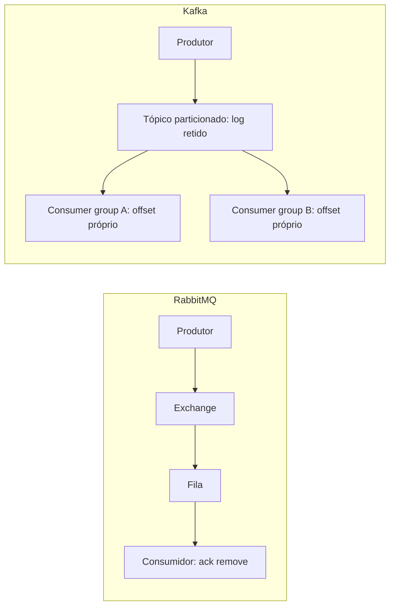

## Resumo

RabbitMQ é um message broker tradicional: roteia mensagens de produtores para filas das quais consumidores as retiram, e a mensagem some quando confirmada. Kafka é um log distribuído de eventos: mensagens são acrescentadas a um log particionado, retidas por um período, e consumidores leem por offset, podendo reler. A escolha depende do problema: filas de tarefas e roteamento flexível (RabbitMQ) versus stream de eventos de alto throughput com reprocessamento (Kafka).

## Explicação detalhada

**RabbitMQ (modelo de broker/fila, AMQP):**

- Produtores publicam em **exchanges**, que roteiam para **filas** segundo regras (binding) e tipo de exchange (direct, topic, fanout, headers).
- Consumidores retiram mensagens das filas. Ao confirmar (ack), a mensagem é removida.
- Foco em **roteamento flexível** e **entrega de tarefas**: cada mensagem é tipicamente processada por um consumidor e descartada.
- Suporta prioridades, TTL, dead lettering (ver [dead letter queue](dead-letter-queue.md)) e confirmação por mensagem.

**Kafka (modelo de log/streaming):**

- Mensagens são **eventos** acrescentados a um **tópico**, dividido em **partições**. Dentro de uma partição há ordem total e cada mensagem tem um **offset** sequencial.
- O log é **retido** por tempo ou tamanho configurados; ler não apaga. Vários **consumer groups** leem o mesmo tópico independentemente, cada um com seu offset.
- A chave da mensagem decide a partição, garantindo ordem por chave (todos os eventos de um pedido na mesma partição).
- Foco em **alto throughput**, **replay** (reprocessar do início ou de um offset) e **event sourcing/streaming**.

Diferenças que decidem:

- **Retenção e replay**: RabbitMQ descarta após consumo; Kafka retém e permite reler. Se você precisa reprocessar histórico ou alimentar vários consumidores independentes do mesmo fluxo, Kafka.
- **Roteamento**: RabbitMQ tem roteamento rico no broker; Kafka roteia por partição via chave, com a lógica de filtragem geralmente no consumidor.
- **Ordem**: Kafka garante ordem por partição; RabbitMQ garante ordem dentro de uma fila com um único consumidor, mas escalar consumidores embaralha a ordem.
- **Throughput**: Kafka é desenhado para volumes muito altos e contínuos; RabbitMQ atende cargas altas, mas o modelo de fila com ack por mensagem tem outro perfil.

## Por baixo dos panos

O Kafka deve grande parte de sua performance a escrever de forma sequencial em disco (append-only log) e usar o page cache do SO, além de transferência eficiente. O paralelismo de consumo é limitado pelo número de partições: dentro de um consumer group, cada partição é lida por no máximo um consumidor, então mais partições permitem mais paralelismo. O offset é o estado do consumidor, commitado para retomar de onde parou.

O RabbitMQ mantém as mensagens em filas (em memória e disco conforme durabilidade) e entrega a consumidores que confirmam o processamento. Um consumidor pode ter um `prefetch` que limita quantas mensagens não confirmadas recebe por vez, controlando a carga. Mensagens duráveis e filas duráveis sobrevivem a reinício do broker.

Ambos podem operar em cluster para alta disponibilidade. As garantias de entrega de cada um (ver [semântica de entrega](semantica-entrega.md)) dependem de configuração: confirmações, replicação e commits de offset.

## Exemplos em C#

Publicação no RabbitMQ:

```csharp
var factory = new ConnectionFactory { HostName = "localhost" };
using var connection = factory.CreateConnection();
using var channel = connection.CreateModel();

channel.ExchangeDeclare("orders", ExchangeType.Topic, durable: true);
var body = JsonSerializer.SerializeToUtf8Bytes(new OrderCreated(42));
var props = channel.CreateBasicProperties();
props.Persistent = true;

channel.BasicPublish("orders", routingKey: "order.created", props, body);
```

Produção no Kafka com chave para garantir ordem por pedido:

```csharp
using var producer = new ProducerBuilder<string, string>(
    new ProducerConfig { BootstrapServers = "localhost:9092" }).Build();

await producer.ProduceAsync("orders", new Message<string, string>
{
    Key = orderId.ToString(),
    Value = JsonSerializer.Serialize(new OrderCreated(orderId))
});
```

## Tradeoffs

- RabbitMQ brilha em filas de trabalho, roteamento complexo, prioridades e padrões de tarefa, com gestão fina por mensagem. Escalar mantendo ordem é mais limitado.
- Kafka brilha em alto throughput, retenção, replay e múltiplos consumidores independentes do mesmo stream, ideal para event sourcing e analytics. O roteamento é mais simples e a ordem é por partição.
- Kafka tende a operar com mais complexidade operacional (partições, offsets, retenção); RabbitMQ é mais direto para casos de fila.
- Não é "um melhor que o outro": são modelos diferentes. Muitas arquiteturas usam os dois para finalidades distintas.

## Pegadinhas e erros comuns

- Esperar ordem global no Kafka: a ordem é garantida por partição, não pelo tópico inteiro. Use a chave certa para colocar eventos relacionados na mesma partição.
- Tratar Kafka como fila de tarefas que apaga ao consumir: ele retém; o "consumo" avança o offset, mas a mensagem permanece para outros grupos e replay.
- Achar que mais consumidores que partições aumenta o paralelismo no Kafka: consumidores extras de um mesmo grupo ficam ociosos.
- Escalar consumidores no RabbitMQ esperando manter ordem: múltiplos consumidores embaralham a ordem de processamento.
- Não configurar durabilidade/persistência e perder mensagens em reinício do broker.
- Usar Kafka para roteamento complexo no broker, papel em que o RabbitMQ é mais adequado.

## Quando usar e quando evitar

Use RabbitMQ para filas de tarefas, distribuição de trabalho, roteamento flexível, prioridades e RPC assíncrono. Use Kafka para streams de eventos de alto volume, event sourcing, integração entre muitos consumidores independentes e quando precisar reprocessar o histórico. Evite Kafka para roteamento sofisticado no broker e para casos simples de fila onde ele adiciona complexidade desnecessária; evite RabbitMQ quando precisar de retenção longa, replay e throughput de streaming.

## Perguntas de auto-teste

1. Qual a diferença fundamental de modelo entre RabbitMQ e Kafka?
<details><summary>Resposta</summary>RabbitMQ é um broker de filas: roteia e entrega mensagens que são removidas ao serem confirmadas. Kafka é um log distribuído: eventos são acrescentados a partições, retidos por um período, e lidos por offset, permitindo releitura.</details>

2. Como o Kafka garante ordem?
<details><summary>Resposta</summary>Por partição: dentro de uma partição há ordem total. A chave da mensagem determina a partição, então eventos com a mesma chave ficam ordenados entre si, mas não há ordem global no tópico.</details>

3. O que limita o paralelismo de consumo no Kafka?
<details><summary>Resposta</summary>O número de partições: em um consumer group, cada partição é lida por no máximo um consumidor, então consumidores além do número de partições ficam ociosos.</details>

4. Por que escalar consumidores no RabbitMQ pode embaralhar a ordem?
<details><summary>Resposta</summary>Porque várias instâncias retiram e processam mensagens da mesma fila concorrentemente, sem garantia de que terminem na ordem em que chegaram.</details>

5. O que acontece com uma mensagem do Kafka após ser consumida?
<details><summary>Resposta</summary>Ela permanece no log até a retenção expirar; o consumo apenas avança o offset do grupo. Outros grupos e replays ainda podem lê-la.</details>

6. Para qual caso o roteamento rico no broker favorece o RabbitMQ?
<details><summary>Resposta</summary>Quando é preciso rotear mensagens por regras (direct, topic, fanout, headers) no próprio broker, algo nativo do RabbitMQ; no Kafka a filtragem fica majoritariamente no consumidor.</details>

## Diagrama



## Referências

- [AMQP 0-9-1 Concepts (RabbitMQ)](https://www.rabbitmq.com/tutorials/amqp-concepts)
- [Apache Kafka Documentation](https://kafka.apache.org/documentation/)
