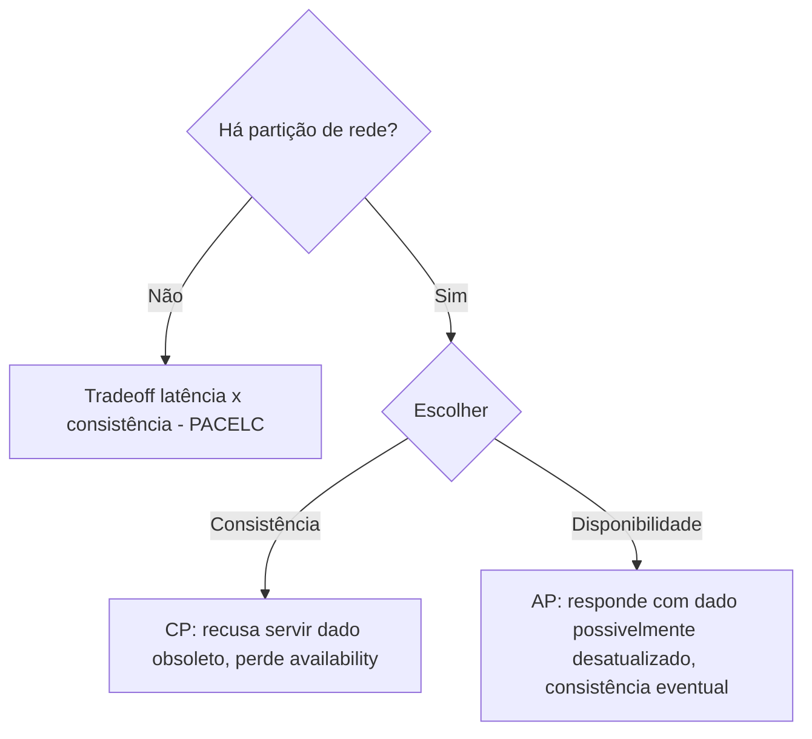

## Resumo

O CAP theorem afirma que um sistema distribuído não pode garantir simultaneamente Consistência, Disponibilidade e tolerância a Partição: na presença de uma partição de rede, é preciso escolher entre consistência e availability. Como partições são inevitáveis em sistemas reais, a escolha prática é entre CP (preferir consistência, recusando respostas durante a partição) e AP (preferir availability, aceitando dados possivelmente desatualizados). Importa para decidir como um sistema se comporta sob falha de rede.

## Explicação detalhada

As três propriedades, na formulação de CAP:

- **Consistência (C)**: toda leitura recebe a escrita mais recente ou um erro. Aqui consistência significa linearizabilidade (todos veem o mesmo valor mais atual), não o C de ACID.
- **Disponibilidade (A)**: toda requisição a um nó não falho recebe uma resposta (não um erro), embora possa não ser a mais recente.
- **Tolerância a partição (P)**: o sistema continua operando mesmo quando mensagens entre nós são perdidas ou atrasadas (a rede se parte).

O teorema diz que, quando ocorre uma partição (P), você só pode manter C ou A, não ambas. Se dois lados da partição não conseguem se comunicar e uma escrita chega a um lado, o sistema deve escolher:

- **Recusar ou bloquear** para não servir dado inconsistente (mantém C, sacrifica A): comportamento **CP**.
- **Responder mesmo assim** com o que tem, podendo estar desatualizado (mantém A, sacrifica C): comportamento **AP**.

O ponto frequentemente mal entendido: P não é opcional. Em qualquer sistema distribuído real, partições acontecem (cabos, switches, GC pauses, timeouts). Então não existe "escolher CA": a escolha real é entre CP e AP **durante a partição**. Fora da partição, um sistema bem projetado pode oferecer tanto consistência quanto availability.

Por isso a evolução do conceito (PACELC) refina: na partição (P), escolha entre A e C; e mesmo sem partição (Else), há um tradeoff entre latência (L) e consistência (C). Sistemas que priorizam baixa latência relaxam a consistência mesmo em operação normal.

## Por baixo dos panos

Bancos e sistemas distribuídos materializam essa escolha:

- Sistemas **CP** (por exemplo, baseados em consenso como ZooKeeper, etcd, e bancos que exigem quórum estrito) preferem recusar escritas/leituras que não consigam confirmar com a maioria dos nós durante uma partição, garantindo que ninguém leia dado obsoleto.
- Sistemas **AP** (por exemplo, Cassandra e DynamoDB em modos de consistência relaxada) aceitam escritas em qualquer réplica disponível e reconciliam depois, oferecendo **consistência eventual**: dado tempo sem novas escritas, todas as réplicas convergem.

Quórum é o mecanismo central de ajuste: com N réplicas, exigir que escritas confirmem em W nós e leituras consultem R nós, com R + W > N, garante que toda leitura veja a última escrita (consistência forte) ao custo de availability quando não há nós suficientes. Reduzir R e W aumenta availability e latência baixa, ao custo de poder ler dado desatualizado.

Muitos sistemas modernos oferecem **consistência ajustável** por operação (como os níveis do Cosmos DB), deixando o desenvolvedor escolher o ponto do tradeoff conforme o caso de uso.

## Exemplos em C#

CAP é uma propriedade de architecture, não de código de aplicação, mas a escolha aparece em como a aplicação lida com a consistência. Exemplo: escolher nível de consistência ao ler de um database distribuído (ilustrativo, API depende do cliente):

```csharp
var options = new ItemRequestOptions
{
    ConsistencyLevel = ConsistencyLevel.Eventual
};

var item = await container.ReadItemAsync<Order>(
    id, new PartitionKey(customerId), options, ct);
```

Lidar com consistência eventual na aplicação, lendo a própria escrita a partir do comando em vez de reler imediatamente uma réplica (ver [CQRS](../02-microservices-patterns/cqrs.md)):

```csharp
public async Task<int> CreateOrderAsync(CreateOrder command, CancellationToken ct)
{
    var order = Order.Create(command.CustomerId, command.Items);
    await _writeStore.SaveAsync(order, ct);
    return order.Id;
}
```

Retornar o id da escrita evita depender de um read model que pode ainda não ter convergido.

## Tradeoffs

- CP garante que ninguém lê dado obsoleto, ao custo de indisponibilidade durante a partição (recusa ou bloqueio). Bom para dinheiro, estoque, invariantes críticas.
- AP mantém o sistema respondendo sob partição, ao custo de poder servir dado desatualizado e exigir reconciliação. Bom para feeds, carrinhos, catálogos, onde availability vale mais que ver o último value.
- Consistência forte traz mais latência e menor availability; consistência eventual traz baixa latência e alta availability, com a complexidade de lidar com dados temporariamente divergentes.
- Quórum ajustável permite calibrar o ponto, mas exige entender as garantias resultantes.

## Pegadinhas e erros comuns

- Acreditar que dá para ter as três (CA) em um sistema distribuído: partições são inevitáveis, então P é obrigatório; a escolha real é CP ou AP na partição.
- Confundir o C de CAP (linearizabilidade) com o C de ACID (integridade de transação): são conceitos diferentes.
- Tratar consistência eventual como "vai dar errado": ela é uma escolha válida e correta para muitos casos, desde que a aplicação lide com a janela de divergência.
- Escolher AP para dados que exigem invariante forte (saldo, estoque), causando overselling ou saldo negativo.
- Ignorar o lado Else do PACELC: mesmo sem partição há tradeoff entre latência e consistência.
- Reler imediatamente uma réplica após escrever e estranhar não ver o próprio dado (consistência eventual em ação).

## Quando usar e quando evitar

Escolha CP quando a correção do dado é inegociável e é aceitável recusar serviço sob partição: transações financeiras, controle de estoque, invariantes críticas. Escolha AP quando manter o sistema respondendo importa mais que ver o último value: catálogos, feeds, sessões, carrinhos, telemetria. Use consistência ajustável para calibrar por operação. Em todo caso, projete a aplicação para conviver com a janela de consistência eventual quando optar por AP, e use [sagas](../02-microservices-patterns/saga.md) para consistência de negócio entre serviços.

## Perguntas de auto-teste

1. O que o CAP theorem afirma?
<details><summary>Resposta</summary>Que um sistema distribuído não pode garantir consistência, availability e tolerância a partição ao mesmo tempo; sob uma partição de rede, é preciso escolher entre consistência e availability.</details>

2. Por que não existe "escolher CA" na prática?
<details><summary>Resposta</summary>Porque partições de rede são inevitáveis em sistemas distribuídos reais, então P é obrigatório. A escolha real, durante a partição, é entre CP e AP.</details>

3. O que diferencia um sistema CP de um AP sob partição?
<details><summary>Resposta</summary>O CP recusa ou bloqueia para não servir dado inconsistente (mantém consistência, perde availability); o AP responde mesmo com dado possivelmente desatualizado (mantém availability, perde consistência).</details>

4. O C de CAP é o mesmo C de ACID?
<details><summary>Resposta</summary>Não. O C de CAP é linearizabilidade (ver o valor mais recente); o C de ACID é integridade/consistência de regras dentro de uma transação.</details>

5. O que o PACELC acrescenta ao CAP?
<details><summary>Resposta</summary>Que, além do tradeoff entre A e C na partição (P), mesmo sem partição (Else) há um tradeoff entre latência (L) e consistência (C).</details>

6. Como o quórum ajusta o tradeoff de consistência?
<details><summary>Resposta</summary>Com N réplicas, exigir R + W > N (leituras em R nós, escritas em W) garante leitura do último value (consistência forte); reduzir R e W aumenta availability e baixa latência ao custo de possível leitura desatualizada.</details>

## Diagrama



## Referências

- [CAP Twelve Years Later (Eric Brewer)](https://www.infoq.com/articles/cap-twelve-years-later-how-the-rules-have-changed/)
- [Consistency levels (Azure Cosmos DB)](https://learn.microsoft.com/en-us/azure/cosmos-db/consistency-levels)
