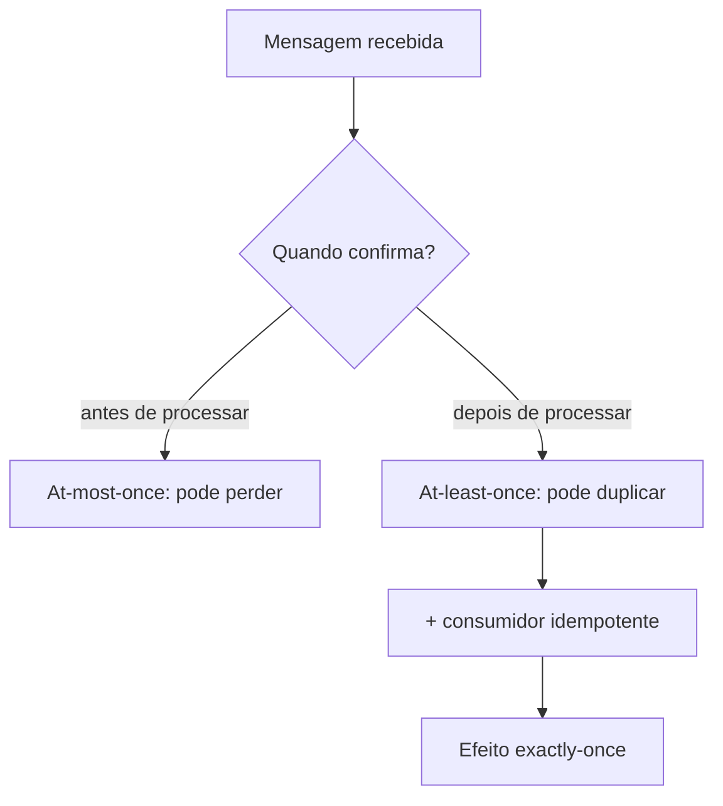

## Resumo

A delivery semantics descreve quantas vezes uma mensagem pode ser processada diante de falhas: at-most-once (zero ou uma, pode perder), at-least-once (uma ou mais, pode duplicar) e exactly-once (exatamente uma). Como falhas e retries são inevitáveis em sistemas distribuídos, a prática real é at-least-once mais idempotency no consumidor, que produz o efeito de exactly-once. Entender isso evita tanto perda silenciosa quanto processamento duplicado.

## Explicação detalhada

O problema de fundo: entre receber a mensagem, processá-la e confirmar (ack), o consumidor pode falhar. Dependendo de quando o ack acontece, o resultado muda.

- **At-most-once**: confirma (ou descarta) antes de processar. Se falhar depois, a mensagem se perde. Nunca há duplicata, mas há risco de perda. Aceitável para dados onde perder um item é tolerável (telemetria de baixa importância).
- **At-least-once**: confirma só depois de processar com sucesso. Se falhar entre processar e confirmar, a mensagem é reentregue e processada de novo. Nunca se perde, mas pode duplicar. É o padrão da maioria dos brokers configurados para reliability.
- **Exactly-once**: cada mensagem afeta o resultado exatamente uma vez. É o ideal, porém difícil e caro de garantir de ponta a ponta, porque envolve coordenar broker, consumidor e o estado que ele altera.

A solução pragmática mais usada: **at-least-once + idempotency**. O broker entrega pelo menos uma vez; o consumidor é idempotente (ver [idempotency](../02-microservices-patterns/idempotency.md)), então reentregas não causam efeito adicional. O efeito observável é exactly-once, mesmo que o processamento físico ocorra mais de uma vez.

No lado do produtor, a publicação confiável também importa: se o produtor publica e não recebe confirmação, ele republica, podendo duplicar. O [Outbox pattern](../02-microservices-patterns/outbox-pattern.md) garante publicação at-least-once a partir de uma transação de database.

## Por baixo dos panos

**RabbitMQ**: confirmações do consumidor (`basic.ack`) determinam a semântica. Com `autoAck = false`, a mensagem só sai da fila após o ack manual, garantindo at-least-once: se o consumidor cair antes do ack, a mensagem é reentregue. Publisher confirms dão garantia análoga no lado do produtor.

**Kafka**: a semântica depende de onde o offset é commitado. Commitar o offset antes de processar dá at-most-once (se falhar, pula a mensagem); commitar depois dá at-least-once (se falhar, relê). Kafka oferece um modo **exactly-once** dentro de seu ecossistema, combinando produtores idempotentes (que deduplicam republicações por sequência) e transações que ligam atomicamente a escrita de saída ao commit do offset. Isso vale para pipelines Kafka-para-Kafka; assim que o efeito é externo (gravar em outro database, chamar uma API), a garantia exactly-once de ponta a ponta volta a depender de idempotency no consumidor.

Por isso a frase comum: "exactly-once de verdade, de ponta a ponta, geralmente é at-least-once com idempotency". O truque é tornar o efeito imune a repetição, não evitar toda repetição.

## Exemplos em C#

At-least-once no RabbitMQ: ack só após processar:

```csharp
channel.BasicConsume(queue: "orders", autoAck: false, consumer: consumer);

consumer.Received += async (model, ea) =>
{
    try
    {
        await ProcessAsync(ea.Body, ct);
        channel.BasicAck(ea.DeliveryTag, multiple: false);
    }
    catch
    {
        channel.BasicNack(ea.DeliveryTag, multiple: false, requeue: false);
    }
};
```

Consumidor idempotente que torna a reentrega segura (efeito exactly-once):

```csharp
public async Task HandleAsync(Message message, CancellationToken ct)
{
    await using var tx = await _db.Database.BeginTransactionAsync(ct);

    bool seen = await _db.Processed.AnyAsync(p => p.Id == message.Id, ct);
    if (seen)
    {
        await tx.CommitAsync(ct);
        return;
    }

    _db.Processed.Add(new Processed(message.Id));
    ApplyEffect(message);

    await _db.SaveChangesAsync(ct);
    await tx.CommitAsync(ct);
}
```

## Tradeoffs

- At-most-once é simples e barato, sem duplicatas, mas perde mensagens sob falha. Só serve quando a perda é tolerável.
- At-least-once não perde, mas exige lidar com duplicatas via idempotency. É o padrão para a maioria dos sistemas confiáveis.
- Exactly-once nativo (quando disponível, como no Kafka interno) elimina a duplicata no pipeline, ao custo de mais latência, complexidade e restrições; e ainda assim, efeitos externos exigem idempotency.
- A combinação at-least-once + idempotency é a mais robusta e portável, ao custo de implementar deduplicação no consumidor.

## Pegadinhas e erros comuns

- Confiar em "exactly-once" como bala de prata: de ponta a ponta com efeitos externos, ele se reduz a at-least-once com idempotency.
- Commitar o offset (Kafka) ou dar ack (RabbitMQ) antes de processar, transformando sem querer em at-most-once e perdendo mensagens sob falha.
- At-least-once sem idempotency: duplicatas causam efeitos repetidos (cobrar duas vezes, e-mails em dobro).
- Ignorar a duplicação no lado do produtor: republicação sem confirmação também duplica; resolva com Outbox e/ou produtor idempotente.
- Assumir ordem junto com a entrega: garantir entrega não garante ordem; são propriedades distintas.
- Achar que aumentar retries melhora a garantia sem tratar idempotency: só aumenta a chance de duplicar.

## Quando usar e quando evitar

Use at-least-once com consumidores idempotentes como padrão para processamento confiável de mensagens. Use at-most-once apenas quando perder mensagens é aceitável e duplicatas seriam piores. Use o exactly-once nativo do Kafka em pipelines internos Kafka-para-Kafka que se beneficiam dele, ciente de que efeitos externos ainda pedem idempotency. Combine com [Outbox](../02-microservices-patterns/outbox-pattern.md) no produtor para publicação confiável.

## Perguntas de auto-teste

1. Quais são as três delivery semantics e seu risco principal?
<details><summary>Resposta</summary>At-most-once (pode perder, nunca duplica), at-least-once (nunca perde, pode duplicar) e exactly-once (exatamente uma vez, difícil e cara de garantir de ponta a ponta).</details>

2. Qual a estratégia pragmática para obter efeito exactly-once?
<details><summary>Resposta</summary>At-least-once no broker mais idempotency no consumidor: reentregas ocorrem, mas não causam efeito adicional, então o efeito observável é exatamente uma vez.</details>

3. No Kafka, o que define se a semântica é at-most-once ou at-least-once?
<details><summary>Resposta</summary>O momento do commit do offset: commitar antes de processar dá at-most-once (pode pular ao falhar); commitar depois dá at-least-once (relê ao falhar).</details>

4. Por que exactly-once de ponta a ponta é difícil quando há efeitos externos?
<details><summary>Resposta</summary>Porque a garantia interna do broker não cobre a escrita em outro sistema ou a chamada a uma API; coordenar isso atomicamente é caro, então recorre-se à idempotency no consumidor.</details>

5. Dar ack antes de processar muda a semântica como?
<details><summary>Resposta</summary>Transforma em at-most-once: se o processamento falhar após o ack, a mensagem já saiu da fila e se perde.</details>

6. Garantir entrega garante ordem?
<details><summary>Resposta</summary>Não. Entrega e ordem são propriedades distintas; um sistema pode entregar de forma confiável sem preservar a ordem das mensagens.</details>

## Diagrama



## Referências

- [Consumer Acknowledgements and Publisher Confirms (RabbitMQ)](https://www.rabbitmq.com/docs/confirms)
- [Kafka Delivery Semantics](https://kafka.apache.org/documentation/#semantics)
