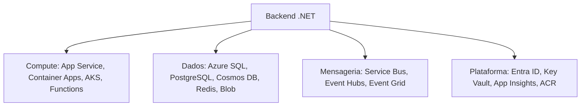

## Resumo

Azure é a cloud da Microsoft, com forte integração ao ecossistema .NET. Para um backend .NET, os serviços mais relevantes se agrupam em compute (onde a aplicação roda), dados (onde o estado vive), messaging e integração, e platform (identidade, segredos, observability). Conhecer as opções de compute e quando usar cada uma é o ponto de partida para projetar e operar sistemas na Azure.

## Explicação detalhada

**Compute (onde a aplicação roda):**

- **App Service**: PaaS para hospedar aplicações web e APIs sem gerenciar o sistema operacional. Escala fácil, slots de deploy, integração nativa com .NET. Ideal para aplicações web tradicionais sem necessidade de orquestração complexa.
- **Azure Container Apps**: serverless para containers, com escala automática (inclusive a zero) e suporte a microsserviços e events, sem gerenciar o cluster. Bom meio-termo entre App Service e Kubernetes.
- **Azure Kubernetes Service (AKS)**: Kubernetes gerenciado (ver [Kubernetes objects](kubernetes-objects.md)), para quem precisa de controle e flexibilidade plenos de orquestração. Mais poder, mais responsabilidade operacional.
- **Azure Functions**: serverless orientado a events, executando funções sob demanda (HTTP, fila, timer), com cobrança por execução. Bom para tarefas event-driven e cargas intermitentes.

**Dados:**

- **Azure SQL Database**: SQL Server gerenciado.
- **Azure Database for PostgreSQL**: PostgreSQL gerenciado (ver [área 03](../03-ef-dapper-postgresql/_index.md)).
- **Azure Cosmos DB**: database NoSQL distribuído globalmente, com consistência ajustável (ver [CAP theorem](../05-messaging-distributed-systems/cap-theorem.md)).
- **Azure Cache for Redis**: Redis gerenciado para cache (ver [Redis](../08-differentials/redis.md)).
- **Azure Blob Storage**: armazenamento de objetos para arquivos e blobs.

**Mensageria e integração:**

- **Azure Service Bus**: broker de mensagens corporativo com filas e tópicos, DLQ embutida (ver [dead letter queue](../05-messaging-distributed-systems/dead-letter-queue.md)).
- **Azure Event Hubs**: ingestão de events em alta escala, próximo do modelo de log (análogo ao Kafka).
- **Azure Event Grid**: routing de events para reações.

**Plataforma:**

- **Microsoft Entra ID** (antes Azure AD): identidade e autenticação.
- **Azure Key Vault**: cofre de segredos, chaves e certificados.
- **Azure Monitor / Application Insights**: observability, métricas, logs e traces (ver [observability](../08-differentials/datadog-observability.md)).
- **Azure Container Registry (ACR)**: registry privado de imagens.

Tudo se organiza em hierarquia: **Management Group** contém **Subscriptions**, que contêm **Resource Groups**, que agrupam os **recursos**. O Resource Group é a unidade de ciclo de vida e organização.

## Por baixo dos panos

Provisionar recursos manualmente no portal não é reprodutível. A prática é **Infrastructure as Code (IaC)**: descrever a infraestrutura em arquivos versionados (Bicep, ARM templates ou Terraform) e aplicá-los pelo pipeline (ver [CI/CD](ci-cd.md)). Isso torna o ambiente reproduzível, revisável e recuperável.

A autenticação entre serviços evita segredos com **Managed Identity**: o recurso (por exemplo, um App Service) recebe uma identidade gerenciada pela Azure e a usa para acessar Key Vault, database ou storage sem credenciais no código. É o caminho recomendado, eliminando senhas em configuração.

A escolha de compute reflete um espectro de controle versus gestão: Functions e Container Apps abstraem mais (menos operação, escala automática, possivelmente até zero); AKS dá mais controle (e mais trabalho); App Service fica no meio para aplicações web. A decisão considera necessidade de orquestração, padrão de carga, custo e maturidade operacional do time.

## Exemplos em C#

Acessar o Key Vault com Managed Identity, sem segredos em código:

```csharp
var builder = WebApplication.CreateBuilder(args);

builder.Configuration.AddAzureKeyVault(
    new Uri("https://meu-cofre.vault.azure.net/"),
    new DefaultAzureCredential());
```

`DefaultAzureCredential` usa a Managed Identity em produção e as credenciais do desenvolvedor localmente, sem mudar código.

Health check exigido por App Service e Container Apps:

```csharp
builder.Services.AddHealthChecks();
var app = builder.Build();
app.MapHealthChecks("/health");
app.Run();
```

## Tradeoffs

- App Service entrega simplicidade e produtividade para web/API, ao custo de menos controle sobre o ambiente e a orquestração.
- Container Apps dá serverless de containers com escala a zero e microsserviços, sem gerenciar cluster, mas com menos controle que o AKS.
- AKS oferece controle e flexibilidade plenos, ao custo de complexidade operacional (upgrades, rede, segurança do cluster).
- Functions são ótimas para events e cargas intermitentes, mas têm restrições (cold start, limites de execução) que as tornam inadequadas para tudo.
- Serviços gerenciados reduzem operação ao custo de menos controle e de lock-in parcial à platform.

## Pegadinhas e erros comuns

- Guardar segredos em arquivos de configuração ou variáveis em texto: use Key Vault e Managed Identity.
- Provisionar tudo manualmente no portal, perdendo reprodutibilidade: prefira IaC versionada.
- Escolher AKS por padrão quando App Service ou Container Apps resolveriam com muito menos esforço operacional.
- Ignorar Resource Groups como unidade de ciclo de vida, espalhando recursos sem organização nem governança de custo.
- Esquecer health checks exigidos pela plataforma para routing e auto-recuperação.
- Subestimar custo: escala automática e serviços gerenciados ajudam, mas recursos esquecidos ligados geram cobrança contínua.

## Quando usar e quando evitar

Use App Service para aplicações web e APIs .NET tradicionais. Use Container Apps para microsserviços em containers com escala automática sem gerenciar cluster. Use AKS quando precisar do controle pleno do Kubernetes. Use Functions para cargas event-driven e intermitentes. Sempre prefira Managed Identity e Key Vault para segredos, e IaC para provisionamento. Evite AKS sem necessidade de orquestração avançada, e evite gerenciar manualmente o que um serviço gerenciado resolve.

## Perguntas de auto-teste

1. Qual a diferença de propósito entre App Service, Container Apps e AKS?
<details><summary>Resposta</summary>App Service hospeda web/API como PaaS sem gerenciar o SO; Container Apps roda containers serverless com escala automática sem gerenciar cluster; AKS é Kubernetes gerenciado para controle pleno de orquestração, com mais responsabilidade operacional.</details>

2. O que é Managed Identity e que problema resolve?
<details><summary>Resposta</summary>Uma identidade gerenciada pela Azure atribuída a um recurso, usada para acessar outros serviços (Key Vault, database, storage) sem credenciais no código, eliminando segredos em configuração.</details>

3. Como os recursos se organizam na hierarquia da Azure?
<details><summary>Resposta</summary>Management Groups contêm Subscriptions, que contêm Resource Groups, que agrupam os recursos. O Resource Group é a unidade de organização e ciclo de vida.</details>

4. Para que serve o Azure Key Vault?
<details><summary>Resposta</summary>Armazenar e controlar acesso a segredos, chaves e certificados, mantendo-os fora do código e da configuração.</details>

5. O que é Infrastructure as Code e por que usá-la na Azure?
<details><summary>Resposta</summary>Descrever a infraestrutura em arquivos versionados (Bicep, ARM, Terraform) aplicados pelo pipeline, tornando o ambiente reproduzível, revisável e recuperável, em vez de provisionar manualmente.</details>

6. Quando Azure Functions é uma boa escolha?
<details><summary>Resposta</summary>Para cargas orientadas a events e intermitentes (HTTP, fila, timer), com cobrança por execução, ciente de restrições como cold start e limites de tempo de execução.</details>

## Diagrama



## Referências

- [Azure Architecture Guide](https://learn.microsoft.com/en-us/azure/architecture/guide/)
- [App Service overview](https://learn.microsoft.com/en-us/azure/app-service/overview)
