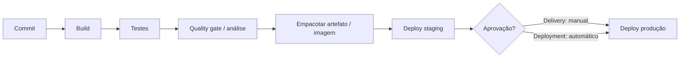

## Resumo

CI/CD automatiza o caminho do código até a produção. Continuous Integration (CI) integra e valida cada mudança com build e testes automáticos a cada commit. Continuous Delivery mantém o software sempre pronto para implantar, com a liberação acionada por decisão humana; Continuous Deployment vai além e implanta automaticamente toda mudança aprovada. Importa porque reduz o risco e o tempo de entrega, transformando deploys em eventos rotineiros e seguros.

## Explicação detalhada

**Continuous Integration (CI)**: a prática de integrar mudanças com frequência (idealmente várias vezes ao dia) numa branch principal, com um pipeline que a cada commit faz checkout, restaura dependências, compila, roda os testes (ver [ferramentas de teste](../04-testes-unitarios/ferramentas-teste.md)) e análise estática (ver [SonarQube](../07-qualidade-solid/sonarqube.md)). O objetivo é detectar problemas cedo, mantendo a base sempre integrável e verde.

**Continuous Delivery**: estende a CI garantindo que o artefato (por exemplo, uma [imagem de container](imagem-vs-container.md)) esteja sempre pronto para implantar em produção, passando por ambientes (dev, staging) automaticamente, mas com a promoção final para produção exigindo uma aprovação manual. O deploy é um clique, não um evento de risco.

**Continuous Deployment**: remove a aprovação manual. Toda mudança que passa por todos os estágios automatizados vai a produção sem intervenção. Exige forte confiança na suíte de testes, em métricas e em estratégias de rollback.

A distinção mais cobrada é **delivery versus deployment**: ambos automatizam o pipeline até a porta de produção; delivery para na aprovação humana, deployment atravessa automaticamente.

Um pipeline típico tem estágios encadeados: **build**, **test**, **análise/quality gate**, **empacotar artefato** (imagem para o registry), **deploy em staging**, e **deploy em produção** (manual ou automático). Migrations de banco (ver [migrations](../03-ef-dapper-postgresql/migrations.md)) entram como um passo controlado antes ou junto do deploy.

**Estratégias de deploy** reduzem risco:

- **Rolling update**: substitui instâncias gradualmente (padrão do Kubernetes Deployment).
- **Blue-green**: mantém dois ambientes; troca o tráfego do antigo (blue) para o novo (green) de uma vez, com rollback instantâneo.
- **Canary**: envia uma fração do tráfego para a nova versão, observa métricas e amplia aos poucos.

## Por baixo dos panos

Pipelines são definidos como código (YAML em Azure Pipelines, GitHub Actions, GitLab CI), versionados junto ao repositório. Um gatilho (push, pull request, tag, agendamento) inicia uma execução que roda em agentes/runners efêmeros. Cada job roda em um ambiente limpo, frequentemente em containers, garantindo reprodutibilidade.

Segredos (credenciais de registry, do cluster) ficam em cofres do sistema de CI/CD e são injetados como variáveis protegidas, nunca commitados. Aprovações, ambientes protegidos e gates (verificações automáticas antes de promover) controlam a passagem entre estágios.

O artefato imutável é a peça central: o mesmo build é promovido por todos os ambientes. Não se recompila por ambiente; promove-se exatamente o que foi testado, mudando apenas a configuração injetada (ver [ConfigMap e Secret](objetos-kubernetes.md)). Isso garante que o que foi validado é o que vai para produção.

## Exemplos em C#

Pipeline GitHub Actions para uma aplicação .NET: build, testes e imagem (YAML):

```yaml
name: ci
on:
  push:
    branches: [main]
jobs:
  build-test:
    runs-on: ubuntu-latest
    steps:
      - uses: actions/checkout@v4
      - uses: actions/setup-dotnet@v4
        with:
          dotnet-version: '8.0.x'
      - run: dotnet restore
      - run: dotnet build --no-restore -c Release
      - run: dotnet test --no-build -c Release --logger trx
      - name: Build image
        run: docker build -t myregistry.azurecr.io/orders-api:${{ github.sha }} .
```

Aplicar migrations como passo controlado antes do deploy:

```bash
dotnet ef migrations script --idempotent --output migrations.sql
psql "$CONNECTION_STRING" -f migrations.sql
```

## Tradeoffs

- CI detecta problemas cedo e mantém a base saudável, ao custo de manter uma suíte de testes confiável e rápida; testes lentos ou instáveis (flaky) minam o pipeline.
- Continuous Delivery dá controle sobre quando liberar, útil para janelas e conformidade, mas mantém um passo manual. Continuous Deployment maximiza velocidade, ao custo de exigir altíssima confiança em automação e observabilidade.
- Blue-green dá rollback instantâneo, ao custo de duplicar a infraestrutura durante a troca. Canary reduz o raio de impacto, ao custo de mais complexidade de roteamento e métricas.
- Promover o mesmo artefato garante fidelidade, mas exige separar configuração do build de forma disciplinada.

## Pegadinhas e erros comuns

- Recompilar por ambiente em vez de promover o mesmo artefato: o que vai a produção pode diferir do que foi testado.
- Testes flaky no pipeline: minam a confiança e levam o time a ignorar falhas.
- Guardar segredos no repositório ou no YAML: use cofres e variáveis protegidas.
- Tratar migrations como parte automática invisível do deploy, sem revisão, arriscando operações destrutivas (ver [migrations](../03-ef-dapper-postgresql/migrations.md)).
- Confundir delivery (para na aprovação) com deployment (vai automático): erro clássico de conceito.
- Pipeline sem quality gate nem análise estática, deixando passar dívida e vulnerabilidades.
- Não ter estratégia de rollback: deploy sem caminho de volta é deploy arriscado.

## Quando usar e quando evitar

Use CI em todo projeto: build e testes automáticos a cada commit são o mínimo. Use Continuous Delivery para manter o software sempre pronto a implantar com promoção controlada; adote Continuous Deployment quando a maturidade de testes, métricas e rollback permitir. Escolha a estratégia de deploy conforme o risco: rolling para o caso comum, blue-green ou canary para mudanças sensíveis. Promova sempre o mesmo artefato. Evite automação de deploy sem testes confiáveis e sem observabilidade, pois automatiza também a propagação de defeitos.

## Perguntas de auto-teste

1. Qual a diferença entre Continuous Delivery e Continuous Deployment?
<details><summary>Resposta</summary>Ambos automatizam o pipeline até a produção; o Delivery para em uma aprovação manual para liberar, enquanto o Deployment implanta automaticamente toda mudança que passa por todos os estágios.</details>

2. O que a Continuous Integration valida a cada commit?
<details><summary>Resposta</summary>Faz checkout, restaura, compila, roda os testes e a análise estática, detectando problemas cedo e mantendo a base sempre integrável.</details>

3. Por que promover o mesmo artefato por todos os ambientes?
<details><summary>Resposta</summary>Para garantir que o que foi testado é exatamente o que vai a produção; recompilar por ambiente abre a chance de divergências. Só a configuração injetada muda.</details>

4. Qual a vantagem do deploy blue-green?
<details><summary>Resposta</summary>Permite trocar todo o tráfego do ambiente antigo para o novo de uma vez, com rollback instantâneo voltando ao ambiente anterior, ao custo de duplicar a infraestrutura na troca.</details>

5. O que é um deploy canary?
<details><summary>Resposta</summary>Enviar uma fração do tráfego para a nova versão, observar métricas e ampliar gradualmente, reduzindo o raio de impacto de um problema.</details>

6. Por onde os segredos do pipeline devem ser geridos?
<details><summary>Resposta</summary>Em cofres do sistema de CI/CD, injetados como variáveis protegidas, nunca commitados no repositório ou escritos no YAML.</details>

## Diagrama



## Referências

- [Azure Pipelines](https://learn.microsoft.com/en-us/azure/devops/pipelines/)
- [GitHub Actions](https://docs.github.com/en/actions)
