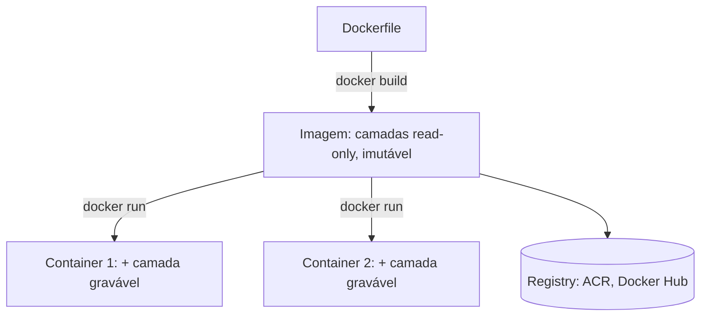

## Resumo

Uma imagem é um template imutável e empacotado de uma aplicação e suas dependências; um container é uma instância em execução criada a partir de uma imagem. A relação é a mesma entre classe e objeto: a imagem define, o container executa. Entender a distinção, as camadas (layers) e a imutabilidade é a base para empacotar aplicações de forma reprodutível e para usar Docker e Kubernetes corretamente.

## Explicação detalhada

Uma **imagem** é um pacote read-only que contém tudo que a aplicação precisa para rodar: o binário, o runtime (por exemplo, o .NET runtime), bibliotecas, arquivos e a configuração de inicialização. Ela é construída a partir de um `Dockerfile`, identificada por nome e tag (`myapp:1.2.0`) e por um digest (hash do conteúdo), e armazenada em um registry (Docker Hub, Azure Container Registry).

Um **container** é uma instância em execução de uma imagem. Quando você roda a imagem, o runtime cria um container: um processo isolado com seu próprio sistema de arquivos (a imagem mais uma camada gravável por cima), rede e limites de recursos. Você pode criar muitos containers da mesma imagem, todos partindo do mesmo estado definido por ela.

A diferença chave é **imutabilidade**: a imagem não muda. O container tem uma camada de escrita efêmera; mudanças feitas nele (arquivos gravados em runtime) somem quando o container é removido, a menos que se use um volume para persistir. Por isso o princípio: containers devem ser **stateless** e descartáveis, com estado externo (banco, volume, storage).

Containers não são máquinas virtuais. Uma VM virtualiza o hardware e roda um sistema operacional completo por instância. Um container compartilha o kernel do host e isola apenas o espaço do processo (via namespaces e cgroups no Linux), sendo muito mais leve e rápido para iniciar.

## Por baixo dos panos

Uma imagem é composta de **camadas** empilhadas. Cada instrução do `Dockerfile` que altera o sistema de arquivos (`COPY`, `RUN`) cria uma camada read-only. As camadas são reaproveitadas entre imagens e em cache de build: se uma camada não mudou, o Docker reusa a do cache, acelerando builds e economizando espaço e transferência.

Ao criar um container, o runtime adiciona uma fina **camada gravável** no topo das camadas read-only da imagem, usando um filesystem de união (overlay). Leituras vêm das camadas da imagem; escritas vão para a camada do container (copy-on-write). Remover o container descarta essa camada.

A ordem das instruções no `Dockerfile` importa por causa do cache: coloque o que muda pouco (restaurar dependências) antes do que muda muito (copiar o código), para maximizar reúso de camadas. **Multi-stage builds** usam um estágio para compilar (com o SDK pesado) e outro só com o runtime e os artefatos, gerando imagens finais menores e mais seguras.

## Exemplos em C#

Dockerfile multi-stage para uma aplicação .NET 8, otimizado para cache:

```dockerfile
FROM mcr.microsoft.com/dotnet/sdk:8.0 AS build
WORKDIR /src
COPY ["MyApp.csproj", "./"]
RUN dotnet restore "MyApp.csproj"
COPY . .
RUN dotnet publish "MyApp.csproj" -c Release -o /app/publish

FROM mcr.microsoft.com/dotnet/aspnet:8.0 AS final
WORKDIR /app
COPY --from=build /app/publish .
ENTRYPOINT ["dotnet", "MyApp.dll"]
```

Copiar o `.csproj` e restaurar antes de copiar o resto do código aproveita o cache: enquanto as dependências não mudam, a camada de restore é reusada.

Comandos básicos do ciclo imagem para container:

```bash
docker build -t myapp:1.2.0 .
docker run -d -p 8080:8080 --name myapp-1 myapp:1.2.0
docker run -d -p 8081:8080 --name myapp-2 myapp:1.2.0
```

Os dois `run` criam containers distintos da mesma imagem.

## Tradeoffs

- Imagens imutáveis dão reprodutibilidade e versionamento: o mesmo digest roda igual em qualquer lugar. O custo é repensar persistência (estado fora do container) e reconstruir/redeployar para mudar.
- Containers são leves e rápidos comparados a VMs, mas compartilham o kernel do host, oferecendo isolamento mais fraco que a virtualização completa.
- Multi-stage builds reduzem tamanho e superfície de ataque da imagem final, ao custo de um Dockerfile um pouco mais elaborado.
- Camadas com cache aceleram builds, mas exigem ordenar as instruções com cuidado para o cache ser efetivo.

## Pegadinhas e erros comuns

- Tratar o container como persistente: dados gravados na camada do container somem ao removê-lo. Use volumes ou armazenamento externo.
- Guardar estado ou segredo dentro da imagem: imagens são distribuídas e versionadas; segredos não pertencem a elas. Use variáveis de ambiente e cofres de segredo.
- Ordem ruim no Dockerfile (copiar todo o código antes de restaurar) que invalida o cache a cada mudança de código, deixando o build lento.
- Usar a imagem do SDK em produção em vez do runtime, resultando em imagem enorme e com mais superfície de ataque.
- Confundir imagem e container: parar um container não apaga a imagem; remover a imagem não afeta containers já em execução até pararem.
- Usar a tag `latest` em produção, perdendo rastreabilidade de qual versão está rodando.

## Quando usar e quando evitar

Use imagens para empacotar a aplicação de forma reprodutível e versionada, com multi-stage build para imagens enxutas. Trate containers como efêmeros e stateless, mantendo estado em volumes ou serviços externos. Use tags de versão explícitas (não `latest`) em produção. Containers são a unidade natural de deploy para microsserviços orquestrados por [Kubernetes](objetos-kubernetes.md). Evite colocar estado ou segredos na imagem e evite depender de mudanças feitas em runtime no container.

## Perguntas de auto-teste

1. Qual a relação entre imagem e container?
<details><summary>Resposta</summary>A imagem é um template imutável; o container é uma instância em execução criada a partir dela. É análogo a classe e objeto.</details>

2. O que acontece com os dados gravados dentro de um container ao removê-lo?
<details><summary>Resposta</summary>Somem, pois ficam na camada gravável efêmera do container. Para persistir, é preciso usar volumes ou armazenamento externo.</details>

3. Por que containers são mais leves que máquinas virtuais?
<details><summary>Resposta</summary>Porque compartilham o kernel do host e isolam apenas o processo (namespaces e cgroups), em vez de virtualizar o hardware e rodar um SO completo por instância.</details>

4. O que são camadas (layers) em uma imagem e por que importam?
<details><summary>Resposta</summary>São partes read-only empilhadas, criadas por instruções do Dockerfile. Importam porque são reaproveitadas em cache de build e entre imagens, acelerando builds e economizando espaço.</details>

5. Para que serve um multi-stage build?
<details><summary>Resposta</summary>Para compilar em um estágio com o SDK pesado e gerar a imagem final só com o runtime e os artefatos, resultando em imagem menor e com menos superfície de ataque.</details>

6. Por que ordenar bem as instruções do Dockerfile?
<details><summary>Resposta</summary>Para aproveitar o cache de camadas: colocar o que muda pouco (restore de dependências) antes do que muda muito (código) evita reconstruir camadas a cada alteração.</details>

## Diagrama



## Referências

- [What is an image? (Docker)](https://docs.docker.com/get-started/docker-concepts/the-basics/what-is-an-image/)
- [What is a container? (Docker)](https://docs.docker.com/get-started/docker-concepts/the-basics/what-is-a-container/)
