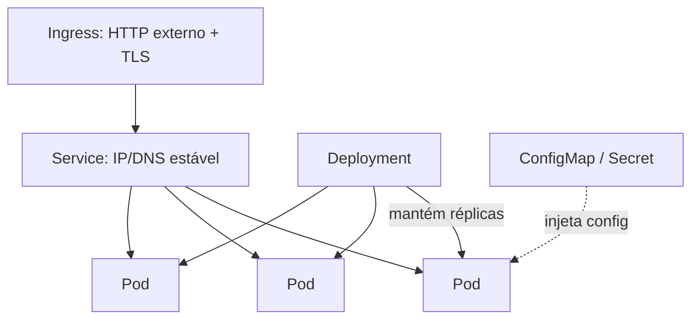

## Resumo

Kubernetes orquestra containers por meio de objetos declarativos: você descreve o estado desejado e o cluster trabalha para alcançá-lo e mantê-lo. Os objetos essenciais são Pod (a menor unidade executável), Deployment (gerencia réplicas e atualizações), Service (rede estável para os Pods), ConfigMap e Secret (configuração) e Ingress (entrada HTTP externa). Conhecer cada um e como se encaixam é a base para implantar aplicações em Kubernetes.

## Explicação detalhada

**Pod**: a menor unidade que o Kubernetes executa. Encapsula um ou mais containers que compartilham rede e armazenamento, rodando juntos no mesmo nó. Pods são efêmeros: têm IP próprio, mas são criados e destruídos conforme necessário, e seu IP muda. Por isso você raramente cria Pods diretamente; usa um controlador.

**Deployment**: gerencia um conjunto de Pods idênticos (réplicas) por meio de um ReplicaSet. Você declara quantas réplicas quer e qual image usar; o Deployment garante esse número, recria Pods que morrem e faz **rolling updates**: ao mudar a image, sobe Pods novos e desce os antigos gradualmente, sem downtime, com rollback possível.

**Service**: dá um endereço de rede estável (nome DNS e IP virtual) para um conjunto de Pods selecionados por labels, balanceando o tráfego entre eles. Resolve o problema de os IPs dos Pods mudarem (ver [service discovery](../02-microservices-patterns/api-gateway-service-discovery.md)). Tipos principais:

- **ClusterIP** (padrão): acessível só dentro do cluster.
- **NodePort**: expõe em uma porta de cada nó.
- **LoadBalancer**: provisiona um balanceador externo (na cloud).

**ConfigMap e Secret**: externalizam configuração da image. ConfigMap guarda configuração não sensível (chave-valor, arquivos); Secret guarda dados sensíveis (senhas, tokens), codificados em base64 e com controle de acesso. Ambos são injetados nos Pods como variáveis de ambiente ou arquivos montados.

**Ingress**: gerencia acesso HTTP/HTTPS externo, roteando por host e caminho para Services internos, com terminação de TLS. Precisa de um Ingress Controller (NGINX, Traefik) rodando no cluster.

Outros objetos comuns: **Namespace** (isolation lógico), **StatefulSet** (workloads com identidade e estado estáveis, como bancos), **DaemonSet** (um Pod por nó), **Job/CronJob** (tarefas pontuais ou agendadas), **HorizontalPodAutoscaler** (escala réplicas por métrica).

## Por baixo dos panos

O Kubernetes funciona por **reconciliação**: controladores observam continuamente o estado atual e o comparam com o estado desejado declarado, agindo para reduzir a diferença. Se um Pod morre, o ReplicaSet do Deployment nota que há réplicas a menos e cria outro. Esse loop de controle é o coração da plataforma.

**Probes** informam a saúde dos Pods: a `livenessProbe` decide se o container deve ser reiniciado; a `readinessProbe` decide se ele está pronto para receber tráfego (e o Service só envia requisições para Pods prontos); a `startupProbe` cobre inicialização lenta. Configurar probes corretamente é essencial para deploys sem erro e para a remoção automática de instâncias não saudáveis.

O **kube-proxy** implementa o Service: distribui o tráfego do IP virtual para os Pods saudáveis atrás dele, atualizando as rotas conforme Pods entram e saem. O DNS interno do cluster resolve o nome do Service para esse IP virtual.

## Exemplos em C#

Manifesto de Deployment e Service para uma API .NET (YAML):

```yaml
apiVersion: apps/v1
kind: Deployment
metadata:
  name: orders-api
spec:
  replicas: 3
  selector:
    matchLabels:
      app: orders-api
  template:
    metadata:
      labels:
        app: orders-api
    spec:
      containers:
        - name: orders-api
          image: myregistry.azurecr.io/orders-api:1.2.0
          ports:
            - containerPort: 8080
          readinessProbe:
            httpGet:
              path: /health/ready
              port: 8080
          envFrom:
            - configMapRef:
                name: orders-config
---
apiVersion: v1
kind: Service
metadata:
  name: orders-api
spec:
  selector:
    app: orders-api
  ports:
    - port: 80
      targetPort: 8080
```

Endpoint de health check no ASP.NET Core que a probe consome:

```csharp
builder.Services.AddHealthChecks();

var app = builder.Build();
app.MapHealthChecks("/health/ready");
app.Run();
```

## Tradeoffs

- O modelo declarativo e a reconciliação dão auto-recuperação, rolling updates e escala, ao custo de uma curva de aprendizado e complexidade operacional consideráveis.
- Deployments são ideais para workloads stateless; estado precisa de StatefulSet e volumes persistentes, com mais cuidado.
- Service ClusterIP é simples e interno; expor para fora exige LoadBalancer (custo de balanceador na cloud) ou Ingress (mais configuração, mas routing HTTP rico e menos balanceadores).
- Secrets do Kubernetes são base64 (não criptografia por padrão); para segurança real, integra-se com cofres externos e criptografia em repouso.

## Pegadinhas e erros comuns

- Criar Pods diretamente em vez de via Deployment: ao morrer, não são recriados.
- Confundir Secret com algo criptografado: por padrão é só base64; habilite criptografia em repouso e controle de acesso, ou use um cofre externo.
- Esquecer readiness probe: o Service envia tráfego para Pods que ainda não estão prontos, causando erros durante o deploy.
- Liveness probe mal configurada que reinicia Pods saudáveis em loop (por exemplo, timeout curto demais).
- Hardcodar configuração e segredos na image em vez de usar ConfigMap/Secret, perdendo flexibilidade entre ambientes.
- Não definir requests e limits de recursos, levando a contenção, evicção de Pods ou desperdício.
- Esquecer que IPs de Pod são efêmeros e tentar endereçá-los diretamente em vez de via Service.

## Quando usar e quando evitar

Use Deployment + Service para a maioria das aplicações stateless. Use Ingress para expor HTTP externo com routing por host/caminho e TLS. Use ConfigMap e Secret para externalizar configuração por ambiente. Use StatefulSet apenas quando o workload exige identidade e estado estáveis. Configure probes e limites de recursos sempre. Evite Kubernetes para aplicações simples ou de baixa escala onde um serviço gerenciado (App Service, Container Apps) entregaria o mesmo com muito menos complexidade.

## Perguntas de auto-teste

1. Qual a menor unidade executável no Kubernetes e qual sua característica de ciclo de vida?
<details><summary>Resposta</summary>O Pod, que encapsula um ou mais containers com rede e armazenamento compartilhados. É efêmero: criado e destruído conforme necessário, com IP que muda.</details>

2. O que um Deployment faz por você?
<details><summary>Resposta</summary>Mantém um número desejado de réplicas de Pods, recria os que morrem e realiza rolling updates (e rollback) ao mudar a image, sem downtime.</details>

3. Por que um Service é necessário se os Pods já têm IP?
<details><summary>Resposta</summary>Porque os IPs dos Pods são efêmeros e mudam. O Service dá um nome DNS e IP virtual estáveis e balanceia o tráfego entre os Pods saudáveis.</details>

4. Qual a diferença entre liveness e readiness probe?
<details><summary>Resposta</summary>A liveness decide se o container deve ser reiniciado (está vivo?); a readiness decide se ele está pronto para receber tráfego, e o Service só roteia para Pods prontos.</details>

5. Secrets do Kubernetes são criptografados por padrão?
<details><summary>Resposta</summary>Não, são apenas codificados em base64. Para segurança real, é preciso habilitar criptografia em repouso e controle de acesso, ou usar um cofre externo.</details>

6. O que significa o Kubernetes operar por reconciliação?
<details><summary>Resposta</summary>Controladores comparam continuamente o estado atual com o estado desejado declarado e agem para eliminar a diferença, recriando recursos e ajustando o cluster automaticamente.</details>

## Diagrama



## Referências

- [Pods (Kubernetes)](https://kubernetes.io/docs/concepts/workloads/pods/)
- [Deployments (Kubernetes)](https://kubernetes.io/docs/concepts/workloads/controllers/deployment/)
- [Service (Kubernetes)](https://kubernetes.io/docs/concepts/services-networking/service/)
