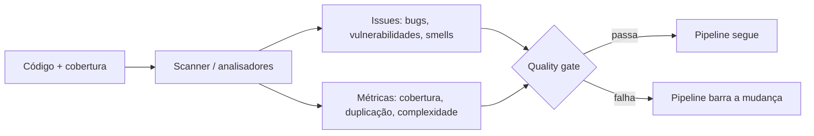

## Resumo

SonarQube é uma plataforma de análise estática que inspeciona o código sem executá-lo, apontando bugs prováveis, vulnerabilidades de segurança, code smells e duplicação, além de medir cobertura de testes. Seu mecanismo central é o quality gate: um conjunto de critérios que o código precisa cumprir para ser aprovado no pipeline. Importa porque automatiza a fiscalização de qualidade, dando feedback objetivo e contínuo em vez de depender só de revisão manual.

## Explicação detalhada

Análise estática lê o código-fonte (ou o bytecode/IL) e raciocina sobre ele sem rodá-lo, detectando padrões problemáticos. O SonarQube classifica os achados (issues) em categorias:

- **Bugs**: código que provavelmente se comporta de forma errada (possível `NullReferenceException`, recurso não liberado).
- **Vulnerabilities**: falhas de segurança (injeção, dados sensíveis expostos, criptografia fraca).
- **Code smells**: problemas de manutenibilidade (ver [code smells](code-smells.md)), como métodos longos e complexidade alta.
- **Security hotspots**: pontos sensíveis que merecem revisão humana, nem sempre uma falha confirmada.

Métricas principais:

- **Cobertura de testes**: percentual de linhas/branches exercitados por testes. Não garante qualidade dos testes, mas revela código não testado.
- **Duplicação**: percentual de linhas duplicadas.
- **Complexidade ciclomática e cognitiva**: número de caminhos de execução e quão difícil é entender o fluxo.
- **Dívida técnica**: estimativa de tempo para corrigir os smells, expressa em tempo e em rating de manutenibilidade.

O **quality gate** é o coração do uso em CI/CD (ver [CI/CD](../06-docker-k8s-cicd-azure/ci-cd.md)): define condições como "nenhum bug novo", "cobertura do código novo acima de 80%", "duplicação abaixo de X". Se o código não passa, o pipeline falha. O foco moderno é no **clean as you code**: aplicar critérios rígidos ao código novo ou alterado, em vez de exigir corrigir todo o legado de uma vez.

No ecossistema .NET, além do SonarQube existem os **Roslyn analyzers** integrados ao compilador, que rodam análise no próprio build (regras de código, `.editorconfig`), complementando a análise da plataforma.

## Por baixo dos panos

O SonarQube usa um scanner que processa o código e, idealmente, os relatórios de cobertura gerados pelos testes, enviando os resultados a um servidor que armazena histórico, calcula métricas e avalia o quality gate. Para projetos .NET, o `dotnet-sonarscanner` instrumenta o build: você inicia a análise, compila, roda os testes coletando cobertura (por exemplo, com Coverlet) e finaliza a análise, que então publica os resultados.

A avaliação por "código novo" depende de o servidor comparar o estado atual com uma referência (a branch base ou uma data), isolando o que mudou. É isso que viabiliza o clean as you code: o gate olha o diff, não o repositório inteiro.

Os Roslyn analyzers, por outro lado, rodam dentro do `dotnet build`: cada regra inspeciona a árvore sintática e semântica do código e emite diagnósticos (info, warning, error), podendo até quebrar o build se configurado com `TreatWarningsAsErrors`. São a primeira linha, imediata, antes mesmo do SonarQube.

## Exemplos em C#

Configurar análise no pipeline (passos do dotnet-sonarscanner):

```bash
dotnet sonarscanner begin /k:"orders-api" /d:sonar.host.url="https://sonar.local" \
  /d:sonar.cs.opencover.reportsPaths="**/coverage.opencover.xml"

dotnet build -c Release
dotnet test -c Release --collect:"XPlat Code Coverage"

dotnet sonarscanner end
```

Habilitar analisadores e tratar avisos como erros no projeto (`.csproj`):

```xml
<PropertyGroup>
  <EnableNETAnalyzers>true</EnableNETAnalyzers>
  <AnalysisLevel>latest</AnalysisLevel>
  <TreatWarningsAsErrors>true</TreatWarningsAsErrors>
</PropertyGroup>
```

Tipo de problema que a análise pega cedo (possível desreferência nula):

```csharp
public int LengthOf(string? input)
{
    return input.Length;
}
```

O analisador aponta que `input` pode ser nulo antes de acessar `.Length`.

## Tradeoffs

- Análise estática dá feedback objetivo, contínuo e automatizado, pegando classes inteiras de problemas cedo, ao custo de configurar e manter o tooling e de lidar com falsos positivos.
- Quality gates rígidos elevam o padrão, mas se calibrados mal (cobertura irreal, regras excessivas) geram atrito e burlas (testes vazios só para subir cobertura).
- Cobertura é uma métrica útil, porém enganosa se tratada como objetivo final: 100% de cobertura com asserções fracas não garante qualidade.
- Clean as you code evita o paralisante "corrija todo o legado", focando no novo, ao custo de conviver com dívida antiga por mais tempo.

## Pegadinhas e erros comuns

- Tratar cobertura como meta a maximizar a qualquer custo: leva a testes sem asserção real, métrica alta e qualidade baixa.
- Ignorar os achados sistematicamente ("depois eu vejo"), tornando o relatório ruído.
- Quality gate aplicado ao repositório inteiro de cara em um legado grande: trava tudo; prefira clean as you code.
- Suprimir avisos em massa em vez de corrigir ou justificar caso a caso.
- Confiar só na análise estática e dispensar revisão humana: ela não entende intenção nem regra de negócio.
- Não integrar a análise ao pipeline, deixando-a como passo manual que ninguém roda.

## Quando usar e quando evitar

Use análise estática em todo projeto sério, integrada ao pipeline, com um quality gate focado no código novo (clean as you code) e cobertura como sinal, não como dogma. Combine SonarQube (visão histórica, segurança, dívida) com Roslyn analyzers (feedback imediato no build). Trate os security hotspots com revisão humana. Não substitua a revisão de código nem o julgamento de design pela ferramenta; use-a para automatizar o que é mecânico e liberar a revisão humana para o que exige contexto.

## Perguntas de auto-teste

1. O que é análise estática?
<details><summary>Resposta</summary>Inspeção do código sem executá-lo, raciocinando sobre sua estrutura para apontar bugs prováveis, vulnerabilidades, code smells e duplicação.</details>

2. O que é um quality gate no SonarQube?
<details><summary>Resposta</summary>Um conjunto de critérios (sem bugs novos, cobertura mínima do código novo, duplicação máxima) que o código precisa cumprir; se falhar, o pipeline falha.</details>

3. O que significa "clean as you code"?
<details><summary>Resposta</summary>Aplicar os critérios de qualidade ao código novo ou alterado, em vez de exigir corrigir todo o legado de uma vez, evitando travar o time e melhorando de forma incremental.</details>

4. Por que cobertura de testes pode enganar?
<details><summary>Resposta</summary>Porque mede linhas exercitadas, não a qualidade das asserções; é possível ter cobertura alta com testes fracos que não verificam comportamento de fato.</details>

5. Qual a diferença entre os Roslyn analyzers e o SonarQube?
<details><summary>Resposta</summary>Os Roslyn analyzers rodam dentro do build e dão feedback imediato (podendo quebrar o build); o SonarQube é uma plataforma com histórico, métricas agregadas, segurança e quality gate no pipeline. São complementares.</details>

6. O que são security hotspots?
<details><summary>Resposta</summary>Pontos de código sensíveis a segurança que merecem revisão humana, nem sempre uma vulnerabilidade confirmada, mas que precisam ser avaliados em contexto.</details>

## Diagrama



## Referências

- [SonarQube Server Documentation](https://docs.sonarsource.com/sonarqube-server/latest/)
- [Code analysis overview (.NET)](https://learn.microsoft.com/en-us/dotnet/fundamentals/code-analysis/overview)
