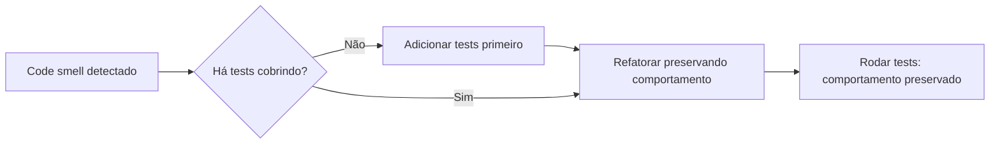

## Resumo

Code smells são sintomas no código que sugerem um problema mais profundo de design, sem necessariamente serem bugs. Eles não quebram o programa, mas dificultam entender, alterar e estender. Reconhecê-los é o primeiro passo para a refatoração: melhorar a estrutura interna sem mudar o comportamento externo. Importam porque a maior parte do custo de software está na manutenção, e smells acumulados tornam cada mudança mais cara e arriscada.

## Explicação detalhada

Smells comuns e o que costumam indicar:

- **Long Method**: método grande demais, fazendo coisas demais. Difícil de ler e testar. Refatoração: extrair métodos menores e coesos.
- **Large Class / God Class**: classe que concentra responsabilidades demais (viola SRP, ver [SOLID](solid.md)). Refatoração: extrair classes.
- **Long Parameter List**: muitos parâmetros, sinal de baixa coesão ou de um objeto faltando. Refatoração: agrupar em um objeto de parâmetros.
- **Duplicated Code**: a mesma lógica repetida. Cada mudança precisa ser feita em vários lugares, com risco de esquecer um. Refatoração: extrair e reusar.
- **Feature Envy**: um método usa mais dados de outra classe do que da própria, indicando que ele está no lugar errado. Refatoração: mover o método.
- **Primitive Obsession**: usar primitive types (string, int) para conceitos que mereciam um tipo próprio (CPF, dinheiro, e-mail). Refatoração: criar value objects (ver [record, class and struct](../01-csharp-dotnet/record-class-struct.md)).
- **Shotgun Surgery**: uma única mudança de requisito obriga a alterar muitos lugares espalhados. Indica responsabilidade dispersa.
- **Switch/Conditional repetido sobre tipo**: cadeias de `if`/`switch` sobre o tipo de algo, que reaparecem em vários pontos. Refatoração: polimorfismo (viola OCP).
- **Magic Numbers/Strings**: literais sem nome no meio do código. Refatoração: constantes nomeadas.
- **Comments como desculpa**: comentários que explicam código confuso em vez de simplificá-lo. Muitas vezes o melhor comentário é um nome melhor (ver convenção de código limpo).

Smells não são proibições absolutas; são pontos de atenção. O julgamento decide se vale refatorar agora, depois, ou conviver com o smell.

## Por baixo dos panos

Refatoração segura depende de uma rede de tests (ver [área 04](../04-unit-tests/_index.md)): você altera a estrutura e roda os tests para garantir que o comportamento não mudou. Sem tests, refatorar é arriscado.

IDEs e analisadores (ver [SonarQube](sonarqube.md)) detectam muitos smells automaticamente por métricas: complexidade ciclomática alta (muitos caminhos de execução, correlaciona com Long Method e condicionais complexas), duplicação, acoplamento, tamanho de método e classe. Essas métricas dão sinais objetivos, mas a decisão de refatorar continua sendo de julgamento, pois nem todo smell vale o custo de remover.

A regra prática da "boy scout rule": deixe o código um pouco melhor do que encontrou. Refatorações pequenas e contínuas evitam o acúmulo que leva a uma reescrita cara.

## Exemplos em C#

Smell: Long Method com Magic Numbers e condicional sobre tipo:

```csharp
public decimal Total(Order o)
{
    decimal t = 0;
    foreach (var i in o.Items) t += i.Price * i.Qty;
    if (o.Type == "vip") t = t * 0.9m;
    else if (o.Type == "employee") t = t * 0.8m;
    if (t > 500) t -= 20;
    return t;
}
```

Refatorado: responsabilidades separadas, polimorfismo no desconto, sem números mágicos:

```csharp
public decimal Total(Order order)
{
    var subtotal = order.Items.Sum(i => i.Price * i.Quantity);
    var discounted = _discountPolicy.Apply(order.CustomerType, subtotal);
    return ApplyFreeShippingThreshold(discounted);
}

private static decimal ApplyFreeShippingThreshold(decimal amount) =>
    amount > FreeShippingThreshold ? amount - ShippingFee : amount;
```

Smell: Primitive Obsession, e a correção com value object:

```csharp
public record Email
{
    public string Value { get; }
    public Email(string value)
    {
        if (!value.Contains('@'))
            throw new ArgumentException("E-mail inválido", nameof(value));
        Value = value;
    }
}
```

Agora o tipo carrega a validação e a intenção, em vez de passar `string` por toda parte.

## Tradeoffs

- Refatorar smells reduz o custo futuro de manutenção e o risco de bugs, ao custo de tempo agora e do risco de introduzir defeitos se não houver tests.
- Eliminar duplicação melhora a manutenção, mas abstrair cedo demais (antes de ver o padrão real) pode acoplar coisas que deviam evoluir separadamente; às vezes um pouco de duplicação é melhor que a abstração errada.
- Value objects (contra Primitive Obsession) trazem clareza e validação, ao custo de mais types.
- Nem todo smell vale a refatoração imediata: em código estável e pouco tocado, conviver pode ser mais econômico que mexer.

## Pegadinhas e erros comuns

- Refatorar sem tests, mudando comportamento sem perceber: refatoração é mudar estrutura preservando comportamento, o que exige verificação.
- Tratar todo smell como obrigação de corrigir já, parando entregas para "limpar tudo".
- Remover duplicação juntando código que só parece igual por acaso, criando acoplamento indevido (falsa duplicação).
- Confundir code smell com bug: smell é sinal de design, não erro funcional.
- Comentar código confuso em vez de simplificá-lo: o comentário envelhece e o código continua difícil.
- Abstrair prematuramente para evitar um smell que talvez nunca cresça (over-engineering).

## Quando usar e quando evitar

Use a identificação de smells como guia de refatoração contínua, apoiada por tests e por análise estática que aponta métricas objetivas. Refatore quando o smell atrapalha uma mudança que você está fazendo agora (refatorar no caminho), seguindo a boy scout rule. Priorize smells em código tocado com frequência. Evite refatorações grandes sem tests, evite eliminar duplicação aparente que na verdade são conceitos distintos, e aceite conviver com smells em código estável quando o custo de mexer supera o benefício.

## Perguntas de auto-teste

1. O que é um code smell e como difere de um bug?
<details><summary>Resposta</summary>É um sintoma de problema de design que dificulta manter e estender o código, sem necessariamente quebrar o comportamento. Um bug é um erro funcional; o smell é um sinal de estrutura ruim.</details>

2. O que caracteriza Primitive Obsession e como corrigir?
<details><summary>Resposta</summary>Usar primitive types para conceitos que mereciam um tipo próprio (e-mail, dinheiro, CPF). Corrige-se criando value objects que carregam validação e significado.</details>

3. Por que cadeias repetidas de `switch` sobre tipo são um smell?
<details><summary>Resposta</summary>Porque indicam que polimorfismo está faltando: adicionar um caso exige tocar em vários switches (viola OCP). A refatoração é substituir por types polimórficos.</details>

4. O que torna a refatoração segura?
<details><summary>Resposta</summary>Uma rede de tests que garante que o comportamento externo não mudou enquanto a estrutura interna é alterada.</details>

5. Por que abstrair cedo demais para eliminar duplicação pode ser um erro?
<details><summary>Resposta</summary>Porque código que parece igual por acaso pode evoluir separadamente; juntá-lo cedo cria acoplamento indevido. Às vezes um pouco de duplicação é melhor que a abstração errada.</details>

6. O que diz a boy scout rule aplicada a código?
<details><summary>Resposta</summary>Deixe o código um pouco melhor do que encontrou, com refatorações pequenas e contínuas, evitando o acúmulo de dívida que leva a reescritas caras.</details>

## Diagrama



## Referências

- [Refactoring Catalog (Martin Fowler)](https://refactoring.com/catalog/)
- [Code Smells (Refactoring Guru)](https://refactoring.guru/refactoring/smells)
