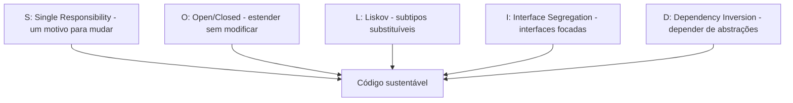

## Resumo

SOLID é um conjunto de cinco princípios de design orientado a objetos que tornam o código mais fácil de manter, estender e testar: Single Responsibility, Open/Closed, Liskov Substitution, Interface Segregation e Dependency Inversion. Cada um ataca uma forma de acoplamento ou rigidez. Não são regras absolutas, mas heurísticas que, aplicadas com bom senso, reduzem o custo de mudança ao longo da vida do software.

## Explicação detalhada

**S - Single Responsibility Principle (SRP)**: uma classe deve ter um, e apenas um, motivo para mudar. Cada classe cuida de uma responsabilidade coesa. Uma classe que valida, persiste e envia e-mail tem três motivos para mudar; separá-las isola o impacto de cada mudança.

**O - Open/Closed Principle (OCP)**: entidades devem estar abertas para extensão, mas fechadas para modificação. Você adiciona comportamento novo sem alterar o código existente, tipicamente via abstrações (interfaces) e polimorfismo. Um novo caso vira uma nova implementação, não um novo `if` numa função que já funciona.

**L - Liskov Substitution Principle (LSP)**: subtipos devem ser substituíveis por seus types base sem quebrar o comportamento esperado. Se `Quadrado` herda de `Retangulo` mas viola a expectativa de que largura e altura variam independentemente, ele quebra o LSP. O contrato do tipo base deve ser honrado pelos derivados.

**I - Interface Segregation Principle (ISP)**: clientes não devem ser forçados a depender de métodos que não usam. Interfaces grandes e genéricas forçam implementações a preencher métodos irrelevantes; interfaces pequenas e focadas evitam isso.

**D - Dependency Inversion Principle (DIP)**: módulos de alto nível não devem depender de módulos de baixo nível; ambos devem depender de abstrações. E abstrações não devem depender de detalhes. Na prática: dependa de interfaces, não de implementações concretas, e injete as dependências (ver injeção de dependência em [pipeline and middleware](../01-csharp-dotnet/pipeline-middleware.md)).

SOLID se reforça mutuamente: DIP e OCP dependem de abstrações; SRP facilita ISP; LSP garante que o polimorfismo do OCP funcione. Muitos [design patterns](../02-microservices-patterns/classic-design-patterns.md) são formas concretas de aplicar esses princípios.

## Por baixo dos panos

O fio condutor do SOLID é gerenciar acoplamento e direção de dependência. O DIP, em particular, inverte a seta: sem ele, a lógica de negócio depende diretamente de detalhes (um repositório concreto, um cliente HTTP específico); com ele, a lógica depende de uma interface, e a implementação concreta é fornecida de fora (injeção de dependência). Isso é o que torna o código testável: nos tests, injeta-se um [test double](../04-unit-tests/test-doubles.md) no lugar da implementação real.

O contêiner de DI do .NET é a infraestrutura que materializa o DIP: você registra que `IOrderRepository` resolve para `SqlOrderRepository`, e o framework injeta a implementação onde a interface é pedida. Trocar a implementação não exige tocar nos consumidores.

## Exemplos em C#

Violação de SRP, classe com três responsabilidades:

```csharp
public class OrderProcessor
{
    public void Process(Order order)
    {
        if (order.Items.Count == 0) throw new InvalidOperationException();
        using var conn = new NpgsqlConnection("...");
        conn.Execute("INSERT INTO orders ...", order);
        new SmtpClient().Send(new MailMessage("a@b.com", order.Email, "Pedido", "..."));
    }
}
```

Aplicando SRP e DIP, responsabilidades separadas e dependências invertidas:

```csharp
public class OrderProcessor(
    IOrderValidator validator,
    IOrderRepository repository,
    INotificationService notifications)
{
    public async Task ProcessAsync(Order order, CancellationToken ct)
    {
        validator.Validate(order);
        await repository.AddAsync(order, ct);
        await notifications.NotifyAsync(order, ct);
    }
}
```

OCP via Strategy, adicionando casos sem alterar o existente:

```csharp
public interface IShippingCost
{
    decimal Calculate(Order order);
}

public class StandardShipping : IShippingCost
{
    public decimal Calculate(Order order) => 10m;
}

public class ExpressShipping : IShippingCost
{
    public decimal Calculate(Order order) => 25m;
}
```

Um novo tipo de frete é uma nova classe, não uma alteração num `switch`.

## Tradeoffs

- SOLID reduz o custo de mudança e melhora testabilidade, ao custo de mais abstrações e arquivos. Aplicado em excesso, gera indireção desnecessária (over-engineering) em código simples.
- DIP e OCP exigem prever pontos de variação; abstrair tudo "por via das dúvidas" cria interfaces de um único implementador sem ganho real.
- SRP bem aplicado dá classes coesas e pequenas, mas levado ao extremo fragmenta demais a lógica, dificultando seguir o fluxo.
- Os princípios são heurísticas, não leis: a meta é código sustentável, não conformidade cega.

## Pegadinhas e erros comuns

- Confundir SRP ("um motivo para mudar") com "uma classe faz uma só coisa minúscula", fragmentando demais.
- Criar interface para cada classe automaticamente, mesmo com um único implementador e sem ponto de variação real: indireção sem valor.
- Violar LSP com herança onde o derivado não honra o contrato do base (o caso quadrado/retângulo), preferindo composição quando a substituição não vale.
- Interfaces "gordas" que forçam implementações a lançar `NotImplementedException` em métodos irrelevantes (violação de ISP).
- Achar que usar o contêiner de DI já é "fazer DIP" mesmo dependendo de types concretos: DIP é depender de abstrações, não só injetar.
- Aplicar SOLID como dogma em scripts e código descartável, onde simplicidade direta seria melhor.

## Quando usar e quando evitar

Use SOLID como guia em código de produção que vai evoluir: separe responsabilidades, dependa de abstrações nos pontos de variação reais, mantenha interfaces focadas e honre contratos na herança. Introduza abstrações quando a variação aparece ou é claramente previsível, não antes. Evite o excesso de indireção em código simples e descartável, e evite criar abstrações sem mais de um implementador ou sem necessidade de teste isolado.

## Perguntas de auto-teste

1. O que diz o Single Responsibility Principle?
<details><summary>Resposta</summary>Que uma classe deve ter apenas um motivo para mudar, concentrando uma responsabilidade coesa, de modo que mudanças em uma preocupação não afetem outras.</details>

2. Como o Open/Closed Principle é tipicamente alcançado?
<details><summary>Resposta</summary>Por abstrações e polimorfismo: novo comportamento entra como nova implementação de uma interface, sem modificar o código existente que já funciona.</details>

3. Dê um exemplo de violação do Liskov Substitution Principle.
<details><summary>Resposta</summary>Quadrado herdando de Retângulo: definir largura altera a altura, quebrando a expectativa do contrato do retângulo, então o subtipo não é substituível pelo base.</details>

4. O que o Interface Segregation Principle previne?
<details><summary>Resposta</summary>Que clientes dependam de métodos que não usam; favorece interfaces pequenas e focadas em vez de interfaces grandes que forçam implementações a preencher métodos irrelevantes.</details>

5. O que significa o Dependency Inversion Principle na prática?
<details><summary>Resposta</summary>Depender de abstrações (interfaces), não de implementações concretas, e fornecer a implementação de fora (injeção de dependência), invertendo a direção da dependência entre alto e baixo nível.</details>

6. SOLID deve ser aplicado sempre, em todo código?
<details><summary>Resposta</summary>Não. São heurísticas para código que evolui; aplicá-los cegamente em código simples ou descartável gera abstração e indireção desnecessárias (over-engineering).</details>

## Diagrama



## Referências

- [Architectural principles (.NET)](https://learn.microsoft.com/en-us/dotnet/architecture/modern-web-apps-azure/architectural-principles)
- [SOLID (Wikipedia)](https://en.wikipedia.org/wiki/SOLID)
