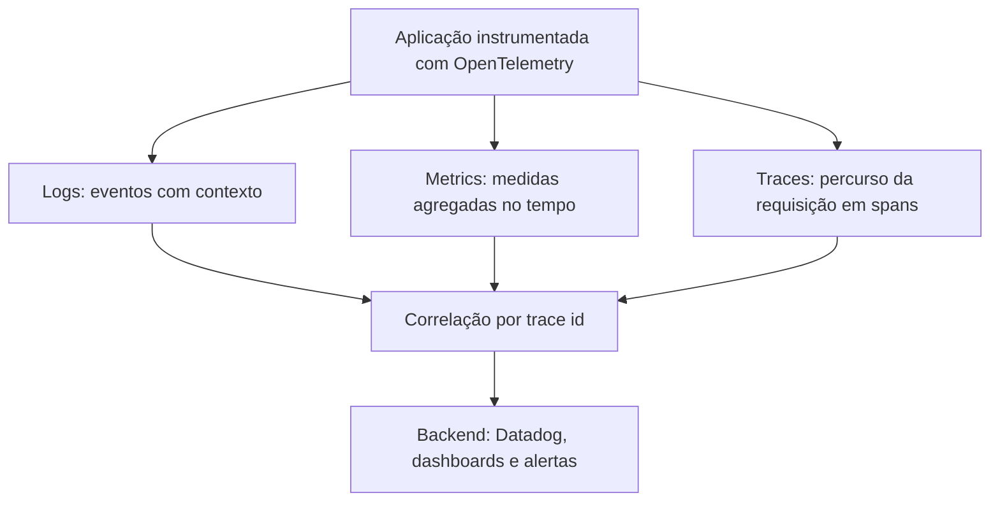

## Resumo

Observabilidade é a capacidade de entender o que acontece dentro de um sistema a partir do que ele emite. Apoia-se em três pilares: logs (eventos discretos com contexto), metrics (medidas numéricas agregadas ao longo do tempo) e traces (o caminho de uma requisição através dos serviços). Datadog é uma plataforma que coleta, correlaciona e visualiza os três. Importa porque, em sistemas distribuídos, sem observabilidade você opera no escuro quando algo falha.

## Explicação detalhada

Monitoramento responde "está funcionando?" com base em perguntas conhecidas; observabilidade permite investigar problemas que você não previu, fazendo perguntas novas sobre o comportamento do sistema. Os três pilares:

- **Logs**: registros de eventos discretos, com mensagem e contexto (timestamp, nível, IDs). Respondem "o que aconteceu exatamente neste ponto". Logs estruturados (JSON com campos) são pesquisáveis e correlacionáveis; logs de texto solto são difíceis de consultar em escala.
- **Metrics**: valores numéricos agregados ao longo do tempo (taxa de requisições, latência p95, uso de CPU, erros por minuto). São baratos de armazenar e ideais para dashboards e alertas sobre tendências e limiares. Respondem "quanto, com que frequência, qual a tendência".
- **Traces**: o registro do percurso de uma requisição por vários serviços, dividido em spans (cada operação, com duração e relação pai/filho). Respondem "por onde a requisição passou e onde gastou tempo". Essenciais para diagnosticar latência e falhas em arquiteturas distribuídas (ver [API gateway](../06-docker-k8s-cicd-azure/objetos-kubernetes.md)).

A força está na **correlação**: um pico de erros (metric) leva a um trace que mostra qual serviço falhou, cujos logs daquele span explicam a causa. Para correlacionar, propaga-se um **correlation id / trace id** por toda a requisição, presente em logs, traces e métricas relacionadas.

**OpenTelemetry (OTel)** é o padrão aberto e neutro de vendor para instrumentar aplicações e exportar os três sinais. Instrumentar com OTel evita lock-in: a mesma instrumentação pode enviar para Datadog, Application Insights ou outro backend.

Conceitos operacionais associados: **SLI** (indicador de nível de serviço, uma métrica como latência), **SLO** (objetivo, ex.: 99,9% das requisições abaixo de 300 ms) e **error budget** (quanto se pode falhar dentro do SLO). Alertas devem se basear em sintomas que afetam o usuário, não em ruído.

## Por baixo dos panos

A instrumentação gera os sinais; um **agente** ou exportador os coleta e envia ao backend. No Datadog, um agente roda junto à aplicação (ou como sidecar/daemonset no Kubernetes) coletando métricas do host, logs e traces, e os encaminha. A aplicação .NET pode ser instrumentada com OpenTelemetry, que captura automaticamente traces de ASP.NET Core, HttpClient e EF Core, além de métricas e logs, exportando para o backend escolhido.

A propagação de contexto é o que costura tudo: ao fazer uma chamada HTTP para outro serviço, o trace id e o span id viajam em headers (padrão W3C Trace Context, `traceparent`), de modo que o serviço seguinte continua o mesmo trace. Sem essa propagação, cada serviço produz traces isolados que não se ligam.

Custo é uma consideração real: logs e traces de alto volume custam armazenamento e ingestão. Por isso usa-se **sampling** (amostrar uma fração dos traces, idealmente mantendo os interessantes, como os com erro ou lentos) e níveis de log adequados, evitando logar tudo em produção.

## Exemplos em C#

Instrumentação com OpenTelemetry no ASP.NET Core, exportando traces e métricas:

```csharp
builder.Services.AddOpenTelemetry()
    .WithTracing(tracing => tracing
        .AddAspNetCoreInstrumentation()
        .AddHttpClientInstrumentation()
        .AddOtlpExporter())
    .WithMetrics(metrics => metrics
        .AddAspNetCoreInstrumentation()
        .AddRuntimeInstrumentation()
        .AddOtlpExporter());
```

Log estruturado com escopo que carrega o correlation id:

```csharp
public async Task<Order> GetAsync(int id, CancellationToken ct)
{
    using var scope = _logger.BeginScope(new Dictionary<string, object>
    {
        ["OrderId"] = id
    });

    _logger.LogInformation("Buscando pedido");
    var order = await _repository.FindAsync(id, ct);

    if (order is null)
        _logger.LogWarning("Pedido não encontrado");

    return order ?? throw new OrderNotFoundException(id);
}
```

Criar um span manual para uma operação relevante:

```csharp
using var activity = _activitySource.StartActivity("ProcessPayment");
activity?.SetTag("order.id", orderId);
await _gateway.ChargeAsync(orderId, amount, ct);
```

## Tradeoffs

- Os três pilares juntos dão visão completa, mas cada um tem custo de ingestão e armazenamento; sampling e bom uso de níveis de log equilibram custo e visibilidade.
- Logs detalhados ajudam a investigar, mas em excesso geram ruído e custo; metrics são baratas mas não explicam o "porquê"; traces explicam o fluxo mas são caros em alto volume. Por isso se combinam.
- OpenTelemetry evita lock-in e padroniza a instrumentação, ao custo de configuração e de maturidade variável de alguns componentes.
- Alertas demais geram fadiga e são ignorados; alertas baseados em SLO e sintomas do usuário são mais acionáveis que alertas em cada métrica.

## Pegadinhas e erros comuns

- Logar texto não estruturado: difícil de pesquisar e correlacionar em escala. Prefira logs estruturados com campos.
- Não propagar o correlation/trace id entre serviços: traces e logs ficam isolados e a correlação se perde.
- Logar dados sensíveis (senhas, tokens, dados pessoais): risco de segurança e conformidade.
- Logar tudo em produção sem níveis nem sampling: custo alto e ruído que esconde o que importa.
- Confundir monitoramento (perguntas conhecidas) com observabilidade (investigar o desconhecido).
- Alertar em métricas de causa em vez de sintomas do usuário, gerando fadiga de alerta.
- Achar que ter os três sinais separados basta: sem correlação, a investigação fica lenta.

## Quando usar e quando evitar

Use os três pilares em qualquer sistema de produção não trivial, instrumentando com OpenTelemetry para neutralidade de vendor e enviando ao backend (Datadog, Application Insights). Propague o trace id por toda a requisição, use logs estruturados e defina SLOs com alertas baseados em sintomas. Aplique sampling para controlar custo. Não há "quando evitar" observabilidade em produção; o que se evita é o excesso sem critério (logar tudo, alertar em tudo), que custa caro e atrapalha mais do que ajuda.

## Perguntas de auto-teste

1. Quais são os três pilares da observabilidade e o que cada um responde?
<details><summary>Resposta</summary>Logs (o que aconteceu em um ponto, eventos discretos), metrics (quanto e qual a tendência, medidas agregadas no tempo) e traces (por onde a requisição passou e onde gastou tempo).</details>

2. Qual a diferença entre monitoramento e observabilidade?
<details><summary>Resposta</summary>Monitoramento responde perguntas conhecidas ("está no ar?"); observabilidade permite investigar problemas não previstos, fazendo perguntas novas sobre o comportamento do sistema.</details>

3. Por que o correlation/trace id é essencial?
<details><summary>Resposta</summary>Porque é o que permite correlacionar logs, traces e métricas de uma mesma requisição entre serviços. Sem propagá-lo, os sinais ficam isolados e a investigação fica lenta.</details>

4. O que é OpenTelemetry e que problema resolve?
<details><summary>Resposta</summary>Um padrão aberto e neutro de vendor para instrumentar aplicações e exportar logs, métricas e traces, evitando lock-in: a mesma instrumentação envia para diferentes backends.</details>

5. Por que usar sampling em traces?
<details><summary>Resposta</summary>Para controlar custo de ingestão e armazenamento em alto volume, amostrando uma fração dos traces, idealmente preservando os mais interessantes (com erro ou lentos).</details>

6. Por que alertar em sintomas do usuário em vez de em toda métrica?
<details><summary>Resposta</summary>Porque alertas em cada métrica de causa geram fadiga e são ignorados; alertas baseados em sintomas e SLOs são mais acionáveis e refletem impacto real.</details>

## Diagrama



## Referências

- [Getting Started (Datadog)](https://docs.datadoghq.com/getting_started/)
- [OpenTelemetry Documentation](https://opentelemetry.io/docs/)
