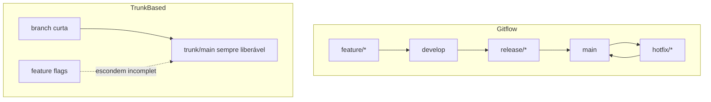

## Resumo

Gitflow e trunk-based development são duas estratégias de branching opostas. Gitflow usa várias branches de longa duração (main, develop, feature, release, hotfix) com fluxo cerimonioso, adequado a releases versionados e periódicos. Trunk-based usa uma única branch principal (trunk) com branches de feature muito curtas e integração contínua, alinhado a CI/CD e entrega frequente. A escolha define o ritmo de integração e o risco de conflitos.

## Explicação detalhada

**Gitflow** define branches com papéis fixos:

- **main** (ou master): reflete o que está em produção, com tags de versão.
- **develop**: integração do trabalho em andamento para a próxima release.
- **feature/***: cada funcionalidade, criada a partir de develop e mesclada de volta nela.
- **release/***: estabilização de uma versão antes de ir para produção, criada de develop.
- **hotfix/***: correção urgente em produção, criada de main e mesclada em main e develop.

É um modelo estruturado, bom para produtos com releases versionados explícitos (software distribuído, versões com suporte). O custo é a cerimônia: muitas branches, merges entre elas e branches de feature que podem viver muito tempo, acumulando divergência e conflitos (merge hell).

**Trunk-based development** minimiza branches de longa duração:

- Todos integram numa única branch principal (trunk/main) com frequência alta (idealmente diária ou mais).
- Branches de feature, quando existem, são curtíssimas (horas a um ou dois dias) e mescladas rápido.
- Funcionalidades incompletas ficam escondidas atrás de **feature flags** em vez de viverem em branches separadas.
- Releases saem do trunk, frequentemente com tags ou release branches efêmeras só para corte de versão.

É o modelo que melhor habilita Continuous Integration e Continuous Delivery/Deployment (ver [CI/CD](../06-docker-k8s-cicd-azure/ci-cd.md)): integrar cedo e com frequência reduz conflitos e mantém o trunk sempre liberável.

A distinção essencial: Gitflow integra **tarde** (branches longas, merge no fim); trunk-based integra **cedo e sempre**. Integração frequente é o que a sigla CI realmente significa.

## Por baixo dos panos

O custo de um merge cresce com o tempo que as branches divergem. Branches de feature longas (típicas de Gitflow malusado) acumulam mudanças que conflitam com o que outros entregaram, gerando merges difíceis e arriscados. Trunk-based ataca isso pela raiz: integrando pequenas porções com frequência, cada merge é trivial.

Para integrar código de uma feature incompleta sem expô-la, o trunk-based usa **feature flags**: o código vai para o trunk, mas o caminho fica desligado por configuração até estar pronto. Isso separa **deploy** (o código está em produção) de **release** (a funcionalidade está ativa para usuários), permitindo deploys contínuos sem liberar features pela metade. Exige disciplina de manter o trunk sempre verde (testes passando) e de limpar flags antigas.

Gitflow funciona bem quando releases são eventos periódicos e versionados, com necessidade de manter várias versões. Trunk-based prospera com entrega contínua e uma única versão em produção (típico de SaaS e serviços web).

## Exemplos em C#

Feature flag escondendo funcionalidade incompleta no trunk:

```csharp
public class CheckoutService(IFeatureManager features, IPaymentGateway gateway)
{
    public async Task<Receipt> CheckoutAsync(Cart cart, CancellationToken ct)
    {
        if (await features.IsEnabledAsync("NewPixFlow"))
            return await ProcessWithPixAsync(cart, ct);

        return await ProcessLegacyAsync(cart, ct);
    }
}
```

O código do novo fluxo já está no trunk e foi implantado, mas só é exercitado quando a flag é ligada, permitindo integração contínua sem liberar a feature.

Fluxo de comandos no trunk-based, branch curta:

```bash
git switch -c feature/ajuste-frete
git commit -am "feat: calcula frete por região"
git switch main
git merge --no-ff feature/ajuste-frete
git push
```

A branch existe por poucas horas e some logo após o merge.

## Tradeoffs

- Gitflow dá estrutura clara para releases versionados e manutenção de múltiplas versões, ao custo de cerimônia, mais branches e risco de merges longos e conflituosos.
- Trunk-based minimiza conflitos e habilita entrega contínua, ao custo de exigir feature flags, alta cobertura de testes e disciplina para manter o trunk sempre liberável.
- Feature flags desacoplam deploy de release e permitem testes A/B e rollout gradual, ao custo de complexidade no código e de dívida se as flags não forem removidas.
- A escolha depende do produto: distribuído e versionado tende a Gitflow; SaaS de entrega contínua tende a trunk-based.

## Pegadinhas e erros comuns

- Usar Gitflow mas com branches de feature longas: vira merge hell, o oposto de integração contínua.
- Chamar de "Continuous Integration" um processo onde as branches só integram semanas depois: CI exige integração frequente, não apenas um servidor de build.
- Trunk-based sem testes confiáveis: integrar direto no trunk sem rede de testes propaga defeitos rapidamente.
- Acumular feature flags sem removê-las: o código vira um emaranhado de condicionais e dívida técnica.
- Confundir deploy com release: implantar código (mesmo desligado por flag) não é o mesmo que liberar a funcionalidade.
- Adotar Gitflow por hábito em um SaaS de deploy diário, onde a cerimônia só atrapalha.

## Quando usar e quando evitar

Use Gitflow para produtos com releases versionados explícitos, múltiplas versões em suporte e cadência periódica (software distribuído, on-premises). Use trunk-based para serviços web e SaaS com entrega contínua, apoiado em feature flags, testes fortes e CI/CD. Mantenha branches curtas em qualquer modelo. Evite Gitflow com branches longas (perde o sentido de CI) e evite trunk-based sem a rede de testes e a disciplina que ele pressupõe.

## Perguntas de auto-teste

1. Qual a diferença essencial entre Gitflow e trunk-based?
<details><summary>Resposta</summary>Gitflow integra tarde, com várias branches de longa duração mescladas no fim; trunk-based integra cedo e com frequência numa única branch principal, com branches de feature curtíssimas.</details>

2. Quais são as branches do Gitflow e seus papéis?
<details><summary>Resposta</summary>main (produção), develop (integração da próxima release), feature (funcionalidades), release (estabilização de versão) e hotfix (correção urgente de produção).</details>

3. Como o trunk-based lida com funcionalidades incompletas sem usar branches longas?
<details><summary>Resposta</summary>Com feature flags: o código incompleto vai para o trunk mas fica desligado por configuração até estar pronto, permitindo integração contínua sem expor a feature.</details>

4. Por que branches de feature longas causam problemas?
<details><summary>Resposta</summary>Porque acumulam divergência em relação ao que outros entregaram, gerando merges difíceis e arriscados (merge hell). Integração frequente evita isso.</details>

5. Qual a diferença entre deploy e release que as feature flags permitem separar?
<details><summary>Resposta</summary>Deploy é o código estar em produção; release é a funcionalidade estar ativa para usuários. Com flags, é possível implantar código desligado e liberá-lo depois.</details>

6. Qual modelo melhor habilita CI/CD e por quê?
<details><summary>Resposta</summary>Trunk-based, porque a integração frequente numa única branch mantém o conjunto sempre liberável e reduz conflitos, que é a essência da integração e entrega contínuas.</details>

## Diagrama



## Referências

- [A successful Git branching model (Gitflow)](https://nvie.com/posts/a-successful-git-branching-model/)
- [Trunk Based Development](https://trunkbaseddevelopment.com/)
