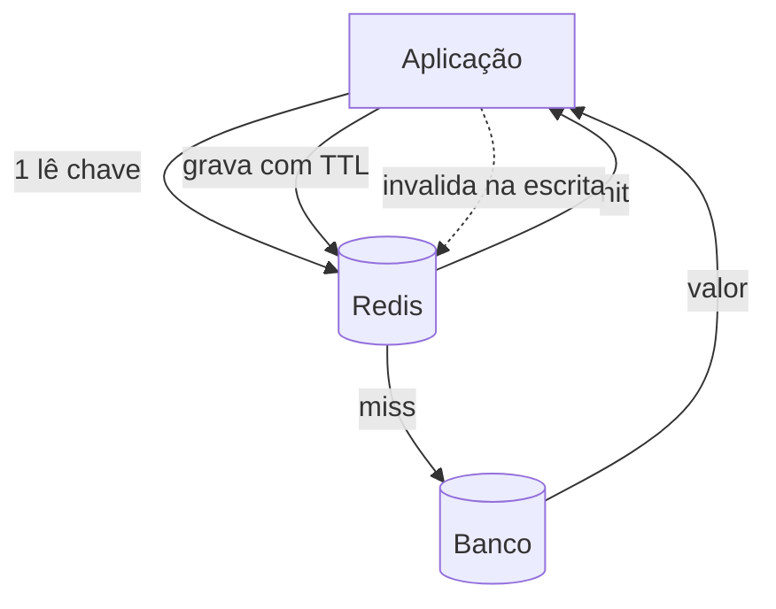

## Resumo

Redis é um armazenamento de dados em memória, usado principalmente como cache distribuído para reduzir latência e carga no banco. Guarda pares chave-valor (e estruturas mais ricas) na RAM, com acesso submilissegundo. Os conceitos centrais para usá-lo bem são o padrão cache-aside, o TTL (tempo de vida das chaves) e as políticas de eviction (o que descartar quando a memória enche). Importa porque cache mal feito causa dados velhos ou inconsistentes.

## Explicação detalhada

Redis mantém os dados em memória, o que o torna extremamente rápido, mas também finito e volátil (com opções de persistência). Além de strings simples, oferece estruturas: hashes, listas, sets, sorted sets, além de recursos como pub/sub, contadores atômicos e expiração por chave. Casos de uso comuns: cache de leitura, sessões, rate limiting, locks distribuídos, filas leves e leaderboards (sorted sets).

**Cache-aside (lazy loading)**, o padrão mais comum:

1. A aplicação tenta ler a chave no Redis.
2. **Cache hit**: retorna o valor do cache.
3. **Cache miss**: lê do banco, grava no cache com um TTL e retorna.

A aplicação é responsável por popular e invalidar o cache; o Redis não sabe nada do banco. Na escrita, a estratégia mais simples e robusta é **invalidar** a chave (removê-la) após atualizar o banco, deixando a próxima leitura repopular. Tentar atualizar o cache junto da escrita (write-through) é possível, mas invalidar evita várias corridas.

**TTL (time to live)**: cada chave pode expirar após um tempo. TTL é a principal defesa contra dado velho: mesmo sem invalidação explícita, a chave morre e é relida do banco. Escolher o TTL é um tradeoff entre frescor (TTL curto, mais idas ao banco) e eficiência (TTL longo, mais risco de dado desatualizado).

**Eviction**: quando o Redis atinge o limite de memória, ele descarta chaves segundo a política configurada (`maxmemory-policy`):

- **noeviction**: recusa novas escritas (erro). 
- **allkeys-lru**: descarta as chaves menos recentemente usadas, entre todas.
- **allkeys-lfu**: descarta as menos frequentemente usadas.
- **volatile-lru / volatile-ttl**: descarta apenas entre chaves com TTL definido, pela menos usada ou pela mais próxima de expirar.

Para uso puro como cache, políticas `allkeys-lru` ou `allkeys-lfu` são comuns.

## Por baixo dos panos

Redis é majoritariamente single-threaded para a execução de comandos, o que simplifica a atomicidade: cada comando roda sem interleaving, então operações como `INCR` são atômicas sem locks. Isso e a memória explicam a baixa latência.

A consistência cache versus banco é o ponto difícil. Há sempre uma janela em que o cache pode divergir do banco (entre a escrita no banco e a invalidação do cache, ou se a invalidação falhar). Estratégias mitigam, não eliminam: invalidar após o commit, usar TTL como rede de segurança, e aceitar consistência eventual no cache. Para a maioria dos dados cacheáveis, ler um valor levemente desatualizado por alguns segundos é aceitável; para dados que não toleram isso, ou não se cacheia, ou se usa TTL muito curto.

Outro cuidado é o **cache stampede**: quando uma chave popular expira, muitas requisições simultâneas dão miss e batem no banco ao mesmo tempo. Mitigações incluem bloqueio para que só uma requisição repopule, TTL com jitter, ou recomputação antecipada.

## Exemplos em C#

Cache-aside com `IDistributedCache` (Redis) no ASP.NET Core:

```csharp
public class ProductCache(IDistributedCache cache, IProductRepository repository)
{
    private static readonly DistributedCacheEntryOptions Options = new()
    {
        AbsoluteExpirationRelativeToNow = TimeSpan.FromMinutes(10)
    };

    public async Task<Product?> GetAsync(int id, CancellationToken ct)
    {
        var key = $"product:{id}";
        var cached = await cache.GetStringAsync(key, ct);
        if (cached is not null)
            return JsonSerializer.Deserialize<Product>(cached);

        var product = await repository.GetAsync(id, ct);
        if (product is not null)
            await cache.SetStringAsync(key, JsonSerializer.Serialize(product), Options, ct);

        return product;
    }
}
```

Invalidação na escrita, deixando a próxima leitura repopular:

```csharp
public async Task UpdateAsync(Product product, CancellationToken ct)
{
    await repository.UpdateAsync(product, ct);
    await cache.RemoveAsync($"product:{product.Id}", ct);
}
```

## Tradeoffs

- Cache reduz latência e carga no banco drasticamente para leituras quentes, ao custo de complexidade de invalidação e risco de servir dado desatualizado.
- TTL curto mantém frescor mas aumenta misses e carga no banco; TTL longo é eficiente mas arrisca dado velho. Calibra-se por tipo de dado.
- Invalidar na escrita é simples e robusto; atualizar o cache junto (write-through) mantém o cache quente mas adiciona corridas e complexidade.
- Eviction LRU/LFU mantém as chaves úteis sob pressão de memória, mas chaves importantes podem ser descartadas se a memória for subdimensionada.

## Pegadinhas e erros comuns

- Não definir TTL: chaves vivem para sempre, acumulando dado velho e enchendo a memória.
- Cachear dado que não tolera estar desatualizado sem pensar na janela de inconsistência.
- Cache stampede: muitas requisições repopulando a mesma chave ao expirar; mitigue com lock, jitter no TTL ou recomputação antecipada.
- Esquecer de invalidar na escrita, servindo dado obsoleto até o TTL expirar.
- Política de eviction inadequada (por exemplo, `noeviction` num cache puro), causando erros de escrita quando a memória enche.
- Guardar no cache objetos enormes ou a base inteira, desvirtuando o propósito e estourando memória.
- Tratar o Redis como fonte da verdade durável: é cache em memória, com persistência opcional, não um banco primário para todo caso.

## Quando usar e quando evitar

Use Redis como cache para leituras frequentes e relativamente estáveis, com cache-aside, TTL adequado e invalidação na escrita. Use suas estruturas para sessões, rate limiting, contadores atômicos, locks distribuídos e leaderboards. Defina sempre TTL e uma política de eviction coerente com o uso. Evite cachear dados que exigem consistência forte e imediata, evite o cache como banco primário durável, e evite chaves sem expiração que viram lixo permanente.

## Perguntas de auto-teste

1. Descreva o fluxo do padrão cache-aside.
<details><summary>Resposta</summary>A aplicação lê a chave no cache; se hit, retorna; se miss, lê do banco, grava no cache com TTL e retorna. A aplicação é responsável por popular e invalidar.</details>

2. Por que o TTL é importante mesmo havendo invalidação na escrita?
<details><summary>Resposta</summary>Porque serve de rede de segurança: se a invalidação falhar ou for esquecida, a chave ainda expira e é relida do banco, limitando o tempo de dado desatualizado.</details>

3. O que são políticas de eviction e cite duas?
<details><summary>Resposta</summary>Regras de descarte quando a memória enche. Exemplos: allkeys-lru (descarta as menos recentemente usadas) e volatile-ttl (descarta, entre chaves com TTL, as mais próximas de expirar).</details>

4. O que é cache stampede e como mitigar?
<details><summary>Resposta</summary>Muitas requisições dando miss e batendo no banco ao mesmo tempo quando uma chave popular expira. Mitiga-se com bloqueio para uma só repopular, jitter no TTL ou recomputação antecipada.</details>

5. Por que invalidar na escrita costuma ser preferível a atualizar o cache junto?
<details><summary>Resposta</summary>Porque remover a chave e deixar a próxima leitura repopular evita várias condições de corrida que surgem ao tentar manter cache e banco sincronizados na escrita.</details>

6. Redis pode ser a fonte da verdade durável dos dados?
<details><summary>Resposta</summary>Em geral não: é um armazenamento em memória usado como cache, com persistência opcional. Para durabilidade primária de todo dado, usa-se um banco; o Redis acelera o acesso.</details>

## Diagrama



## Referências

- [Redis Documentation](https://redis.io/docs/latest/develop/)
- [Caching best practices (Azure Architecture)](https://learn.microsoft.com/en-us/azure/architecture/best-practices/caching)
