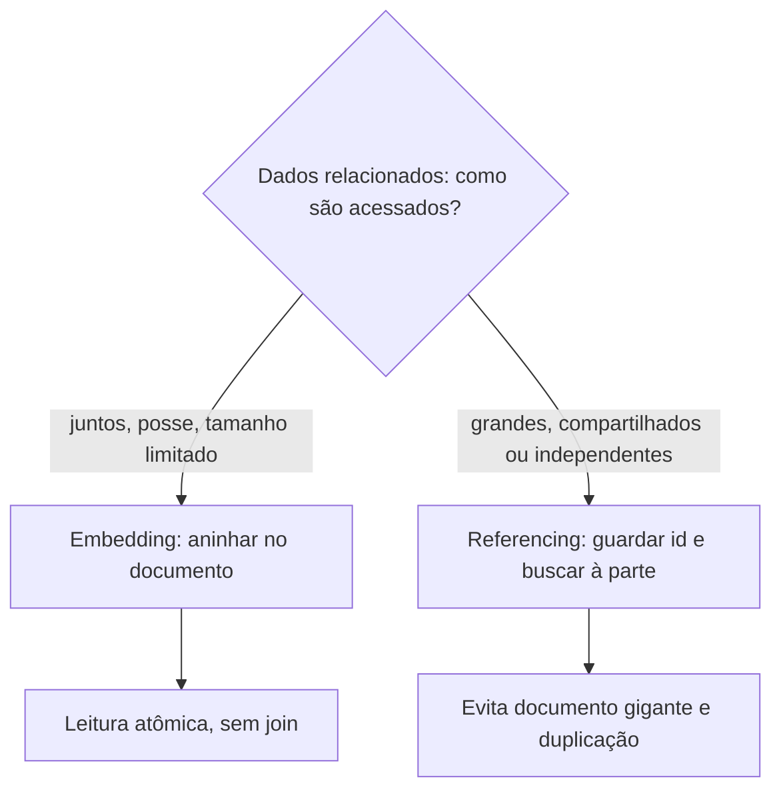

## Resumo

MongoDB é um database NoSQL orientado a documentos: armazena dados como documentos semelhantes a JSON (BSON), agrupados em coleções, sem schema rígido. A decisão central de modelagem é entre embedding (aninhar dados relacionados dentro de um documento) e referencing (guardar referências e juntar em consultas separadas). Essa escolha, guiada pelos padrões de acesso, determina performance e consistência, e é o que mais cai em entrevista sobre MongoDB.

## Explicação detalhada

Em um database relacional, você normaliza: cada entidade em sua tabela, ligadas por chaves, montadas com JOINs. Em MongoDB, você modela em torno de **como os dados são acessados**, não da forma normalizada. As duas estratégias:

**Embedding (aninhar)**: colocar os dados relacionados dentro do mesmo documento. Um pedido com seus itens embutidos vem em uma única leitura. Vantagens: leitura atômica e rápida (um documento, sem joins), e atualização atômica daquele documento. Adequado quando:

- Os dados são acessados juntos.
- O relacionamento é de contenção/posse (itens pertencem ao pedido).
- O subconjunto não cresce sem limite e não é compartilhado.

**Referencing (referenciar)**: guardar o id do relacionado e buscar separadamente (ou com `$lookup`). Análogo a uma chave estrangeira. Adequado quando:

- Os dados são grandes ou crescem sem limite (evita documentos gigantes).
- São compartilhados por muitos documentos (um produto referenciado por muitos pedidos).
- São acessados independentemente.

A regra prática: **dados que são lidos juntos ficam juntos** (embedding); dados grandes, compartilhados ou independentes ficam separados (referencing). Modela-se pelos padrões de consulta, não pela pureza relacional.

Limites importantes: um documento BSON tem tamanho máximo (16 MB), então embedding ilimitado não é opção. MongoDB oferece transações multi-documento, mas o modelo natural favorece manter a unidade de consistência dentro de um único documento, onde a atomicidade é garantida sem transação.

## Por baixo dos panos

Cada documento é armazenado em BSON (JSON binário) e tem um campo `_id` único e indexado. Índices funcionam de forma análoga aos relacionais (ver [índices e JSONB](../03-ef-dapper-postgresql/jsonb-indexes.md)): aceleram consultas e ordenação ao custo de escrita e espaço; pode-se indexar campos aninhados e arrays.

A atomicidade no MongoDB é por documento: uma operação de escrita sobre um único documento é atômica, mesmo alterando vários campos aninhados. É por isso que embedding dá consistência fácil para dados que mudam juntos: estão no mesmo documento, então a atualização é atômica sem transação. Quando os dados estão em documentos diferentes (referencing) e precisam mudar juntos com garantia, recorre-se a transações multi-documento, mais caras.

O `$lookup` (equivalente a um join) existe, mas é menos eficiente que um JOIN relacional otimizado e contraria a filosofia do modelo; usá-lo demais sugere que o relacional seria mais adequado. A duplicação controlada de dados (desnormalização) é aceitável e comum, trocando consistência imediata por performance de leitura, com a aplicação responsável por manter as cópias coerentes.

## Exemplos em C#

Embedding: pedido com itens no mesmo documento (driver MongoDB para .NET):

```csharp
public class Order
{
    public ObjectId Id { get; set; }
    public int CustomerId { get; set; }
    public List<OrderItem> Items { get; set; } = new();
    public decimal Total { get; set; }
}

public class OrderItem
{
    public string ProductName { get; set; } = "";
    public int Quantity { get; set; }
    public decimal UnitPrice { get; set; }
}
```

```csharp
var collection = database.GetCollection<Order>("orders");
await collection.InsertOneAsync(new Order
{
    CustomerId = 42,
    Items = [ new() { ProductName = "Caneca", Quantity = 2, UnitPrice = 25m } ],
    Total = 50m
});
```

Uma leitura traz o pedido inteiro com itens, sem join.

Referencing: pedido guarda o id do cliente, buscado à parte:

```csharp
public class OrderRef
{
    public ObjectId Id { get; set; }
    public ObjectId CustomerId { get; set; }
    public decimal Total { get; set; }
}
```

O cliente, grande e compartilhado por muitos pedidos, fica em sua própria coleção e é buscado quando necessário.

## Tradeoffs

- Embedding dá leitura rápida e atômica de dados acessados juntos, ao custo de documentos que podem crescer e de duplicação se os dados forem compartilhados.
- Referencing evita documentos gigantes e duplicação de dados compartilhados, ao custo de leituras adicionais (ou `$lookup`) e de consistência entre documentos por conta da aplicação.
- MongoDB dá schema flexível (campos variáveis, evolução sem migration rígida), ao custo de menos garantias estruturais e do risco de inconsistência de formato se não houver disciplina.
- Desnormalização melhora leitura, mas transfere para a aplicação o trabalho de manter cópias coerentes.

## Pegadinhas e erros comuns

- Modelar como no relacional (tudo normalizado, muitos `$lookup`): perde a vantagem do document model e fica mais lento que o relacional faria.
- Embedding de coleções que crescem sem limite: documento estoura o limite de 16 MB ou fica caro de carregar inteiro.
- Embedding de dados compartilhados: a mesma informação duplicada em muitos documentos vira pesadelo de atualização.
- Esperar JOINs eficientes como no relacional: `$lookup` é limitado e contraria a filosofia; se você precisa muito dele, talvez o relacional seja a escolha.
- Assumir atomicidade entre documentos sem transação: a atomicidade nativa é por documento.
- Schema flexível como desculpa para inconsistência de formato: sem disciplina, a coleção vira um amontoado de formatos diferentes.

## Quando usar e quando evitar

Use MongoDB quando os dados têm structure de documento natural, schema variável e padrões de acesso que se beneficiam de ler/escrever um agregado por vez (catálogos, perfis, events, conteúdo). Use embedding para dados acessados juntos e de posse; referencing para dados grandes, compartilhados ou independentes, modelando sempre pelos padrões de consulta. Evite MongoDB para dados altamente relacionais com muitas junções e transações multi-entidade frequentes, onde um database relacional é mais adequado.

## Perguntas de auto-teste

1. Qual a decisão central de modelagem no MongoDB?
<details><summary>Resposta</summary>Entre embedding (aninhar dados relacionados no mesmo documento) e referencing (guardar referências e buscar separadamente), guiada pelos padrões de acesso aos dados.</details>

2. Quando preferir embedding?
<details><summary>Resposta</summary>Quando os dados são acessados juntos, têm relação de posse/contenção, não crescem sem limite e não são compartilhados; assim uma leitura traz tudo de forma atômica.</details>

3. Quando preferir referencing?
<details><summary>Resposta</summary>Quando os dados são grandes ou crescem sem limite, são compartilhados por muitos documentos, ou são acessados de forma independente.</details>

4. Em que nível o MongoDB garante atomicidade nativa?
<details><summary>Resposta</summary>No nível do documento: uma escrita sobre um único documento é atômica, mesmo alterando vários campos aninhados. Entre documentos, é preciso transação multi-documento.</details>

5. Por que modelar o MongoDB como um database relacional normalizado é um erro?
<details><summary>Resposta</summary>Porque depende de muitos $lookup, que são menos eficientes que JOINs relacionais e contrariam a filosofia de documentos, resultando em desempenho pior do que o próprio relacional ofereceria.</details>

6. Qual o limite de tamanho de um documento e por que importa?
<details><summary>Resposta</summary>16 MB. Importa porque inviabiliza embedding de coleções que crescem sem limite, forçando referencing nesses casos.</details>

## Diagrama



## Referências

- [Data Modeling (MongoDB)](https://www.mongodb.com/docs/manual/data-modeling/)
- [Data Model Design (MongoDB)](https://www.mongodb.com/docs/manual/core/data-model-design/)
